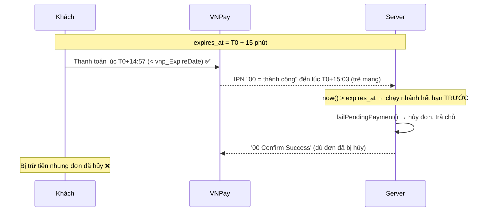

# Code Quality Audit — 2026-07-26

> Báo cáo quét toàn dự án tìm **bug, lỗi logic, lỗi giao diện** trên code hiện tại
> (nhánh `feature/enhance-homepage-interactive`). Đây là bản audit độc lập với
> [business-model-audit](../business-model-audit/README.md): register cũ tập trung
> vào sai lệch so với đặc tả nghiệp vụ và phần lớn đã `Resolved` tính đến 2026-07-22;
> báo cáo này quét chất lượng/độ đúng đắn của code **đang chạy** và các lỗi dưới đây
> đều **đang mở**.

## Cách đọc tài liệu này

- **[Bảng theo dõi](#bảng-theo-dõi-checklist)** ở ngay dưới là nơi tra nhanh: mỗi lỗi có mã (`CQA-*`),
  mức độ, vùng, file, và ô trạng thái để tick khi đã sửa.
- **[Chi tiết từng lỗi](#chi-tiết-từng-lỗi)** giải thích: *sai ở đâu → tái hiện thế nào → sửa ra sao*.
  Đọc phần này khi bắt tay vá.
- **[Đã kiểm tra & an toàn](#đã-kiểm-tra--an-toàn)** ghi lại những gì đã soi mà **không** có lỗi
  (để lần sau khỏi soi lại), gồm cả các báo động giả đã bị loại.
- Mã lỗi đặt theo mức độ: `CQA-H*` = High, `CQA-M*` = Medium, `CQA-L*` = Low.
- Đường dẫn file ghi kèm số dòng tại thời điểm audit (2026-07-26); số dòng có thể trôi khi code đổi.

## Tổng quan

| Mức độ | Số lượng | Ý nghĩa |
| --- | ---: | --- |
| 🔴 High | 5 | Mất tiền, hỏng dữ liệu, hoặc lỗi 500 dễ tái hiện |
| 🟠 Medium | 15 | Sai logic/hiệu năng ảnh hưởng nghiệp vụ, chưa gây sập ngay |
| 🟡 Low | 3 | Rác kỹ thuật / trải nghiệm, tác động nhỏ |
| **Tổng** | **23** | |

**Phương pháp:** chia dự án (157 file PHP Laravel + 182 file JS/JSX React) thành 11 vùng chức năng.
Mỗi vùng được một agent rà soát chuyên sâu (đọc trực tiếp code, truy vết luồng chạy), sau đó một
agent kiểm chứng đối kháng (*adversarial verify*) cố gắng bác bỏ từng phát hiện. Chỉ giữ lại các lỗi
đã qua kiểm chứng; 6 báo động giả đã bị loại (xem [phần cuối](#báo-động-giả-đã-loại)).

## Bảng theo dõi (checklist)

| Mã | Mức | Vùng | Lỗi | File | Trạng thái |
| --- | --- | --- | --- | --- | --- |
| CQA-H01 | 🔴 | Thanh toán | Thanh toán VNPay thành công vẫn bị hủy đơn nếu callback về sau hạn (mất tiền) | `backend_laravel/app/Http/Controllers/Api/Customer/VnpayPaymentController.php:184` | ☐ Chưa xử lý |
| CQA-H02 | 🔴 | Phân công guide | Gán lại guide từng bị hủy trên cùng chuyến → 500 (trùng khóa unique) | `backend_laravel/app/Http/Controllers/Api/Admin/AdminGuideReplacementRequestController.php:107` | ☐ Chưa xử lý |
| CQA-H03 | 🔴 | Báo cáo/Booking | Sửa booking không cập nhật `payment.amount` → sai doanh thu | `backend_laravel/app/Http/Controllers/Api/Admin/BookingController.php:248` | ☐ Chưa xử lý |
| CQA-H04 | 🔴 | Catalog | Slug tour không tạo duy nhất → 500 khi trùng tên | `backend_laravel/app/Http/Controllers/Api/Admin/TourManagerController.php:171` | ☐ Chưa xử lý |
| CQA-H05 | 🔴 | Catalog | `Destination::update()` dùng `$request->all()` không validate | `backend_laravel/app/Http/Controllers/Api/Admin/DestinationController.php:72` | ☐ Chưa xử lý |
| CQA-M01 | 🟠 | Phân công guide | Chuyến đã hủy/hoàn thành vẫn khóa guide (báo bận oan) | `backend_laravel/app/Services/GuideAssignmentService.php:169` | ☐ Chưa xử lý |
| CQA-M02 | 🟠 | Phân công guide | `directAssign` kiểm tra xung đột ngoài transaction → double-booking | `backend_laravel/app/Http/Controllers/Api/Admin/TourDepartureGuideAssignmentController.php:796` | ☐ Chưa xử lý |
| CQA-M03 | 🟠 | Phân công guide | N+1 ở màn hình lập kế hoạch guide | `backend_laravel/app/Http/Controllers/Api/Admin/TourDepartureGuideAssignmentController.php:227` | ☐ Chưa xử lý |
| CQA-M04 | 🟠 | Đánh giá | Eligibility đánh giá không kiểm `payment_status` (đơn chưa trả tiền vẫn review được) | `backend_laravel/app/Services/BookingReviewEligibilityService.php:27` | ☐ Chưa xử lý |
| CQA-M05 | 🟠 | Chấm công guide | Phiên hiện diện bị bỏ dở không bao giờ đóng (giờ online tăng vô hạn) | `backend_laravel/app/Http/Controllers/Api/Admin/AdminGuideMonitoringController.php:78` | ☐ Chưa xử lý |
| CQA-M06 | 🟠 | Chấm công guide | `checkInAll` ghi đè khách đã check-out mà không xóa `checked_out_at` | `backend_laravel/app/Services/GuideTourOperationService.php:283` | ☐ Chưa xử lý |
| CQA-M07 | 🟠 | Hỗ trợ/Chat | Race khi "Tiếp nhận" chat: hai nhân viên cùng nhận một hội thoại | `backend_laravel/app/Http/Controllers/Api/Support/SupportChatController.php:67` | ☐ Chưa xử lý |
| CQA-M08 | 🟠 | Hỗ trợ/Chat | Chatbot `getMessages` deref null trước khi kiểm tra → 500 | `backend_laravel/app/Http/Controllers/Api/Chat/ChatBotController.php:168` | ☐ Chưa xử lý |
| CQA-M09 | 🟠 | Thông báo | Đếm người nhận theo tiêu đề + thời gian thay vì `draft_id` (đếm lẫn chiến dịch) | `backend_laravel/app/Http/Controllers/Api/Admin/NotificationController.php:240` | ☐ Chưa xử lý |
| CQA-M10 | 🟠 | Thông báo | Badge chưa đọc của guide chỉ đếm trang đầu | `frontend_react/src/services/guideNotificationApi.js:29` | ☐ Chưa xử lý |
| CQA-M11 | 🟠 | Báo cáo | N+1 dashboard hiện diện guide (1+2N truy vấn, bị poll liên tục) | `backend_laravel/app/Http/Controllers/Api/Admin/AdminGuideMonitoringController.php:21` | ☐ Chưa xử lý |
| CQA-M12 | 🟠 | Báo cáo | N+1 dashboard hiện diện support staff | `backend_laravel/app/Http/Controllers/Api/Admin/AdminSupportStaffMonitoringController.php:47` | ☐ Chưa xử lý |
| CQA-M13 | 🟠 | Catalog | Thiếu `min:0` cho giá/số chỗ tour (chấp nhận giá trị âm qua API) | `backend_laravel/app/Http/Controllers/Api/Admin/TourManagerController.php:142` | ☐ Chưa xử lý |
| CQA-M14 | 🟠 | Catalog | File ảnh tour cũ không bị xóa khi thay/cập nhật (rác đĩa) | `backend_laravel/app/Http/Controllers/Api/Admin/TourManagerController.php:354` | ☐ Chưa xử lý |
| CQA-M15 | 🟠 | Frontend | Poll 5s thay cả danh sách bằng spinner (nháy, mất vị trí cuộn) | `frontend_react/src/pages/support/SupportRequestsPage.jsx:372` | ☐ Chưa xử lý |
| CQA-L01 | 🟡 | Phân công guide | 3 file cùng khai báo class `TourGuideAssignment` (bản chết, autoloader nhập nhằng) | `backend_laravel/app/Models/GuideDestination.php:8` | ☐ Chưa xử lý |
| CQA-L02 | 🟡 | Frontend | Object URL preview ảnh không được revoke (rò rỉ bộ nhớ) | `frontend_react/src/components/admin/tours/TourForm.jsx:1521` | ☐ Chưa xử lý |
| CQA-L03 | 🟡 | Frontend | Cài đặt `date_format`/`timezone` bị bỏ qua khi format ngày | `frontend_react/src/contexts/LocaleContext.jsx:119` | ☐ Chưa xử lý |

## Thứ tự xử lý đề xuất

1. **CQA-H01** trước tiên — là lỗi duy nhất gây **mất tiền trực tiếp** và không có đối soát tự động.
2. **CQA-H02, CQA-H04, CQA-H05** — đều là lỗi **500 dễ tái hiện** trong thao tác admin hằng ngày.
3. **CQA-H03** — sai số liệu doanh thu, ảnh hưởng ra quyết định.
4. Nhóm **concurrency/logic** (CQA-M01, M02, M04, M06, M07) — hỏng dữ liệu nghiệp vụ.
5. Nhóm **hiệu năng** (CQA-M03, M11, M12) — gom lại tối ưu N+1 một đợt.
6. Còn lại theo mức độ.

---

## Chi tiết từng lỗi

### 🔴 High

#### CQA-H01 — Thanh toán VNPay thành công vẫn bị hủy đơn nếu callback về sau hạn
- **File:** `backend_laravel/app/Http/Controllers/Api/Customer/VnpayPaymentController.php:184` (đã đọc & xác nhận trực tiếp)
- **Sai ở đâu:** Trong `processVnpayResponse()`, nhánh kiểm tra hết hạn cục bộ `$payment->expires_at?->isPast()`
  (dòng 184–192) chạy **trước** khi đọc `vnp_ResponseCode`/`vnp_TransactionStatus` (dòng 194–195). Nếu payment
  còn `pending` nhưng `expires_at` (đặt = `now()+15 phút` tại `CustomerBookingController:226`) đã qua tại thời điểm
  xử lý callback, code gọi thẳng `failPendingPayment()` → đánh dấu payment `failed`, lật booking sang
  `cancelled`/`payment_status=failed`, trả lại `booked_slots`, và trả về `['00','Confirm Success']` cho VNPay —
  **kể cả khi payload báo giao dịch thành công**. `vnp_ExpireDate` được đặt bằng đúng `expires_at`
  (`VnpayService.php:36`), nên VNPay vẫn cho thanh toán tới sát mốc đó, còn callback bất đắc dĩ về sau mốc.
- **Đường thứ hai (cron):** Lệnh `vnpay:expire-pending-payments` (`app/Console/Commands/ExpirePendingVnpayPayments.php`)
  chạy mỗi phút, fail mọi payment `pending` quá hạn; nếu nó chạy trong khe giữa lúc khách trả tiền và lúc IPN về,
  IPN thành công sau đó gặp `status !== 'pending'` (dòng 180) và trả `['01']` mà **không** cộng tiền.
- **Kịch bản:** Khách trả tiền lúc `T = expires_at − 3s` (VNPay chấp nhận vì `T < vnp_ExpireDate`). IPN về server
  lúc `T + 6s` (trễ mạng) → `now() > expires_at` → nhánh hết hạn chạy → đơn bị hủy, chỗ được trả, khách **đã bị trừ tiền**.
- **Cách sửa:** Xác định `$isSuccessful` từ `vnp_ResponseCode`/`vnp_TransactionStatus` **trước** nhánh hết hạn;
  nếu cổng báo thành công thì xác nhận đơn (`success`/`paid`) bất kể `expires_at`. Chỉ áp dụng nhánh fail-hết-hạn
  khi cổng **không** báo thành công. Áp dụng cùng thứ tự cho `ExpirePendingVnpayPayments` (hoặc gọi VNPay
  querydr đối soát trước khi force-fail).
- **Trạng thái:** ☐ Chưa xử lý

#### CQA-H02 — Gán lại guide từng bị hủy trên cùng chuyến → lỗi 500
- **File:** `backend_laravel/app/Http/Controllers/Api/Admin/AdminGuideReplacementRequestController.php:107`
  (và `directAssign()` tại `TourDepartureGuideAssignmentController.php:928`)
- **Sai ở đâu:** Bảng `tour_guide_assignments` có ràng buộc `unique(guide_id, tour_departure_id)`
  (migration `2026_06_28_092905:24`), **không** có cột `deleted_at` và model **không** dùng `SoftDeletes` — tức
  mỗi cặp (guide, chuyến) chỉ được tồn tại **một** dòng bất kể trạng thái. Nhưng `approve()` chỉ *soft-cancel*
  dòng cũ (`UPDATE status='cancelled'`, giữ dòng lại) rồi **INSERT** dòng thay thế. `findReplacementGuide` chỉ loại
  guide có assignment `assigned` đang trùng (dòng 254), nên một guide chỉ còn dòng `cancelled` trên chuyến đó vẫn
  được coi là hợp lệ và dễ được chọn (workload thấp) → INSERT trùng khóa → `SQLSTATE 23000` **không được bắt** → HTTP 500,
  rollback cả transaction.
- **Kịch bản:** Chuyến D có guide A (`assigned`). Duyệt thay A → (A,D) thành `cancelled`, chèn (B,D). Sau đó duyệt
  thay B → `findReplacementGuide` chọn lại A → `INSERT (A,D)` trùng dòng `cancelled` cũ → 500.
- **Cách sửa:** Dùng `updateOrInsert`/kích hoạt lại dòng `cancelled` (lật về `assigned`) thay vì INSERT mù, hoặc
  hard-delete dòng `cancelled` như endpoint `cancel()` đang làm, để vòng đời nhất quán với ràng buộc unique.
- **Trạng thái:** ☐ Chưa xử lý

#### CQA-H03 — Sửa booking không cập nhật `payment.amount` → sai doanh thu
- **File:** `backend_laravel/app/Http/Controllers/Api/Admin/BookingController.php:248`
- **Sai ở đâu:** Khi tạo booking, `payment.amount` được đặt = `booking.total_amount` (dòng 191–196) — hai giá trị
  buộc phải đồng bộ. Khi admin sửa (thêm/bớt khách, đổi giá/giảm giá), `update()` tính lại `booking.total_amount`
  (dòng 243–256) và lưu, nhưng **không** cập nhật `payment.amount`. Trong khi đó `ReportController` cộng doanh thu
  theo `payments.amount`, còn `BookingController::statistics` cộng theo `booking.total_amount` → sau bất kỳ lần sửa nào,
  hai con số doanh thu **lệch nhau vĩnh viễn**.
- **Kịch bản:** Tạo đơn 1 khách (total = payment = 1.000.000). Sửa thêm 1 khách → `total_amount` = 2.000.000 nhưng
  `payment.amount` vẫn 1.000.000. Xác nhận thanh toán → báo cáo theo payment hiển thị 1.000.000 còn báo cáo theo booking
  hiển thị 2.000.000.
- **Cách sửa:** Khi tính lại `total_amount`, cập nhật luôn payment liên quan (ví dụ
  `$lockedBooking->payment()->update(['amount' => $data['total_amount']])` khi payment còn `pending`), hoặc thống nhất
  một nguồn doanh thu duy nhất.
- **Trạng thái:** ☐ Chưa xử lý

#### CQA-H04 — Slug tour không tạo duy nhất → 500 khi trùng tên
- **File:** `backend_laravel/app/Http/Controllers/Api/Admin/TourManagerController.php:171` (và `update()` dòng 299–301)
- **Sai ở đâu:** `store()` đặt `slug = $request->slug ?? Str::slug($title)`, `update()` đặt `slug = Str::slug($title)`,
  **không** kiểm tra trùng, trong khi cột `slug` là `UNIQUE` (migration `2026_06_10_220020:21`). `Str::slug` cho kết quả
  tất định → hai tour cùng tiêu đề sinh cùng slug → INSERT trong `DB::transaction` gặp `SQLSTATE 23000` (Duplicate
  entry) không bắt → 500. `CategoryController`/`ServiceCategory` đã có `generateUniqueSlug()`, còn Tour thì không — không nhất quán.
- **Kịch bản:** Tạo tour "Ha Long Bay 3N2D", sau đó tạo tour thứ hai cùng tiêu đề (tour theo mùa / chạy lại) → 500.
- **Cách sửa:** Sinh slug duy nhất (thêm hậu tố `-2`, `-3`… khi đã tồn tại, bỏ qua id hiện tại lúc update) như
  `CategoryController::generateUniqueSlug`, hoặc thêm rule validate `unique:tours,slug`.
- **Trạng thái:** ☐ Chưa xử lý

#### CQA-H05 — `Destination::update()` dùng `$request->all()` không validate
- **File:** `backend_laravel/app/Http/Controllers/Api/Admin/DestinationController.php:72`
- **Sai ở đâu:** `update()` gọi `$destination->update($request->all())` **không hề validate**, khác hẳn `store()`
  (vốn validate `name/slug/province_city/country` và ép `unique:destinations` cho slug). `destinations.slug` là UNIQUE
  và `status` là enum (`2026_06_10_220010:17,22`). Hệ quả: gửi slug trùng → lỗi ràng buộc 500; gửi `status` ngoài
  enum → 500 hoặc hỏng dữ liệu; mọi cột `fillable` đều bị ghi đè tùy ý (mass-assignment).
- **Kịch bản:** `PUT /api/admin/destinations/5` với body `{"slug":"ha-noi"}` trong khi một destination khác đã giữ slug
  `ha-noi` → Duplicate entry → 500. Hoặc `{"status":"foo"}` → ngoài enum → 500 / hỏng dữ liệu.
- **Cách sửa:** Thêm khối `$request->validate([...])` như `store()`, với `unique:destinations,slug,{id}` và
  `in:active,inactive` cho `status`, và chỉ truyền dữ liệu đã validate vào `update()`.
- **Trạng thái:** ☐ Chưa xử lý

### 🟠 Medium

#### CQA-M01 — Chuyến đã hủy/hoàn thành vẫn khóa guide
- **File:** `backend_laravel/app/Services/GuideAssignmentService.php:169`
- **Sai ở đâu:** Mọi truy vấn xung đột lịch/eligibility (`eligibleGuidesQuery`, `hasScheduleConflict`, …) chỉ lọc theo
  khoảng ngày + trạng thái *assignment* (`assigned`,`confirmed`), **không** lọc theo trạng thái *chuyến*. Khi admin hủy
  một chuyến (`TourDepartureController::update()` đặt `status='cancelled'`), các dòng assignment của chuyến đó vẫn giữ
  `assigned` (không có observer/event) → guide bị coi là "bận" cho khoảng ngày đó.
- **Kịch bản:** Chuyến D1 (10–13/7, Đà Lạt) có guide G. Hủy D1. Tạo D2 (12/7, Đà Lạt), gán G → G không xuất hiện trong
  danh sách eligible, `directAssign` trả `GUIDE_SCHEDULE_CONFLICT` — dù G thực ra đang rảnh.
- **Cách sửa:** Thêm `whereNotIn('departure.status', ['cancelled','completed'])` vào mọi truy vấn xung đột/eligibility,
  và/hoặc hủy các dòng assignment khi chuyến bị hủy.
- **Trạng thái:** ☐ Chưa xử lý

#### CQA-M02 — `directAssign` kiểm tra xung đột ngoài transaction → double-booking
- **File:** `backend_laravel/app/Http/Controllers/Api/Admin/TourDepartureGuideAssignmentController.php:796`
- **Sai ở đâu:** Trong `directAssign()`, phần kiểm tra trùng lịch + trùng nghỉ phép (dòng 796–815) chạy **trước** khối
  `DB::transaction`/`lockForUpdate` (bắt đầu dòng 869), và dòng guide không hề bị lock. `autoAssign()`/`assignSpecific()`
  tránh được vì lấy guide qua `eligibleGuidesQuery()->lockForUpdate()` bên trong transaction. Ràng buộc
  `unique(guide_id, tour_departure_id)` chỉ chặn 2 dòng trên **cùng** chuyến, không chặn 1 guide gán vào 2 chuyến **khác** trùng ngày.
- **Kịch bản:** Hai request `directAssign` guide G vào D2 (12–14/7) và D3 (13–15/7) chạy đồng thời → cả hai kiểm tra đều
  thấy chưa trùng → cả hai insert → G bị đặt trùng 2 tour giao ngày.
- **Cách sửa:** Đưa các kiểm tra trùng vào trong `DB::transaction` và lock dòng guide (`SELECT ... FOR UPDATE`) trước khi
  kiểm tra, giống `autoAssign`/`assignSpecific`.
- **Trạng thái:** ☐ Chưa xử lý

#### CQA-M03 — N+1 ở màn hình lập kế hoạch guide
- **File:** `backend_laravel/app/Http/Controllers/Api/Admin/TourDepartureGuideAssignmentController.php:227`
- **Sai ở đâu:** `planning()` phân trang tới 100 chuyến; với mỗi chuyến thiếu guide, `formatPlanningItem()` gọi
  `$service->eligibleGuidesQuery($departure)->count()` — mỗi lần là một COUNT nặng (vòng `whereHas` theo điểm đến +
  subquery `whereDoesntHave`), chạy một lần cho **mỗi** chuyến.
- **Kịch bản:** Mở lập kế hoạch với `per_page=100` trong khoảng ngày nhiều chuyến chưa có guide → ~100 truy vấn eligibility
  nặng cho một lần tải trang.
- **Cách sửa:** Tính sẵn số guide khả dụng bằng một truy vấn tổng hợp keyed theo chuyến, hoặc cache/giới hạn phép đếm.
- **Trạng thái:** ☐ Chưa xử lý

#### CQA-M04 — Eligibility đánh giá không kiểm `payment_status`
- **File:** `backend_laravel/app/Services/BookingReviewEligibilityService.php:27`
- **Sai ở đâu:** `isReviewable()` chỉ xét trạng thái booking/chuyến, **không** xét `payment_status`. Nhánh 2 (dòng 27,
  `$departure->status === 'completed'`) trả `true` cho mọi booking chưa bị hủy trên chuyến đó — thậm chí không đòi booking
  đó phải `confirmed`/`completed`. `TourReviewService`/`GuideReviewService` đều gọi thẳng hàm này.
- **Kịch bản:** Khách đặt tour (`pending`/`unpaid`), admin đặt `confirmed` (thanh toán offline dự kiến) nhưng khách không
  trả tiền. Sau khi chuyến kết thúc, khách vẫn POST review thành công.
- **Cách sửa:** Thêm điều kiện `$booking->payment_status === 'paid'` trước khi trả `true`, và đồng bộ điều kiện này trong
  `GuideReviewNotificationService::eligibleBookingsQuery` và danh sách `reviewableBookings`.
- **Trạng thái:** ☐ Chưa xử lý

#### CQA-M05 — Phiên hiện diện bị bỏ dở không bao giờ đóng
- **File:** `backend_laravel/app/Http/Controllers/Api/Admin/AdminGuideMonitoringController.php:78`
- **Sai ở đâu:** `duration()` tính `started_at->diffInSeconds($session->ended_at ?: now())` — fallback về `now()` khi
  `ended_at` NULL. Một dòng presence chỉ được gán `ended_at` bởi `GuidePresenceController::heartbeat` ở lần heartbeat
  **kế tiếp** của chính user đó. Không có scheduler quét đóng phiên cũ (routes/console.php chỉ chạy `db:backup`). Guide
  đóng trình duyệt mà không heartbeat lại → `ended_at` mãi NULL → `duration()` cứ đếm tới hiện tại.
- **Kịch bản:** Guide online 08:00–08:30 rồi tắt máy. Admin xem lúc 10:00: `is_online` đúng là false, nhưng
  `today_online_seconds` báo ~7200s (08:00→10:00) thay vì ~1800s thật.
- **Cách sửa:** Chốt duration tại `last_seen_at` khi phiên không còn online:
  `$end = $session->ended_at ?: ($this->online($session) ? now() : $session->last_seen_at);` — hoặc thêm command quét
  đóng phiên khi `last_seen_at` quá cũ.
- **Trạng thái:** ☐ Chưa xử lý

#### CQA-M06 — `checkInAll` ghi đè khách đã check-out
- **File:** `backend_laravel/app/Services/GuideTourOperationService.php:283`
- **Sai ở đâu:** `checkInAll` upsert mọi participant với `status='checked_in'` và khi trùng chỉ update
  `['checked_in_at','checked_in_by','status','updated_at']` (dòng 283–287). Participant đã `checked_out` (có
  `checked_out_at`) bị lật lại `checked_in` và reset `checked_in_at=now()`, nhưng `checked_out_at`/`checked_out_by` vẫn
  còn → dòng tự mâu thuẫn (`checked_in` mà vẫn có `checked_out_at`), mất mốc check-in gốc.
- **Kịch bản:** Check-in khách A → check-out A (09:00). Bấm "Điểm danh tất cả" → A thành `checked_in`, `checked_out_at`
  vẫn 09:00; check-out A lần nữa báo "đã check out" dù A đang hiển thị checked-in.
- **Cách sửa:** Giới hạn upsert cho participant chưa có bản ghi (hoặc loại `status IN ('checked_in','checked_out')`), và
  khi ghi đè thì null hóa `checked_out_at`/`checked_out_by`.
- **Trạng thái:** ☐ Chưa xử lý

#### CQA-M07 — Race khi "Tiếp nhận" chat trực tiếp
- **File:** `backend_laravel/app/Http/Controllers/Api/Support/SupportChatController.php:67`
- **Sai ở đâu:** `accept()` là check-then-update (đọc `mode === 'pending_human'` rồi update `mode='human'` +
  `assigned_staff_id`) **không** lock, **không** transaction — khác với luồng ticket (`SupportWorkflowController::claim`)
  vốn bọc đúng bằng `DB::transaction + lockForUpdate`. Danh sách chờ được poll mỗi 5s (`SupportChatbotPage.jsx`), nên hai
  nhân viên dễ cùng vượt qua kiểm tra và cùng ghi.
- **Kịch bản:** Hội thoại #10 `pending_human`. Nhân viên A và B cùng bấm "Tiếp nhận" → cả hai đọc `pending_human`, cả hai
  update → cả hai nhận 200, #10 xuất hiện trong danh sách của cả hai; DB giữ người ghi sau cùng.
- **Cách sửa:** Bọc `accept()` trong `DB::transaction` + `lockForUpdate` trên dòng hội thoại, đọc lại `mode` trong lock,
  chỉ gán nếu vẫn `pending_human` và `assigned_staff_id` null; ngược lại trả 409 (giống `claim()` của ticket).
- **Trạng thái:** ☐ Chưa xử lý

#### CQA-M08 — Chatbot `getMessages` deref null trước khi kiểm tra → 500
- **File:** `backend_laravel/app/Http/Controllers/Api/Chat/ChatBotController.php:168`
- **Sai ở đâu:** `getMessages()` gọi `autoCloseIfStale($conversation)` (dòng 168, tham số type-hint **non-nullable**
  `ChatConversation`) và `$conversation->refresh()` (dòng 169) **trước** guard `if (!$conversation)` (dòng 170). Route
  `GET /travel-assistant/messages` là public (không auth), nên `session_id` không tồn tại → `$conversation` null →
  TypeError → 500 thay vì trả `{messages:[], mode:'ai'}`.
- **Kịch bản:** `GET /api/travel-assistant/messages?session_id=khong-ton-tai` (session cũ trong localStorage đã bị xóa,
  hoặc gọi trực tiếp) → 500.
- **Cách sửa:** Chuyển guard `if (!$conversation) { return ...['messages'=>[],'mode'=>'ai']; }` lên ngay sau `->first()`,
  trước khi gọi `autoCloseIfStale()`/`refresh()`.
- **Trạng thái:** ☐ Chưa xử lý

#### CQA-M09 — Đếm người nhận theo tiêu đề + thời gian thay vì `draft_id`
- **File:** `backend_laravel/app/Http/Controllers/Api/Admin/NotificationController.php:240`
- **Sai ở đâu:** `getAllSentNotifications` tính `total_recipients` bằng
  `Notification::where('title',$campaign->title)->where('created_at','>=',$campaign->updated_at->subMinutes(1))->count()`.
  Mỗi notification đã lưu sẵn `draft_id` (dùng ở `sendNotification` dòng 203 và `revoke` dòng 268), nên đáng lẽ đếm theo
  `draft_id`. Khớp theo tiêu đề + mốc thời gian mở làm **đếm lẫn** giữa các chiến dịch trùng tiêu đề (và là N+1).
- **Kịch bản:** Gửi draft A "Bảo trì hệ thống" cho 5 user lúc 10:00; sau đó draft B cùng tiêu đề cho 500 user lúc 11:00 →
  chiến dịch A báo 505 người nhận thay vì 5.
- **Cách sửa:** Đếm theo `draft_id` (`where('draft_id',$campaign->id)`), tốt nhất bằng một truy vấn gộp
  (`withCount`/`groupBy draft_id`) để bỏ N+1.
- **Trạng thái:** ☐ Chưa xử lý

#### CQA-M10 — Badge chưa đọc của guide chỉ đếm trang đầu
- **File:** `frontend_react/src/services/guideNotificationApi.js:29`
- **Sai ở đâu:** `getGuideUnreadNotificationCount` gọi `getGuideNotifications(1)` (endpoint phân trang `paginate(10)`),
  chỉ nhận tối đa 10 mục rồi `filter(status==='unread').length` — bỏ qua các trang cũ. Backend đã có endpoint đếm chính
  xác `GET /notifications/customers/unread-count` (routes/api.php:320) nhưng không được gọi.
- **Kịch bản:** Guide có 30 thông báo, 12 chưa đọc nhưng 10 mục mới nhất đã đọc → badge hiển thị 0 dù còn 12 chưa đọc.
- **Cách sửa:** Gọi endpoint `unread-count` chuyên dụng và trả `response.data.unread_count` thay vì đếm client-side trên trang 1.
- **Trạng thái:** ☐ Chưa xử lý

#### CQA-M11 — N+1 dashboard hiện diện guide
- **File:** `backend_laravel/app/Http/Controllers/Api/Admin/AdminGuideMonitoringController.php:21`
- **Sai ở đâu:** `presenceIndex()` map qua từng guide và gọi `presence()` cho mỗi guide (dòng 21); `presence()` chạy 2
  truy vấn/guide (phiên mới nhất + các phiên hôm nay) → tổng `1 + 2N`. Endpoint được thiết kế để poll liên tục.
- **Kịch bản:** 60 guide → ~121 truy vấn mỗi lần poll; poll 30–60s trên nhiều phiên admin làm endpoint này chiếm phần lớn tải DB.
- **Cách sửa:** Gộp: lấy phiên mới nhất/user và tổng hợp phiên hôm nay cho tất cả `user_id` trong 1–2 truy vấn nhóm, rồi ráp map trong bộ nhớ.
- **Trạng thái:** ☐ Chưa xử lý

#### CQA-M12 — N+1 dashboard hiện diện support staff
- **File:** `backend_laravel/app/Http/Controllers/Api/Admin/AdminSupportStaffMonitoringController.php:47`
- **Sai ở đâu:** `presenceIndex()` map qua từng support staff và gọi `buildPresenceData()` (dòng 47); mỗi lần 2 truy vấn
  (`SupportStaffPresenceSession` mới nhất + `getTodayOnlineSeconds()`) → `1 + 2N`. Docblock ghi rõ frontend re-poll 30–60s.
- **Kịch bản:** 40 support staff → ~81 truy vấn mỗi lần poll, lặp liên tục.
- **Cách sửa:** Thay truy vấn theo-từng-staff bằng truy vấn nhóm theo `user_id` (phiên mới nhất + tổng thời lượng hôm nay) rồi ráp trong bộ nhớ.
- **Trạng thái:** ☐ Chưa xử lý

#### CQA-M13 — Thiếu `min:0` cho giá/số chỗ tour
- **File:** `backend_laravel/app/Http/Controllers/Api/Admin/TourManagerController.php:142` (và `update()` dòng 284–287)
- **Sai ở đâu:** `base_price` là `required|numeric`, `discount_price` là `nullable|numeric`, `max_slots` là
  `required|integer` — không rule nào có `min:0` (`duration_days` thì có `min:1`). Form React chặn giá âm ở client, nhưng
  API admin nhận request trực tiếp nên vượt qua được.
- **Kịch bản:** `POST /api/admin/tours` với `base_price=-500000`, `max_slots=-5` (curl/Postman) được chấp nhận → giá âm chảy
  vào tính giá theo tuổi/tổng đơn, số chỗ âm làm hỏng tồn kho.
- **Cách sửa:** Thêm `min:0` cho `base_price`, `discount_price`, `max_slots` (và `available_slots`) ở cả `store()` lẫn `update()`.
- **Trạng thái:** ☐ Chưa xử lý

#### CQA-M14 — File ảnh tour cũ không bị xóa khi thay
- **File:** `backend_laravel/app/Http/Controllers/Api/Admin/TourManagerController.php:354`
- **Sai ở đâu:** Khi `update()` upload thumbnail mới (dòng 354–366), `image_url` của bản ghi `TourImage` cũ bị ghi đè nhưng
  **file vật lý cũ** dưới `storage/app/public/tours` không bị xóa. Gallery chỉ được *append* (dòng 387–404), không bao giờ
  dọn. Cả controller lẫn model không có lời gọi `Storage::delete`; soft-delete tour cũng để lại toàn bộ file.
  `CategoryController::deleteStoredCategoryImage` làm đúng — có thể tái dùng pattern đó.
- **Kịch bản:** Sửa thumbnail 10 lần → 10 file JPEG/PNG cũ (mỗi cái tới 5MB) tồn đọng không tham chiếu, ngốn đĩa dần.
- **Cách sửa:** Trước khi ghi đè, xóa file cũ qua `Storage::disk('public')->delete($path)`; dọn file khi xóa tour/ảnh.
- **Trạng thái:** ☐ Chưa xử lý

#### CQA-M15 — Poll 5s thay cả danh sách bằng spinner (nháy)
- **File:** `frontend_react/src/pages/support/SupportRequestsPage.jsx:372`
- **Sai ở đâu:** `loadRequests()` luôn gọi `setLoading(true)` ở đầu (dòng 372). `setInterval` poll `loadRequests()` mỗi
  5000ms (dòng 608), và effect lọc debounce cũng gọi nó. Thân render là `loading ? 'Đang tải…' : requests.map(...)`
  (dòng 1324–1333) → mỗi nhịp poll, toàn bộ danh sách bị thay bằng "Đang tải…".
- **Kịch bản:** Nhân viên đang đọc danh sách; cứ 5s danh sách nháy về "Đang tải…", reset vị trí cuộn và trạng thái hover.
- **Cách sửa:** Chỉ hiện loading toàn màn ở lần tải đầu; dùng cờ riêng (`isRefreshing`) cho poll nền, hoặc bỏ `setLoading(true)`
  khi `requests.length > 0` / khi trigger từ interval.
- **Trạng thái:** ☐ Chưa xử lý

### 🟡 Low

#### CQA-L01 — Ba file cùng khai báo class `App\Models\TourGuideAssignment`
- **File:** `backend_laravel/app/Models/GuideDestination.php:8`, `backend_laravel/app/Models/TourGuideAssignments.php`
  (và bản thật `TourGuideAssignment.php`)
- **Sai ở đâu:** Class `App\Models\TourGuideAssignment` được khai báo ở **ba** file. `composer.json` bật
  `optimize-autoloader=true`, nên classmap có ba entry cùng FQCN → composer chọn tùy ý (cảnh báo "ambiguous class
  resolution"). `TourGuideAssignments.php` và `GuideDestination.php` là bản **chết** (không được tham chiếu); sửa chúng
  sẽ không có tác dụng runtime. `GuideDestination.php` còn sai tên: tham chiếu `App\Models\GuideDestination` sẽ báo "not found".
- **Cách sửa:** Xóa `TourGuideAssignments.php` và `GuideDestination.php` (hoặc đổi `GuideDestination.php` thành model
  `GuideDestination` thực sự).
- **Trạng thái:** ☐ Chưa xử lý

#### CQA-L02 — Object URL preview ảnh không được revoke
- **File:** `frontend_react/src/components/admin/tours/TourForm.jsx:1521`
- **Sai ở đâu:** `handleThumbnailChange` gọi `URL.createObjectURL` cho thumbnail (dòng 1527) và từng file gallery (dòng 1521),
  lưu vào state, nhưng **không** có `URL.revokeObjectURL` nào và không có cleanup effect → mỗi lần chọn lại / unmount đều rò rỉ blob URL.
- **Cách sửa:** Theo dõi các URL đã tạo và revoke trong cleanup (`useEffect` return / khi thay preview / khi unmount).
- **Trạng thái:** ☐ Chưa xử lý

#### CQA-L03 — Cài đặt `date_format`/`timezone` bị bỏ qua khi format ngày
- **File:** `frontend_react/src/contexts/LocaleContext.jsx:119`
- **Sai ở đâu:** `LocaleContext` phơi ra `dateFormat` (`settings.date_format`) và `timezone` (`settings.timezone`), admin có
  thể đổi trong `LocaleSettingsPage`, nhưng `formatDate`/`formatDateTime` (dòng 119–133) luôn ủy quyền cho
  `formatDateDdMmYyyy`/`formatDateTimeDdMmYyyy` — hard-code `dd/mm/yyyy` và dùng giờ trình duyệt. Nên hai cài đặt kia **không có tác dụng**.
- **Cách sửa:** Cho `formatDate`/`formatDateTime` tôn trọng `settings.date_format` và `settings.timezone`
  (ví dụ dùng `Intl.DateTimeFormat` với `timeZone`), hoặc gỡ hai cài đặt không dùng để tránh gây hiểu nhầm.
- **Trạng thái:** ☐ Chưa xử lý

---

## Đã kiểm tra & an toàn

Các vùng sau đã được rà soát và **không** phát hiện lỗi được xác nhận:

- **Xác thực & phân quyền:** middleware `CheckRole`/`EnsureAdmin`, luồng login/register — không có bypass được xác nhận.
- **Reset mật khẩu:** OTP được **hash** (`Hash::make`), có **hạn 10 phút**, endpoint có **throttle**
  (`throttle:5,1` cho forgot, `throttle:10,1` cho reset), và **thu hồi toàn bộ token** sau khi đổi mật khẩu
  (`AuthController.php:174`). An toàn.
- **Chữ ký VNPay:** callback **có** xác minh `vnp_SecureHash` bằng `hash_hmac('sha512', …)` (`VnpayService.php:56–69`).
  Số tiền cũng được đối chiếu (`VnpayPaymentController.php:174–178`). Vấn đề duy nhất là thứ tự kiểm tra hết hạn (CQA-H01).
- **IDOR / SQL injection:** không tìm thấy trường hợp nào được xác nhận trong các controller khách hàng/wishlist/profile.

### Báo động giả đã loại

Kiểm chứng đối kháng đã loại 6 phát hiện sai (chủ yếu dựa trên **code cũ đã được viết lại**), gồm:

- ~~"OTP reset mật khẩu bị trả về trong response → account takeover"~~ — **sai**: code thật không trả OTP, chỉ trả message
  trung tính; OTP được hash. (Reviewer trích nhầm `CustomerController.php:152` vốn không chứa logic này.)
- ~~"reset-password không rate-limit, OTP không hết hạn, so sánh lỏng"~~ — **sai**: có throttle, có hạn 10 phút, so bằng `Hash::check`.
- ~~"Reset mật khẩu không thu hồi token Sanctum"~~ — **sai**: `AuthController.php:174` gọi `$user->tokens()->delete()`.

---

## Phương pháp & metadata

- **Ngày quét:** 2026-07-26
- **Nhánh:** `feature/enhance-homepage-interactive`
- **Phạm vi:** 157 file PHP (`backend_laravel/`) + 182 file JS/JSX (`frontend_react/`), 11 vùng chức năng.
- **Quy trình:** mỗi vùng → 1 agent rà soát chuyên sâu (đọc code, truy vết luồng) → 1 agent kiểm chứng đối kháng cố bác bỏ.
  Chỉ giữ lỗi qua kiểm chứng. Lỗi nghiêm trọng nhất (CQA-H01) và một số lỗi khác đã được đọc trực tiếp để xác nhận lại.
- **Lưu ý:** số dòng file phản ánh trạng thái ngày quét; hãy đối chiếu lại khi bắt tay sửa. Danh sách này **không** thay thế
  register nghiệp vụ tại [business-model-audit/08-bug-register.md](../business-model-audit/08-bug-register.md).
