# State Machine, Sequence Diagram và Activity Diagram

## 1. Phạm vi và quy ước

Tài liệu này tái dựng quy trình từ backend Laravel tại thời điểm phân tích. Chỉ trạng thái, nhánh quyết định và tác động dữ liệu có câu lệnh trực tiếp trong source code mới được đưa vào sơ đồ.

Các luồng thuộc phạm vi sửa Business Model ngày 2026-07-22 đã được đối chiếu lại theo `docs/business-model-audit/11-post-fix-verification.md`. Tài liệu hậu sửa này là nguồn tổng hợp kết quả test; từng kết luận trong các sơ đồ bên dưới vẫn dẫn trực tiếp tới controller, service, migration hoặc test tương ứng.

- Mũi tên trạng thái biểu diễn phép ghi dữ liệu hoặc hành vi được kiểm tra trực tiếp trong controller/service.
- Trạng thái khởi tạo `[*]` chỉ biểu diễn việc bản ghi được tạo với giá trị mặc định hoặc giá trị được gán trực tiếp.
- Enum trong migration không tự động được coi là một state machine. Nếu không tìm thấy guard hoặc method chuyển trạng thái, tài liệu ghi rõ giới hạn.
- Nội dung tổng hợp từ nhiều câu lệnh nhưng không được đặt tên trực tiếp trong source được gắn nhãn **[Suy luận từ source code]**.

## 2. State Machine

### 2.1. Kiểm duyệt đánh giá tour

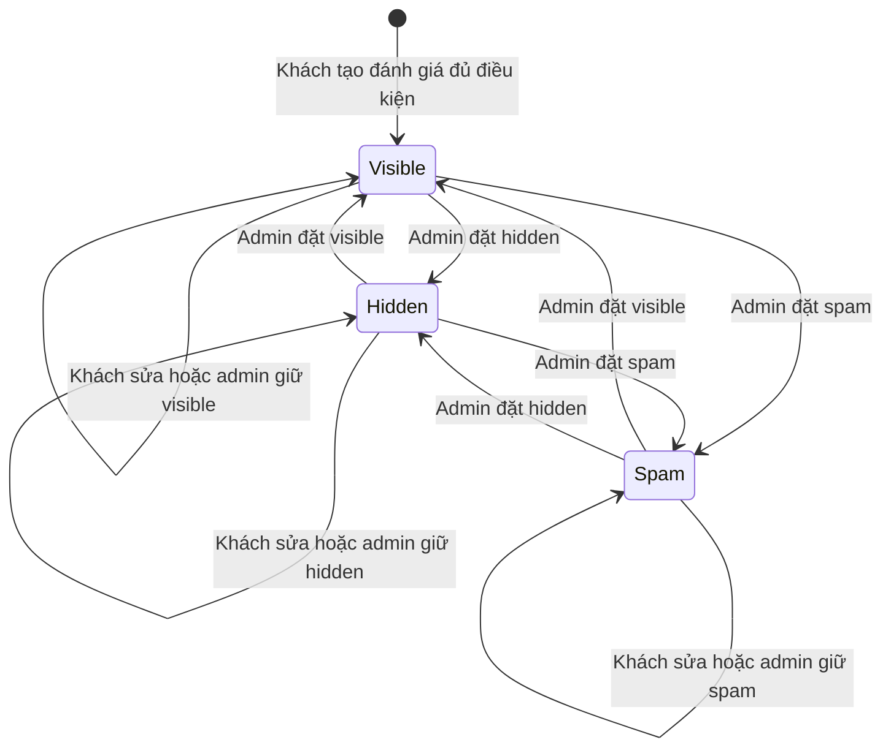
```mermaid
stateDiagram-v2
    [*] --> Visible: Khách tạo đánh giá đủ điều kiện
    Visible --> Visible: Khách sửa hoặc admin giữ visible
    Hidden --> Hidden: Khách sửa hoặc admin giữ hidden
    Spam --> Spam: Khách sửa hoặc admin giữ spam
    Visible --> Hidden: Admin đặt hidden
    Visible --> Spam: Admin đặt spam
    Hidden --> Visible: Admin đặt visible
    Hidden --> Spam: Admin đặt spam
    Spam --> Visible: Admin đặt visible
    Spam --> Hidden: Admin đặt hidden
```

Các chuyển trạng thái admin không có guard theo trạng thái nguồn: `updateStatus` chấp nhận một trong `visible`, `hidden`, `spam` và ghi trực tiếp giá trị đích. Khi khách sửa, controller chỉ cập nhật `rating` và `comment`, vì vậy trạng thái đang có được giữ nguyên. Mỗi lần tạo, sửa hoặc kiểm duyệt đều gọi tính lại `tours.average_rating` và `review_count`; truy vấn tổng hợp chỉ lấy `visible`.

**Source Code Reference**

- File: `backend_laravel/routes/api.php`; route: `POST /api/customer/tour-reviews`, `PUT /api/customer/tour-reviews/{tourReview}`, `PATCH /api/admin/tour-reviews/{tourReview}/status`, `GET /api/tours/{slug}/reviews`; middleware: `auth:sanctum`, `role:customer`, `role:admin`, throttle `10,1` cho ghi đánh giá tour.
- File: `backend_laravel/app/Http/Controllers/Api/Customer/TourReviewController.php`; class: `App\Http\Controllers\Api\Customer\TourReviewController`; methods: `store`, `update`, `normalizeComment`.
- File: `backend_laravel/app/Http/Controllers/Api/Admin/TourReviewController.php`; class: `App\Http\Controllers\Api\Admin\TourReviewController`; method: `updateStatus`.
- File: `backend_laravel/app/Http/Controllers/Api/TourReviewController.php`; class: `App\Http\Controllers\Api\TourReviewController`; method: `index`.
- File: `backend_laravel/app/Services/TourReviewService.php`; class: `App\Services\TourReviewService`; methods: `isBookingReviewable`, `refreshTourRating`, `summaryForTour`.
- Models: `App\Models\TourReview`, `App\Models\Booking`, `App\Models\Tour`.
- Migration: `backend_laravel/database/migrations/2026_07_21_000000_create_tour_reviews_table.php`; methods: `up`, `down`, `moveLegacyTourReviews`, `restoreLegacyTourReviews`, `refreshTourRatingsFrom`.
- Test: `backend_laravel/tests/Feature/TourReviewApiTest.php`; cases “khách hàng tạo và cập nhật đánh giá cho booking đã hoàn tất”, “admin kiểm duyệt đánh giá và điểm tour được tính lại”, “api công khai chỉ trả đánh giá đang hiển thị và che tên khách hàng”.

### 2.2. Booking và thanh toán VNPAY

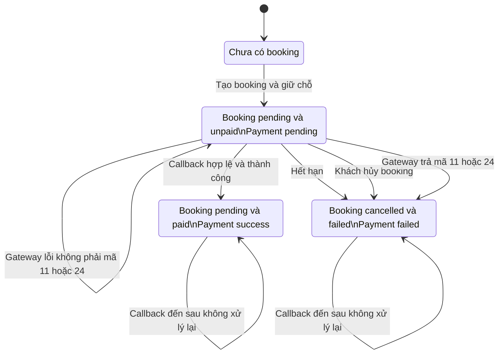
```mermaid
stateDiagram-v2
    state "Chưa có booking" as None
    state "Booking pending và unpaid\nPayment pending" as Pending
    state "Booking pending và paid\nPayment success" as Paid
    state "Booking cancelled và failed\nPayment failed" as Failed

    [*] --> None
    None --> Pending: Tạo booking và giữ chỗ
    Pending --> Pending: Tiếp tục thanh toán còn hạn
    Pending --> Pending: Gateway lỗi không phải mã 11 hoặc 24
    Pending --> Paid: Callback hợp lệ và thành công
    Pending --> Failed: Hết hạn
    Pending --> Failed: Khách hủy booking
    Pending --> Failed: Gateway trả mã 11 hoặc 24
    Paid --> Paid: Callback đến sau không xử lý lại
    Failed --> Failed: Callback đến sau không xử lý lại
```

**[Suy luận từ source code]** Các node ghép hai cột booking/payment để thể hiện một trạng thái nhất quán của luồng VNPAY. Callback thành công chỉ đổi `payments.status` thành `success` và `bookings.payment_status` thành `paid`; source không đổi `bookings.status` từ `pending` sang `confirmed`. Nhánh thất bại dùng chung service, giảm `booked_slots`, ghi lịch sử `pending` sang `cancelled`, và có guard để không xử lý payment không còn `pending`.

#### Ma trận trạng thái thanh toán của admin

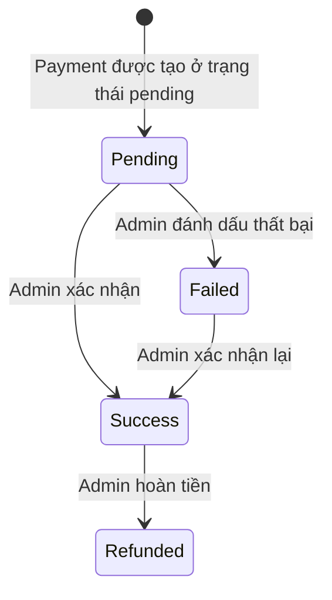
```mermaid
stateDiagram-v2
    [*] --> Pending: Payment được tạo ở trạng thái pending
    Pending --> Success: Admin xác nhận
    Pending --> Failed: Admin đánh dấu thất bại
    Failed --> Success: Admin xác nhận lại
    Success --> Refunded: Admin hoàn tiền
```

`PaymentController::updateStatus` thực hiện trong transaction, khóa dòng payment bằng `lockForUpdate()` rồi mới kiểm tra ma trận trên. Mọi cạnh khác, kể cả tự chuyển về cùng trạng thái, bị từ chối bằng validation HTTP 422; payment và `bookings.payment_status` chỉ được cập nhật khi cạnh hợp lệ.

#### Trạng thái booking do admin cập nhật hoặc hủy

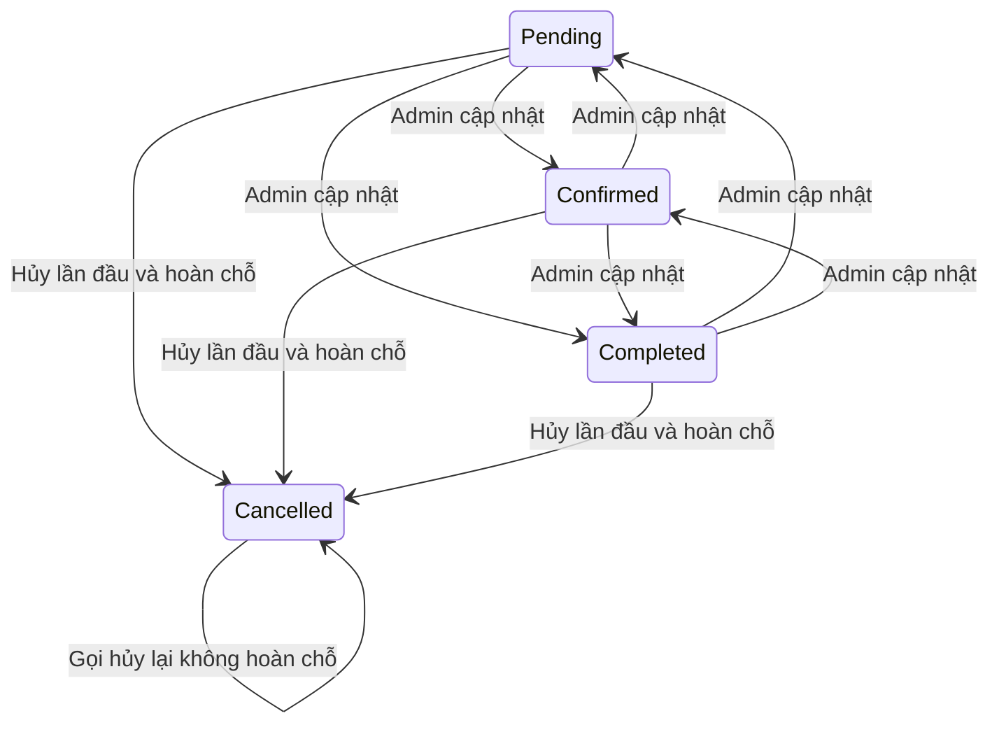
```mermaid
stateDiagram-v2
    Pending --> Confirmed: Admin cập nhật
    Pending --> Completed: Admin cập nhật
    Pending --> Cancelled: Hủy lần đầu và hoàn chỗ
    Confirmed --> Pending: Admin cập nhật
    Confirmed --> Completed: Admin cập nhật
    Confirmed --> Cancelled: Hủy lần đầu và hoàn chỗ
    Completed --> Pending: Admin cập nhật
    Completed --> Confirmed: Admin cập nhật
    Completed --> Cancelled: Hủy lần đầu và hoàn chỗ
    Cancelled --> Cancelled: Gọi hủy lại không hoàn chỗ
```

`BookingController::update` và `softDelete` đều khóa booking trong transaction. `cancelled` là trạng thái terminal đối với cập nhật trạng thái: yêu cầu chuyển từ `cancelled` sang trạng thái khác trả HTTP 422. Chỉ lần đầu một booking chưa hủy chuyển sang `cancelled` mới khóa departure và trừ `booked_slots`; thao tác hủy lặp lại không trừ thêm.

**Source Code Reference**

- File: `backend_laravel/routes/api.php`; route: `POST /api/customer/bookings`, `POST /api/customer/bookings/{booking}/continue-payment`, `PATCH /api/customer/bookings/{booking}/cancel`, `GET /api/customer/payments/vnpay/{payment}`, `GET /api/webhooks/vnpay`, `GET /api/vnpay/return-status`.
- File: `backend_laravel/app/Http/Controllers/Api/Customer/CustomerBookingController.php`; class: `App\Http\Controllers\Api\Customer\CustomerBookingController`; methods: `store`, `continuePayment`, `cancel`, `ensureDepartureCanBeBooked`.
- File: `backend_laravel/app/Http/Controllers/Api/Customer/VnpayPaymentController.php`; class: `App\Http\Controllers\Api\Customer\VnpayPaymentController`; methods: `status`, `returnStatus`, `ipn`, `processVnpayResponse`.
- File: `backend_laravel/app/Services/VnpayPaymentLifecycleService.php`; class: `App\Services\VnpayPaymentLifecycleService`; method: `failPendingPayment`.
- File: `backend_laravel/app/Console/Commands/ExpirePendingVnpayPayments.php`; class: `App\Console\Commands\ExpirePendingVnpayPayments`; method: `handle`; scheduler: `backend_laravel/routes/console.php` chạy `vnpay:expire-pending-payments` mỗi phút.
- File: `backend_laravel/app/Http/Controllers/Api/Admin/PaymentController.php`; class: `App\Http\Controllers\Api\Admin\PaymentController`; methods: `confirm`, `fail`, `refund`, `updateStatus`; routes: `PATCH /api/admin/payments/{id}/confirm`, `PATCH /api/admin/payments/{id}/fail`, `PATCH /api/admin/payments/{id}/refund`.
- File: `backend_laravel/app/Http/Controllers/Api/Admin/BookingController.php`; class: `App\Http\Controllers\Api\Admin\BookingController`; methods: `update`, `softDelete`, `releaseBookedSlots`; routes: `PUT /api/admin/bookings/{id}`, `PATCH /api/admin/bookings/{id}/cancel`.
- Models: `App\Models\Booking`, `App\Models\Payment`, `App\Models\TourDeparture`, `App\Models\BookingStatusHistory`.
- Migrations: `backend_laravel/database/migrations/2026_06_10_220060_create_bookings_table.php`, `2026_06_10_220090_create_payments_table.php`, `2026_07_15_000000_add_vnpay_expiry_to_payments_table.php`, `2026_06_10_220200_create_booking_status_histories_table.php`.
- Tests: `backend_laravel/tests/Feature/AuthBookingBusinessModelRegressionTest.php` cho ma trận payment; `backend_laravel/tests/Feature/PaymentBookingSafetyTest.php` cho payment/booking; `backend_laravel/tests/Feature/BusinessModelAuditBugFixTest.php` cho booking terminal; `backend_laravel/tests/Feature/BusinessModelConcurrencyMysqlTest.php` cho hai thao tác hủy đồng thời chỉ hoàn chỗ một lần.
- Xác minh hậu sửa: `docs/business-model-audit/11-post-fix-verification.md`; các mục `BUG-AB-004` và `BUG-SA-003`.

### 2.3. Yêu cầu hỗ trợ

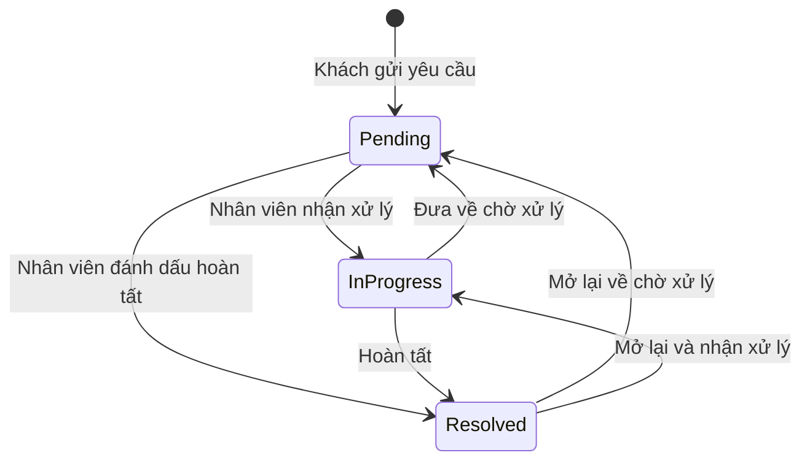
```mermaid
stateDiagram-v2
    [*] --> Pending: Khách gửi yêu cầu
    Pending --> InProgress: Nhân viên nhận xử lý
    Pending --> Resolved: Nhân viên đánh dấu hoàn tất
    InProgress --> Pending: Đưa về chờ xử lý
    InProgress --> Resolved: Hoàn tất
    Resolved --> Pending: Mở lại về chờ xử lý
    Resolved --> InProgress: Mở lại và nhận xử lý
```

Controller không kiểm tra trạng thái nguồn, nên mọi bản ghi hiện có đều có thể được đặt thành một trong ba trạng thái đích. Khi về `pending`, hệ thống xóa người nhận xử lý và hai timestamp; khi sang `in_progress`, hệ thống gán nhân viên hiện tại và đặt `started_at` nếu chưa có; khi sang `resolved`, hệ thống giữ hoặc gán người xử lý, bảo đảm `started_at`, rồi đặt `resolved_at`.

Luồng notification riêng `POST /api/notifications/support/send` cho phép nhân viên hỗ trợ gửi tới toàn bộ admin. Mỗi bản ghi được insert trong transaction với `type = support`, `status = unread` và metadata nguồn `support_to_admin`; luồng này không làm thay đổi state của support request ở sơ đồ trên.

**Source Code Reference**

- File: `backend_laravel/routes/api.php`; route: `POST /api/customer/support-requests`, `PATCH /api/support/requests/{supportRequest}/status`; middleware tương ứng `role:customer` và `role:support staff`.
- File: `backend_laravel/app/Http/Controllers/Api/Customer/CustomerSupportRequestController.php`; class: `App\Http\Controllers\Api\Customer\CustomerSupportRequestController`; methods: `store`, `generateTicketCode`, `notifySupportStaff`.
- File: `backend_laravel/app/Http/Controllers/Api/Support/SupportRequestController.php`; class: `App\Http\Controllers\Api\Support\SupportRequestController`; method: `updateStatus`.
- File: `backend_laravel/app/Http/Controllers/Api/Support/SupportNotificationController.php`; class: `App\Http\Controllers\Api\Support\SupportNotificationController`; method: `sendNotification`; route: `POST /api/notifications/support/send`.
- Models: `App\Models\SupportRequest`, `App\Models\SupportRequestAttachment`, `App\Models\Notification`.
- Migrations: `backend_laravel/database/migrations/2026_07_16_220919_create_support_requests_table.php`, `2026_07_16_220920_create_support_request_attachments_table.php`, `2026_06_24_161627_modify_notifications_table.php`.
- Test chuyên biệt cho chuyển trạng thái yêu cầu hỗ trợ: **KHÔNG TÌM THẤY BẰNG CHỨNG TRONG SOURCE CODE**.
- Test notification support: `backend_laravel/tests/Feature/BusinessModelAuditBugFixTest.php`; case “nhân viên hỗ trợ gửi được thông báo hợp lệ tới toàn bộ admin”.
- Xác minh hậu sửa: `docs/business-model-audit/11-post-fix-verification.md`; mục `BUG-SA-001`.

### 2.4. Đơn xin nghỉ hướng dẫn viên

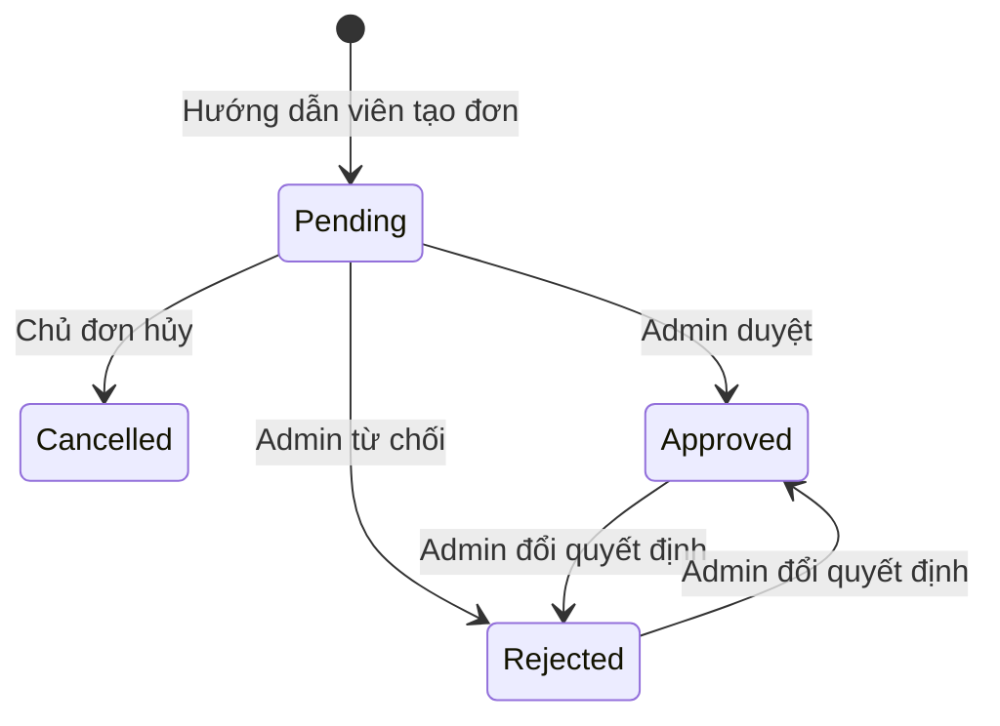
```mermaid
stateDiagram-v2
    [*] --> Pending: Hướng dẫn viên tạo đơn
    Pending --> Cancelled: Chủ đơn hủy
    Pending --> Approved: Admin duyệt
    Pending --> Rejected: Admin từ chối
    Approved --> Rejected: Admin đổi quyết định
    Rejected --> Approved: Admin đổi quyết định
```

Admin không được xử lý đơn `cancelled` và không được sửa quyết định nếu `end_date` đã trước ngày hiện tại. Ngoài hai guard này, source cho phép đổi qua lại `approved` và `rejected`. `expired`, `current`, `upcoming` trong `leaveState` là trạng thái hiển thị suy ra từ ngày, không phải giá trị lưu ở cột `status`.

Khi tạo đơn, transaction khóa dòng guide trước rồi tái kiểm tra khoảng ngày giao nhau bằng locking read trước khi insert. Khi guide hủy hoặc admin ra quyết định, cả hai flow khóa cùng dòng leave request và tái kiểm tra quyền sở hữu/trạng thái trong transaction trước khi ghi; transaction đặt retry count là `3`.

**Source Code Reference**

- File: `backend_laravel/routes/api.php`; route: `POST /api/guide/leave-requests`, `PATCH /api/guide/leave-requests/{leaveRequest}/cancel`, `POST /api/admin/guide-leave-requests/{leaveRequest}/approve`, `POST /api/admin/guide-leave-requests/{leaveRequest}/reject`, `PATCH /api/admin/guide-leave-requests/{leaveRequest}/decision`.
- File: `backend_laravel/app/Http/Controllers/Api/Guide/GuideLeaveRequestController.php`; class: `App\Http\Controllers\Api\Guide\GuideLeaveRequestController`; methods: `store`, `cancel`, `notifyAdminsAboutLeaveRequest`.
- File: `backend_laravel/app/Http/Controllers/Api/Admin/AdminGuideLeaveRequestController.php`; class: `App\Http\Controllers\Api\Admin\AdminGuideLeaveRequestController`; methods: `approve`, `reject`, `updateDecision`, `updateStatus`, `leaveState`.
- Models: `App\Models\GuideLeaveRequest`, `App\Models\GuideLeaveRequestAttachment`, `App\Models\Guide`, `App\Models\Notification`.
- Migration: `backend_laravel/database/migrations/2026_07_13_000000_create_guide_leave_requests_tables.php`.
- Tests: `backend_laravel/tests/Feature/GuideBusinessModelRegressionTest.php` cho trùng ngày, stale state và đổi quyết định; `backend_laravel/tests/Feature/BusinessModelConcurrencyMysqlTest.php` cho tạo đồng thời và cancel-vs-admin decision.
- Xác minh hậu sửa: `docs/business-model-audit/11-post-fix-verification.md`; các mục `BUG-RG-001`, `BUG-RG-002`.

### 2.5. Yêu cầu thay hướng dẫn viên

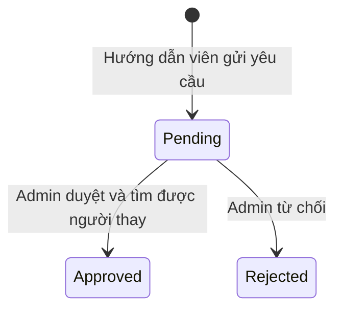
```mermaid
stateDiagram-v2
    [*] --> Pending: Hướng dẫn viên gửi yêu cầu
    Pending --> Approved: Admin duyệt và tìm được người thay
    Pending --> Rejected: Admin từ chối
```

Chỉ yêu cầu `pending` được duyệt hoặc từ chối. Khi duyệt, source đổi assignment hiện tại từ `assigned` sang `cancelled` nếu khớp điều kiện, tạo assignment `assigned` cho hướng dẫn viên thay thế và cập nhật yêu cầu thành `approved` trong transaction. Không có route hủy yêu cầu thay thế từ phía hướng dẫn viên.

Khi tạo, transaction khóa departure rồi assignment hiện tại và tái kiểm tra điều kiện ngày cùng request `pending`; file evidence đã lưu được xóa nếu transaction lỗi hoặc không tạo request. Khi duyệt hoặc từ chối, hai action cùng khóa departure trước, sau đó khóa request, tái kiểm tra `pending` rồi mới ghi assignment, request và notification trong cùng transaction; luồng duyệt còn khóa guide thay thế được chọn.

**Source Code Reference**

- File: `backend_laravel/routes/api.php`; route: `POST /api/guide/tours/{tourDeparture}/replacement-requests`, `GET /api/guide/tours/{tourDeparture}/replacement-requests/status`, `POST /api/admin/guide-replacement-requests/{id}/approve`, `POST /api/admin/guide-replacement-requests/{id}/reject`.
- File: `backend_laravel/app/Http/Controllers/Api/Guide/GuideTourController.php`; class: `App\Http\Controllers\Api\Guide\GuideTourController`; methods: `requestReplacement`, `replacementRequestStatus`, `notifyAdminsAboutReplacementRequest`.
- File: `backend_laravel/app/Http/Controllers/Api/Admin/AdminGuideReplacementRequestController.php`; class: `App\Http\Controllers\Api\Admin\AdminGuideReplacementRequestController`; methods: `approve`, `reject`, `findReplacementGuide`, `notifyResult`, `notifyAdmins`.
- Models: `App\Models\TourDeparture`, `App\Models\Guide`, `App\Models\TourGuideAssignment`, `App\Models\Notification`; model riêng cho `guide_replacement_requests`: **KHÔNG TÌM THẤY BẰNG CHỨNG TRONG SOURCE CODE** vì controller dùng `DB::table`.
- Migrations: `backend_laravel/database/migrations/2026_07_12_000000_create_guide_replacement_requests_table.php`, `2026_06_28_092905_create_tour_guide_assignments_table.php`.
- Tests: `backend_laravel/tests/Feature/GuideBusinessModelRegressionTest.php` cho request trùng và stale state; `backend_laravel/tests/Feature/BusinessModelConcurrencyMysqlTest.php` cho hai request đồng thời và approve-vs-reject.
- Xác minh hậu sửa: `docs/business-model-audit/11-post-fix-verification.md`; các mục `BUG-RG-003`, `BUG-RG-004`.

### 2.6. Điểm danh hành khách

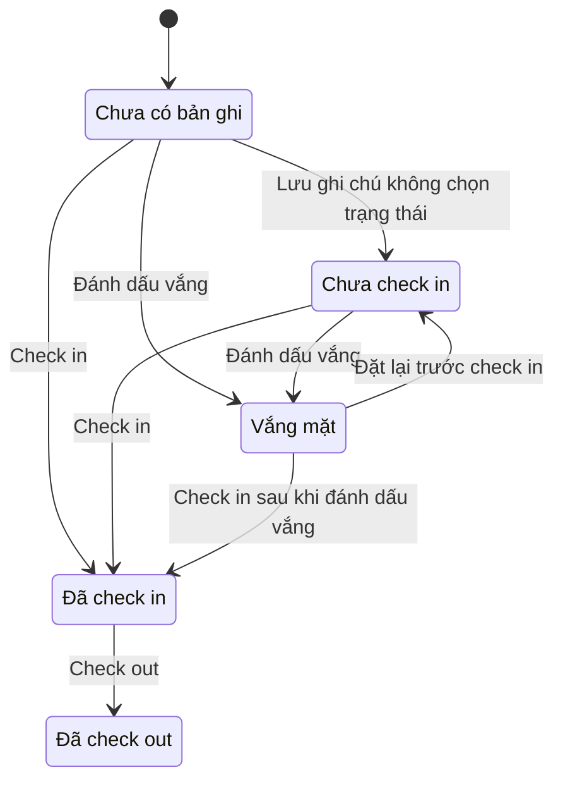
```mermaid
stateDiagram-v2
    state "Chưa có bản ghi" as None
    state "Chưa check in" as NotCheckedIn
    state "Vắng mặt" as Absent
    state "Đã check in" as CheckedIn
    state "Đã check out" as CheckedOut

    [*] --> None
    None --> NotCheckedIn: Lưu ghi chú không chọn trạng thái
    None --> Absent: Đánh dấu vắng
    None --> CheckedIn: Check in
    NotCheckedIn --> Absent: Đánh dấu vắng
    Absent --> NotCheckedIn: Đặt lại trước check in
    NotCheckedIn --> CheckedIn: Check in
    Absent --> CheckedIn: Check in sau khi đánh dấu vắng
    CheckedIn --> CheckedOut: Check out
```

`updateAttendanceNote` chỉ nhận `not_checked_in` hoặc `absent` và từ chối đổi trạng thái nếu `checked_in_at` đã có. `checkIn` chỉ chặn khi đã có `checked_in_at`, nên bản ghi `absent` vẫn có thể sang `checked_in`. `checkOut` yêu cầu đã check in và chưa check out. Tất cả thao tác còn bị chặn nếu tour không đang diễn ra, session không thuộc departure, session không `active`, sai ngày boundary hoặc hành khách không thuộc booking `confirmed` và `paid` của departure.

**Source Code Reference**

- File: `backend_laravel/routes/api.php`; routes: `POST /api/guide/tours/{tourDeparture}/attendance-sessions`, `POST /api/guide/tours/{tourDeparture}/attendance-sessions/{attendanceSession}/check-in`, `POST /api/guide/tours/{tourDeparture}/attendance-sessions/{attendanceSession}/check-out`, `PATCH /api/guide/tours/{tourDeparture}/attendance-sessions/{attendanceSession}/notes`; middleware `auth:sanctum`, `role:tour guide`.
- File: `backend_laravel/app/Http/Controllers/Api/Guide/GuideAttendanceController.php`; class: `App\Http\Controllers\Api\Guide\GuideAttendanceController`; methods: `storeSession`, `checkIn`, `checkOut`, `updateNote`.
- File: `backend_laravel/app/Services/GuideTourOperationService.php`; class: `App\Services\GuideTourOperationService`; methods: `createAttendanceSession`, `checkIn`, `checkOut`, `updateAttendanceNote`, `assignedDepartureForUser`, `assertDepartureCanTakeAttendance`, `assertSessionCanTakeAttendance`, `assertBoundaryMatchesToday`, `assertParticipantBelongsToDeparture`.
- File: `backend_laravel/app/Http/Requests/UpdateAttendanceNoteRequest.php`; class: `UpdateAttendanceNoteRequest`; method: `rules`.
- Models: `App\Models\Attendance`, `App\Models\AttendanceSession`, `App\Models\BookingParticipant`, `App\Models\TourDeparture`.
- Migrations: `backend_laravel/database/migrations/2026_07_02_143241_create_guide_attendance_and_stage_tables.php`, `2026_07_18_000000_add_boundary_to_attendance_sessions_table.php`.
- Test: `backend_laravel/tests/Feature/GuideTourAttendanceApiTest.php`; cases “only ongoing tours can create attendance sessions”, “attendance actions are only allowed on the selected boundary date”, “attendance note is visible across departure and return sessions”.

### 2.7. Tiến độ chặng tour

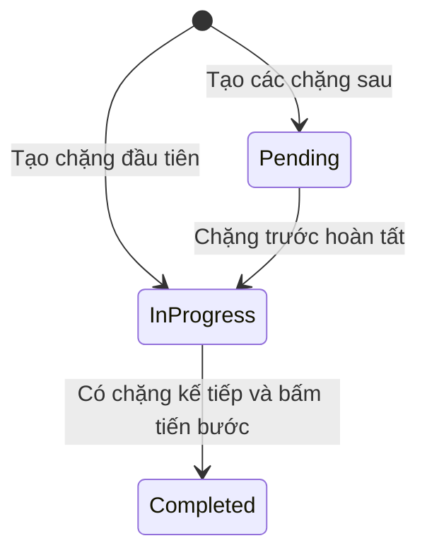
```mermaid
stateDiagram-v2
    [*] --> Pending: Tạo các chặng sau
    [*] --> InProgress: Tạo chặng đầu tiên
    Pending --> InProgress: Chặng trước hoàn tất
    InProgress --> Completed: Có chặng kế tiếp và bấm tiến bước
```

Khi chưa có chặng, service sao chép itinerary theo thứ tự; chặng đầu là `in_progress`, còn lại là `pending`. `advanceStage` chỉ chạy khi departure đang diễn ra, phải có chặng `in_progress` và phải tìm thấy chặng kế tiếp. Vì method từ chối khi đang ở chặng cuối, không có chuyển trạng thái trực tiếp nào trong method này để chặng cuối từ `in_progress` sang `completed`.

**Source Code Reference**

- File: `backend_laravel/routes/api.php`; route: `GET /api/guide/tours/{tourDeparture}/stages`, `POST /api/guide/tours/{tourDeparture}/stages/advance`.
- File: `backend_laravel/app/Http/Controllers/Api/Guide/GuideAttendanceController.php`; class: `App\Http\Controllers\Api\Guide\GuideAttendanceController`; methods: `stages`, `advanceStage`.
- File: `backend_laravel/app/Services/GuideTourOperationService.php`; class: `App\Services\GuideTourOperationService`; methods: `getStages`, `advanceStage`, `ensureStagesForDeparture`, `createStagesFromItinerary`, `findDisplayCurrentStage`.
- Models: `App\Models\TourDepartureStage`, `App\Models\TourDeparture`, `App\Models\TourItinerary`.
- Migration: `backend_laravel/database/migrations/2026_07_02_143241_create_guide_attendance_and_stage_tables.php`.
- Test trực tiếp cho `advanceStage` và chặng cuối: **KHÔNG TÌM THẤY BẰNG CHỨNG TRONG SOURCE CODE**.

### 2.8. Trạng thái phân công hướng dẫn viên có bằng chứng

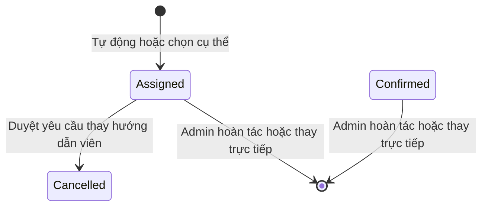
```mermaid
stateDiagram-v2
    [*] --> Assigned: Tự động hoặc chọn cụ thể
    Assigned --> Cancelled: Duyệt yêu cầu thay hướng dẫn viên
    Assigned --> [*]: Admin hoàn tác hoặc thay trực tiếp
    Confirmed --> [*]: Admin hoàn tác hoặc thay trực tiếp
```

Migration khai báo `assigned`, `confirmed`, `completed`, `cancelled`, nhưng source được tìm thấy chỉ tạo `assigned`, đổi `assigned` thành `cancelled` khi duyệt yêu cầu thay thế, hoặc xóa cứng assignment trong `cancel` và `directAssign`. Chuyển `assigned` sang `confirmed` hoặc `completed`: **KHÔNG TÌM THẤY BẰNG CHỨNG TRONG SOURCE CODE**. Vì vậy đây là state machine một phần, không phải vòng đời đầy đủ.

Cả sáu API `candidates`, `autoAssign`, `assign`, `cancel`, `directCandidates`, `directAssign` đều gọi `TourDepartureMutationGuard::assertCanMutate` và trả validation HTTP 422 khi `departure_date <= hôm nay`. Bốn luồng ghi còn khóa departure và gọi lại guard trong transaction: `autoAssign` và `assignSpecific` tại service; `cancel` và `directAssign` tại controller.

**Source Code Reference**

- File: `backend_laravel/routes/api.php`; routes: `GET /api/admin/tour-departures/{departure}/guide-candidates`, `POST /api/admin/tour-departures/{departure}/auto-assign-guide`, `POST /api/admin/tour-departures/{departure}/assign-guide`, `PATCH /api/admin/tour-departures/{departure}/guide-assignments/{assignment}/cancel`, `GET /api/admin/tour-departures/{departure}/direct-guide-candidates`, `POST /api/admin/tour-departures/{departure}/direct-assign-guide`, `POST /api/admin/guide-replacement-requests/{id}/approve`.
- File: `backend_laravel/app/Services/GuideAssignmentService.php`; class: `App\Services\GuideAssignmentService`; methods: `autoAssign`, `assignSpecific`, `eligibleGuidesQuery`, `hasScheduleConflict`.
- File: `backend_laravel/app/Http/Controllers/Api/Admin/TourDepartureGuideAssignmentController.php`; class: `TourDepartureGuideAssignmentController`; methods: `candidates`, `autoAssign`, `assign`, `cancel`, `directCandidates`, `directAssign`.
- File: `backend_laravel/app/Services/TourDepartureMutationGuard.php`; class: `App\Services\TourDepartureMutationGuard`; methods: `isLocked`, `assertCanMutate`.
- File: `backend_laravel/app/Http/Controllers/Api/Admin/AdminGuideReplacementRequestController.php`; class: `AdminGuideReplacementRequestController`; method: `approve`.
- Model: `App\Models\TourGuideAssignment`.
- Migrations: `backend_laravel/database/migrations/2026_06_28_092905_create_tour_guide_assignments_table.php`, `2026_07_07_080821_add_assignment_fields_to_tour_guide_assignments_table.php`.
- Test guard của sáu API và thao tác hủy tương lai: `backend_laravel/tests/Feature/GuideBusinessModelRegressionTest.php`; state `confirmed`/`completed` vẫn không có test chuyển trạng thái trực tiếp.
- Xác minh hậu sửa: `docs/business-model-audit/11-post-fix-verification.md`; mục `BUG-XD-001`.

### 2.9. Chiến dịch thông báo

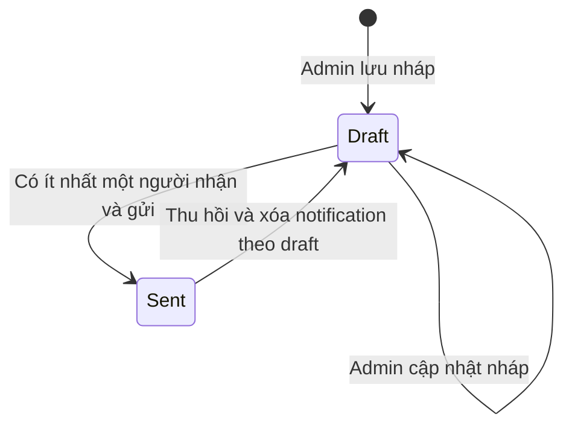
```mermaid
stateDiagram-v2
    [*] --> Draft: Admin lưu nháp
    Draft --> Draft: Admin cập nhật nháp
    Draft --> Sent: Có ít nhất một người nhận và gửi
    Sent --> Draft: Thu hồi và xóa notification theo draft
```

Xóa mềm, khôi phục và xóa vĩnh viễn là vòng đời bản ghi độc lập với enum `draft`/`sent`. `destroy` không giới hạn theo status; `restoreDraft` chỉ yêu cầu bản ghi đang bị xóa mềm; `forceDeleteDraft` tìm cả bản ghi đã hoặc chưa xóa mềm. Đây là hành vi trực tiếp của source, không phải một trạng thái bổ sung trong enum.

Khi gửi campaign, `sendNotification` mở transaction, khóa draft bằng `lockForUpdate()` và tái kiểm tra `status = draft` trước khi resolve recipient và bulk insert. Vì vậy lần gửi lặp lại sau khi draft đã thành `sent` trả HTTP 404 và không tạo thêm notification.

**Source Code Reference**

- File: `backend_laravel/routes/api.php`; route: `POST /api/admin/notifications/draft`, `PUT /api/admin/notifications/draft/{id}`, `POST /api/admin/notifications/send/{id}`, `DELETE /api/admin/notifications/revoke/{draft_id}`, các route xóa/khôi phục/xóa vĩnh viễn; middleware `role:admin`.
- File: `backend_laravel/app/Http/Controllers/Api/Admin/NotificationController.php`; class: `App\Http\Controllers\Api\Admin\NotificationController`; methods: `saveDraft`, `updateDraft`, `sendNotification`, `revoke`, `destroy`, `restoreDraft`, `forceDeleteDraft`.
- Models: `App\Models\NotificationDraft`, `App\Models\Notification`, `App\Models\User`.
- Migrations: `backend_laravel/database/migrations/2026_06_24_152026_create_notification_drafts_table.php`, `2026_06_24_155228_add_deleted_at_to_notification_drafts_table.php`, `2026_06_24_161627_modify_notifications_table.php`, `2026_06_24_165838_add_draft_id_to_notifications_table.php`.
- Tests gửi campaign: `backend_laravel/tests/Feature/BusinessModelAuditBugFixTest.php` cho gửi lặp tuần tự; `backend_laravel/tests/Feature/BusinessModelConcurrencyMysqlTest.php` cho hai lần gửi đồng thời. Test chuyên biệt cho thu hồi campaign: **KHÔNG TÌM THẤY BẰNG CHỨNG TRONG SOURCE CODE**.
- Xác minh hậu sửa: `docs/business-model-audit/11-post-fix-verification.md`; mục `BUG-SA-004`.

### 2.10. Thao tác ẩn và bỏ ẩn tour

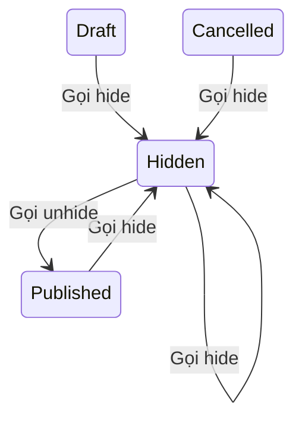
```mermaid
stateDiagram-v2
    Draft --> Hidden: Gọi hide
    Published --> Hidden: Gọi hide
    Cancelled --> Hidden: Gọi hide
    Hidden --> Hidden: Gọi hide
    Hidden --> Published: Gọi unhide
```

Đây chỉ là state machine một phần của hai endpoint chuyên biệt. `hide` không kiểm tra trạng thái nguồn; `unhide` yêu cầu nguồn là `hidden`. API `update` tổng quát vẫn có thể đặt trực tiếp bất kỳ giá trị nào trong enum, nên sơ đồ trên không đại diện cho toàn bộ vòng đời tour.

**Source Code Reference**

- File: `backend_laravel/routes/api.php`; route: `PATCH /api/admin/tours/{id}/hide`, `PATCH /api/admin/tours/{id}/unhide`, `PUT /api/admin/tours/{id}`; middleware `auth:sanctum`, `role:admin`.
- File: `backend_laravel/app/Http/Controllers/Api/Admin/TourManagerController.php`; class: `App\Http\Controllers\Api\Admin\TourManagerController`; methods: `hide`, `unhide`, `update`.
- Model: `App\Models\Tour`.
- Migration: `backend_laravel/database/migrations/2026_06_10_220020_create_tours_table.php`.
- Test trực tiếp cho `hide` và `unhide`: **KHÔNG TÌM THẤY BẰNG CHỨNG TRONG SOURCE CODE**.

### 2.11. Enum chưa đủ bằng chứng để dựng vòng đời đầy đủ

| Đối tượng | Enum migration | Hành vi trực tiếp tìm thấy | Kết luận |
| --- | --- | --- | --- |
| Tour | `draft`, `published`, `hidden`, `cancelled` | `hide` đặt bất kỳ tour tìm thấy thành `hidden`; `unhide` chỉ cho `hidden` sang `published`; `store` và `update` nhận giá trị enum đích | Không có guard trạng thái nguồn trong API cập nhật tổng quát, nên **KHÔNG TÌM THẤY BẰNG CHỨNG TRONG SOURCE CODE** về một state machine tour đầy đủ. |
| Lịch khởi hành | `open`, `closed`, `completed`, `cancelled` | `store` tạo bằng bất kỳ giá trị hợp lệ; `update` nhận bất kỳ giá trị hợp lệ nếu lịch chưa bắt đầu, đủ điều kiện slot và xác nhận khi có booking | Không có ma trận trạng thái nguồn sang trạng thái đích, nên **KHÔNG TÌM THẤY BẰNG CHỨNG TRONG SOURCE CODE** về một state machine departure đầy đủ. |
| Phiên điểm danh | `active`, `closed` | Tạo mặc định `active`; các thao tác yêu cầu `active` | Method hoặc route chuyển `active` sang `closed`: **KHÔNG TÌM THẤY BẰNG CHỨNG TRONG SOURCE CODE**. |

**Source Code Reference**

- File: `backend_laravel/app/Http/Controllers/Api/Admin/TourManagerController.php`; class: `TourManagerController`; methods: `store`, `update`, `hide`, `unhide`; route: `POST /api/admin/tours`, `PUT /api/admin/tours/{id}`, `PATCH /api/admin/tours/{id}/hide`, `PATCH /api/admin/tours/{id}/unhide`; model: `App\Models\Tour`; migration: `backend_laravel/database/migrations/2026_06_10_220020_create_tours_table.php`.
- File: `backend_laravel/app/Http/Controllers/Api/Admin/TourDepartureController.php`; class: `TourDepartureController`; methods: `store`, `update`; file `backend_laravel/app/Services/TourDepartureMutationGuard.php`; class: `TourDepartureMutationGuard`; methods: `isLocked`, `assertCanMutate`; route: `POST /api/admin/tours/{tourId}/departures`, `PUT /api/admin/tours/departures/{id}`; model: `App\Models\TourDeparture`; migration: `backend_laravel/database/migrations/2026_06_10_220040_create_tour_departures_table.php`.
- File: `backend_laravel/app/Services/GuideTourOperationService.php`; class: `GuideTourOperationService`; methods: `createAttendanceSession`, `assertSessionCanTakeAttendance`; model: `App\Models\AttendanceSession`; migrations: `backend_laravel/database/migrations/2026_07_02_143241_create_guide_attendance_and_stage_tables.php`, `2026_07_18_000000_add_boundary_to_attendance_sessions_table.php`.

## 3. Sequence Diagram

### 3.1. Đăng ký và đăng nhập

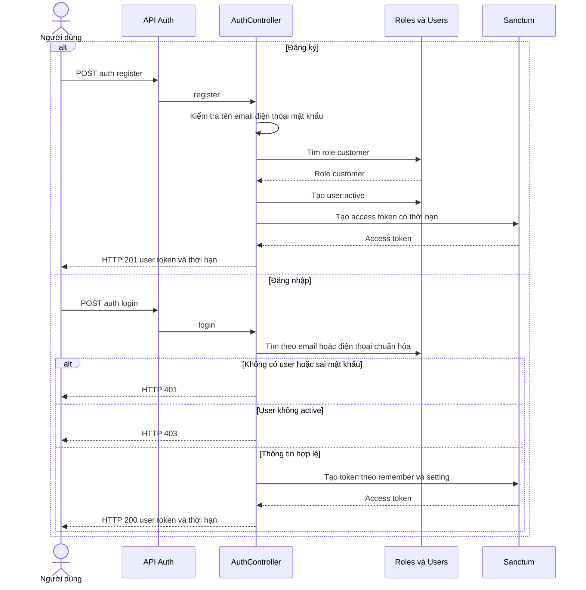
```mermaid
sequenceDiagram
    actor User as Người dùng
    participant API as API Auth
    participant Auth as AuthController
    participant DB as Roles và Users
    participant Token as Sanctum

    alt Đăng ký
        User->>API: POST auth register
        API->>Auth: register
        Auth->>Auth: Kiểm tra tên email điện thoại mật khẩu
        Auth->>DB: Tìm role customer
        DB-->>Auth: Role customer
        Auth->>DB: Tạo user active
        Auth->>Token: Tạo access token có thời hạn
        Token-->>Auth: Access token
        Auth-->>User: HTTP 201 user token và thời hạn
    else Đăng nhập
        User->>API: POST auth login
        API->>Auth: login
        Auth->>DB: Tìm theo email hoặc điện thoại chuẩn hóa
        alt Không có user hoặc sai mật khẩu
            Auth-->>User: HTTP 401
        else User không active
            Auth-->>User: HTTP 403
        else Thông tin hợp lệ
            Auth->>Token: Tạo token theo remember và setting
            Token-->>Auth: Access token
            Auth-->>User: HTTP 200 user token và thời hạn
        end
    end
```

**Source Code Reference**

- File: `backend_laravel/routes/api.php`; route: `POST /api/auth/register` với throttle `5,1`, `POST /api/auth/login` với throttle `6,1`.
- File: `backend_laravel/app/Http/Controllers/Api/AuthController.php`; class: `App\Http\Controllers\Api\AuthController`; methods: `register`, `login`.
- Models: `App\Models\User`, `App\Models\Role`, `App\Models\Setting`; token model do Laravel Sanctum sử dụng: `Laravel\Sanctum\PersonalAccessToken`.
- Migrations: `backend_laravel/database/migrations/0001_01_01_000000_create_users_table.php`, `2026_06_10_215900_create_roles_table.php`, `2026_06_10_215910_add_vivugo_columns_to_users_table.php`, `2026_06_10_055225_create_personal_access_tokens_table.php`, `2026_06_13_000001_create_settings_table.php`.
- Tests: `backend_laravel/tests/Feature/RbacAuthorizationTest.php` kiểm tra user inactive/locked không đăng nhập; `backend_laravel/tests/Feature/ApiRateLimitTest.php` kiểm tra rate limit login.

### 3.2. Booking, VNPAY và thao tác trạng thái của admin

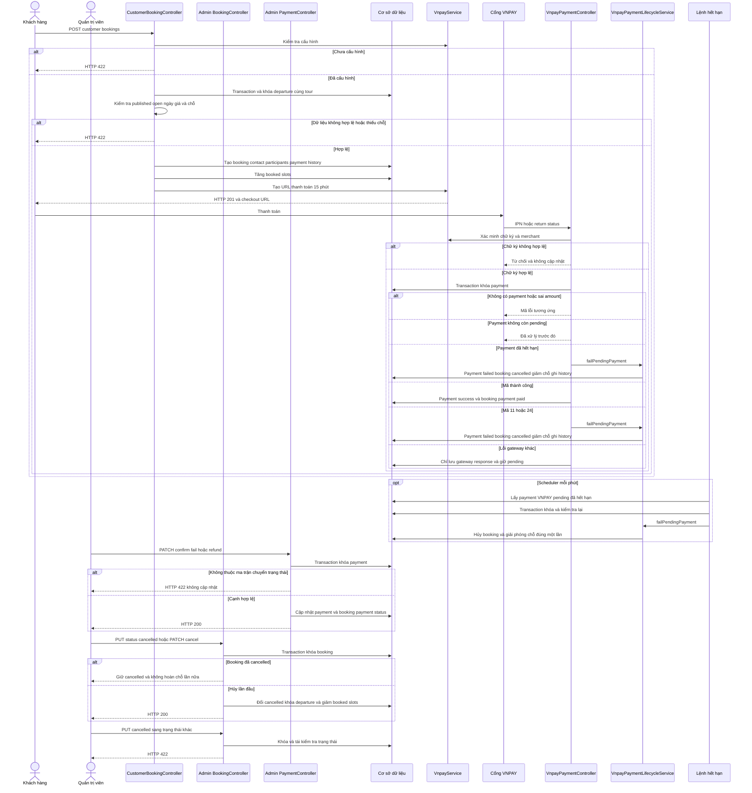
```mermaid
sequenceDiagram
    actor Customer as Khách hàng
    actor Admin as Quản trị viên
    participant Booking as CustomerBookingController
    participant AdminBooking as Admin BookingController
    participant AdminPayment as Admin PaymentController
    participant DB as Cơ sở dữ liệu
    participant VService as VnpayService
    participant VNPAY as Cổng VNPAY
    participant Callback as VnpayPaymentController
    participant Lifecycle as VnpayPaymentLifecycleService
    participant Timer as Lệnh hết hạn

    Customer->>Booking: POST customer bookings
    Booking->>VService: Kiểm tra cấu hình
    alt Chưa cấu hình
        Booking-->>Customer: HTTP 422
    else Đã cấu hình
        Booking->>DB: Transaction và khóa departure cùng tour
        Booking->>Booking: Kiểm tra published open ngày giá và chỗ
        alt Dữ liệu không hợp lệ hoặc thiếu chỗ
            Booking-->>Customer: HTTP 422
        else Hợp lệ
            Booking->>DB: Tạo booking contact participants payment history
            Booking->>DB: Tăng booked slots
            Booking->>VService: Tạo URL thanh toán 15 phút
            VService-->>Customer: HTTP 201 và checkout URL
            Customer->>VNPAY: Thanh toán
            VNPAY->>Callback: IPN hoặc return status
            Callback->>VService: Xác minh chữ ký và merchant
            alt Chữ ký không hợp lệ
                Callback-->>VNPAY: Từ chối và không cập nhật
            else Chữ ký hợp lệ
                Callback->>DB: Transaction khóa payment
                alt Không có payment hoặc sai amount
                    Callback-->>VNPAY: Mã lỗi tương ứng
                else Payment không còn pending
                    Callback-->>VNPAY: Đã xử lý trước đó
                else Payment đã hết hạn
                    Callback->>Lifecycle: failPendingPayment
                    Lifecycle->>DB: Payment failed booking cancelled giảm chỗ ghi history
                else Mã thành công
                    Callback->>DB: Payment success và booking payment paid
                else Mã 11 hoặc 24
                    Callback->>Lifecycle: failPendingPayment
                    Lifecycle->>DB: Payment failed booking cancelled giảm chỗ ghi history
                else Lỗi gateway khác
                    Callback->>DB: Chỉ lưu gateway response và giữ pending
                end
            end
        end
    end

    opt Scheduler mỗi phút
        Timer->>DB: Lấy payment VNPAY pending đã hết hạn
        Timer->>DB: Transaction khóa và kiểm tra lại
        Timer->>Lifecycle: failPendingPayment
        Lifecycle->>DB: Hủy booking và giải phóng chỗ đúng một lần
    end

    Admin->>AdminPayment: PATCH confirm fail hoặc refund
    AdminPayment->>DB: Transaction khóa payment
    alt Không thuộc ma trận chuyển trạng thái
        AdminPayment-->>Admin: HTTP 422 không cập nhật
    else Cạnh hợp lệ
        AdminPayment->>DB: Cập nhật payment và booking payment status
        AdminPayment-->>Admin: HTTP 200
    end

    Admin->>AdminBooking: PUT status cancelled hoặc PATCH cancel
    AdminBooking->>DB: Transaction khóa booking
    alt Booking đã cancelled
        AdminBooking-->>Admin: Giữ cancelled và không hoàn chỗ lần nữa
    else Hủy lần đầu
        AdminBooking->>DB: Đổi cancelled khóa departure và giảm booked slots
        AdminBooking-->>Admin: HTTP 200
    end
    Admin->>AdminBooking: PUT cancelled sang trạng thái khác
    AdminBooking->>DB: Khóa và tái kiểm tra trạng thái
    AdminBooking-->>Admin: HTTP 422
```

**Source Code Reference**

- File: `backend_laravel/routes/api.php`; routes khách/VNPAY: `POST /api/customer/bookings`, `POST /api/customer/bookings/{booking}/continue-payment`, `PATCH /api/customer/bookings/{booking}/cancel`, `GET /api/webhooks/vnpay`, `GET /api/vnpay/return-status`; routes admin: `PATCH /api/admin/payments/{id}/confirm`, `PATCH /api/admin/payments/{id}/fail`, `PATCH /api/admin/payments/{id}/refund`, `PUT /api/admin/bookings/{id}`, `PATCH /api/admin/bookings/{id}/cancel`.
- File: `backend_laravel/app/Http/Controllers/Api/Customer/CustomerBookingController.php`; class: `CustomerBookingController`; methods: `store`, `continuePayment`, `cancel`, `ensureDepartureCanBeBooked`, `buildQuantityPricing`.
- File: `backend_laravel/app/Services/VnpayService.php`; class: `App\Services\VnpayService`; methods: `isConfigured`, `createPaymentUrl`, `verifyResponse`.
- File: `backend_laravel/app/Http/Controllers/Api/Customer/VnpayPaymentController.php`; class: `VnpayPaymentController`; methods: `ipn`, `returnStatus`, `processVnpayResponse`, `paymentStatusResponse`.
- File: `backend_laravel/app/Services/VnpayPaymentLifecycleService.php`; class: `VnpayPaymentLifecycleService`; method: `failPendingPayment`.
- File: `backend_laravel/app/Console/Commands/ExpirePendingVnpayPayments.php`; class: `ExpirePendingVnpayPayments`; method: `handle`; scheduler: `backend_laravel/routes/console.php`.
- File: `backend_laravel/app/Http/Controllers/Api/Admin/PaymentController.php`; class: `PaymentController`; methods: `confirm`, `fail`, `refund`, `updateStatus`.
- File: `backend_laravel/app/Http/Controllers/Api/Admin/BookingController.php`; class: `BookingController`; methods: `update`, `softDelete`, `releaseBookedSlots`.
- Models: `App\Models\Tour`, `TourDeparture`, `Booking`, `BookingContact`, `BookingParticipant`, `Payment`, `BookingStatusHistory`.
- Migrations: `backend_laravel/database/migrations/2026_06_10_220040_create_tour_departures_table.php`, `2026_06_10_220060_create_bookings_table.php`, `2026_06_10_220070_create_booking_contacts_table.php`, `2026_06_10_220080_create_booking_participants_table.php`, `2026_06_10_220090_create_payments_table.php`, `2026_06_10_220200_create_booking_status_histories_table.php`, `2026_07_15_000000_add_vnpay_expiry_to_payments_table.php`.
- Tests: `backend_laravel/tests/Feature/AuthBookingBusinessModelRegressionTest.php`, `PaymentBookingSafetyTest.php`, `BusinessModelAuditBugFixTest.php`, `BusinessModelConcurrencyMysqlTest.php` trong `backend_laravel/tests/Feature`.
- Xác minh hậu sửa: `docs/business-model-audit/11-post-fix-verification.md`; các mục `BUG-AB-004`, `BUG-SA-003`.

### 3.3. Tạo, sửa, kiểm duyệt và đọc đánh giá tour

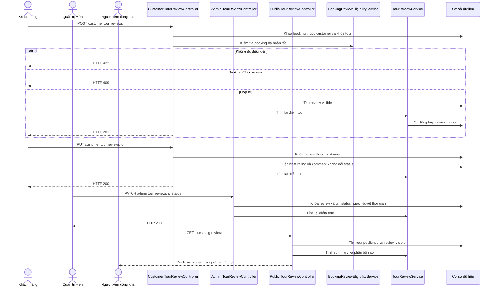
```mermaid
sequenceDiagram
    actor Customer as Khách hàng
    actor Admin as Quản trị viên
    actor Public as Người xem công khai
    participant CReview as Customer TourReviewController
    participant AReview as Admin TourReviewController
    participant PReview as Public TourReviewController
    participant Eligibility as BookingReviewEligibilityService
    participant Service as TourReviewService
    participant DB as Cơ sở dữ liệu

    Customer->>CReview: POST customer tour reviews
    CReview->>DB: Khóa booking thuộc customer và khóa tour
    CReview->>Eligibility: Kiểm tra booking đã hoàn tất
    alt Không đủ điều kiện
        CReview-->>Customer: HTTP 422
    else Booking đã có review
        CReview-->>Customer: HTTP 409
    else Hợp lệ
        CReview->>DB: Tạo review visible
        CReview->>Service: Tính lại điểm tour
        Service->>DB: Chỉ tổng hợp review visible
        CReview-->>Customer: HTTP 201
    end

    Customer->>CReview: PUT customer tour reviews id
    CReview->>DB: Khóa review thuộc customer
    CReview->>DB: Cập nhật rating và comment không đổi status
    CReview->>Service: Tính lại điểm tour
    CReview-->>Customer: HTTP 200

    Admin->>AReview: PATCH admin tour reviews id status
    AReview->>DB: Khóa review và ghi status người duyệt thời gian
    AReview->>Service: Tính lại điểm tour
    AReview-->>Admin: HTTP 200

    Public->>PReview: GET tours slug reviews
    PReview->>DB: Tìm tour published và review visible
    PReview->>Service: Tính summary và phân bố sao
    PReview-->>Public: Danh sách phân trang và tên rút gọn
```

**Source Code Reference**

- File: `backend_laravel/routes/api.php`; routes: `POST /api/customer/tour-reviews`, `PUT /api/customer/tour-reviews/{tourReview}`, `PATCH /api/admin/tour-reviews/{tourReview}/status`, `GET /api/tours/{slug}/reviews`.
- File: `backend_laravel/app/Http/Controllers/Api/Customer/TourReviewController.php`; class: customer `TourReviewController`; methods: `store`, `update`.
- File: `backend_laravel/app/Http/Controllers/Api/Admin/TourReviewController.php`; class: admin `TourReviewController`; methods: `index`, `show`, `updateStatus`.
- File: `backend_laravel/app/Http/Controllers/Api/TourReviewController.php`; class: public `TourReviewController`; method: `index`.
- Files: `backend_laravel/app/Services/BookingReviewEligibilityService.php`, `backend_laravel/app/Services/TourReviewService.php`; classes: `BookingReviewEligibilityService`, `TourReviewService`; methods: `isReviewable`, `refreshTourRating`, `summaryForTour`.
- Requests: `StoreTourReviewRequest::rules`, `UpdateTourReviewRequest::rules`, `UpdateTourReviewStatusRequest::rules`.
- Models: `App\Models\TourReview`, `Booking`, `Tour`, `User`.
- Migration: `backend_laravel/database/migrations/2026_07_21_000000_create_tour_reviews_table.php`.
- Test: `backend_laravel/tests/Feature/TourReviewApiTest.php`.

### 3.4. Đánh giá hướng dẫn viên và nhắc đánh giá

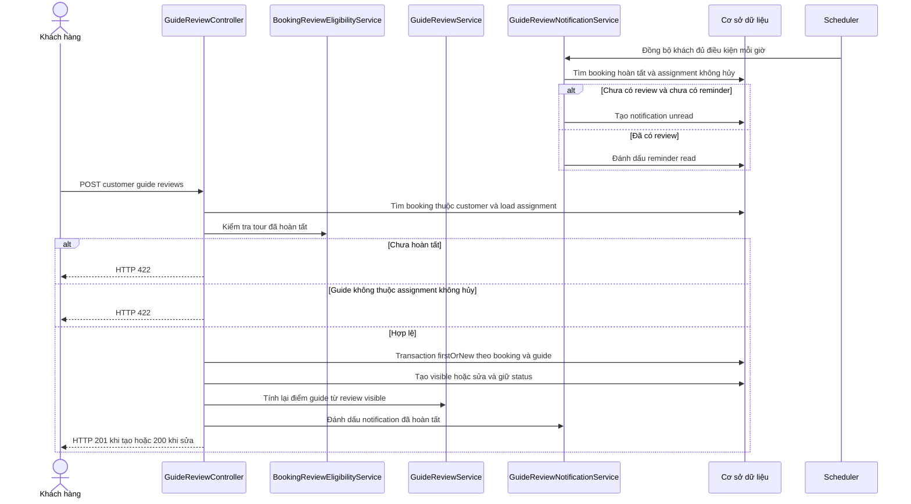
```mermaid
sequenceDiagram
    actor Customer as Khách hàng
    participant Review as GuideReviewController
    participant Eligibility as BookingReviewEligibilityService
    participant Service as GuideReviewService
    participant Reminder as GuideReviewNotificationService
    participant DB as Cơ sở dữ liệu
    participant Scheduler as Scheduler

    Scheduler->>Reminder: Đồng bộ khách đủ điều kiện mỗi giờ
    Reminder->>DB: Tìm booking hoàn tất và assignment không hủy
    alt Chưa có review và chưa có reminder
        Reminder->>DB: Tạo notification unread
    else Đã có review
        Reminder->>DB: Đánh dấu reminder read
    end

    Customer->>Review: POST customer guide reviews
    Review->>DB: Tìm booking thuộc customer và load assignment
    Review->>Eligibility: Kiểm tra tour đã hoàn tất
    alt Chưa hoàn tất
        Review-->>Customer: HTTP 422
    else Guide không thuộc assignment không hủy
        Review-->>Customer: HTTP 422
    else Hợp lệ
        Review->>DB: Transaction firstOrNew theo booking và guide
        Review->>DB: Tạo visible hoặc sửa và giữ status
        Review->>Service: Tính lại điểm guide từ review visible
        Review->>Reminder: Đánh dấu notification đã hoàn tất
        Review-->>Customer: HTTP 201 khi tạo hoặc 200 khi sửa
    end
```

**Source Code Reference**

- File: `backend_laravel/routes/api.php`; route: `GET /api/customer/guide-reviewable-bookings`, `POST /api/customer/guide-reviews`, `GET /api/customer/guides/{guide}/reviews`, `GET /api/guide/reviews`; scheduler `guide-reviews:send-reminders` tại `backend_laravel/routes/console.php`.
- File: `backend_laravel/app/Http/Controllers/Api/Customer/GuideReviewController.php`; class: `App\Http\Controllers\Api\Customer\GuideReviewController`; methods: `reviewableBookings`, `store`, `guideReviews`.
- Files: `backend_laravel/app/Services/BookingReviewEligibilityService.php`, `backend_laravel/app/Services/GuideReviewService.php`, `backend_laravel/app/Services/GuideReviewNotificationService.php`; classes: `BookingReviewEligibilityService`, `GuideReviewService`, `GuideReviewNotificationService`; methods: `isReviewable`, `refreshGuideRating`, `syncAllEligibleCustomers`, `syncForUser`, `markAsCompleted`.
- File: `backend_laravel/app/Console/Commands/SendGuideReviewReminders.php`; class: `SendGuideReviewReminders`; method: `handle`.
- Models: `App\Models\Review`, `Guide`, `Booking`, `TourGuideAssignment`, `Notification`.
- Migrations: `backend_laravel/database/migrations/2026_06_10_220100_create_reviews_table.php`, `2026_07_11_112416_add_guide_context_to_reviews_table.php`, `2026_06_24_161627_modify_notifications_table.php`.
- Test: `backend_laravel/tests/Feature/GuideReviewApiTest.php`.

### 3.5. Admin sửa lịch khởi hành và gửi thông báo

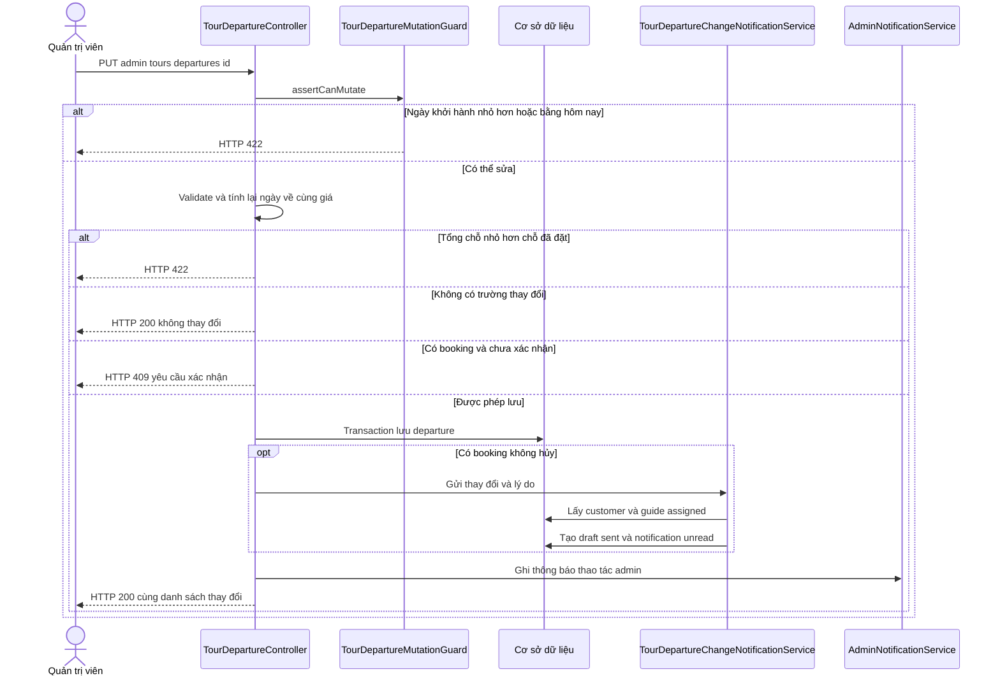
```mermaid
sequenceDiagram
    actor Admin as Quản trị viên
    participant Controller as TourDepartureController
    participant Guard as TourDepartureMutationGuard
    participant DB as Cơ sở dữ liệu
    participant Notify as TourDepartureChangeNotificationService
    participant AdminNotify as AdminNotificationService

    Admin->>Controller: PUT admin tours departures id
    Controller->>Guard: assertCanMutate
    alt Ngày khởi hành nhỏ hơn hoặc bằng hôm nay
        Guard-->>Admin: HTTP 422
    else Có thể sửa
        Controller->>Controller: Validate và tính lại ngày về cùng giá
        alt Tổng chỗ nhỏ hơn chỗ đã đặt
            Controller-->>Admin: HTTP 422
        else Không có trường thay đổi
            Controller-->>Admin: HTTP 200 không thay đổi
        else Có booking và chưa xác nhận
            Controller-->>Admin: HTTP 409 yêu cầu xác nhận
        else Được phép lưu
            Controller->>DB: Transaction lưu departure
            opt Có booking không hủy
                Controller->>Notify: Gửi thay đổi và lý do
                Notify->>DB: Lấy customer và guide assigned
                Notify->>DB: Tạo draft sent và notification unread
            end
            Controller->>AdminNotify: Ghi thông báo thao tác admin
            Controller-->>Admin: HTTP 200 cùng danh sách thay đổi
        end
    end
```

**Source Code Reference**

- File: `backend_laravel/routes/api.php`; route: `PUT /api/admin/tours/departures/{id}`; middleware `auth:sanctum`, `role:admin`.
- File: `backend_laravel/app/Http/Controllers/Api/Admin/TourDepartureController.php`; class: `TourDepartureController`; methods: `update`, `calculateReturnDate`, `normalizeUpdatedPrices`.
- File: `backend_laravel/app/Services/TourDepartureMutationGuard.php`; class: `TourDepartureMutationGuard`; method: `assertCanMutate`.
- File: `backend_laravel/app/Services/TourDepartureChangeNotificationService.php`; class: `TourDepartureChangeNotificationService`; methods: `sendForUpdatedDeparture`, `buildChangedText`.
- File: `backend_laravel/app/Services/AdminNotificationService.php`; class: `AdminNotificationService`; method: `notifyTourDepartureUpdated`.
- Models: `App\Models\TourDeparture`, `Booking`, `TourGuideAssignment`, `NotificationDraft`, `Notification`.
- Migrations: `backend_laravel/database/migrations/2026_06_10_220040_create_tour_departures_table.php`, `2026_06_24_152026_create_notification_drafts_table.php`, `2026_06_24_161627_modify_notifications_table.php`, `2026_06_24_165838_add_draft_id_to_notifications_table.php`.
- Test: `backend_laravel/tests/Feature/TourDepartureApiTest.php` kiểm tra tính lại ngày về và giới hạn `total_slots`; test chuyên biệt cho xác nhận và notification khi lịch đã có booking: **KHÔNG TÌM THẤY BẰNG CHỨNG TRONG SOURCE CODE**.

### 3.6. Phân công hướng dẫn viên

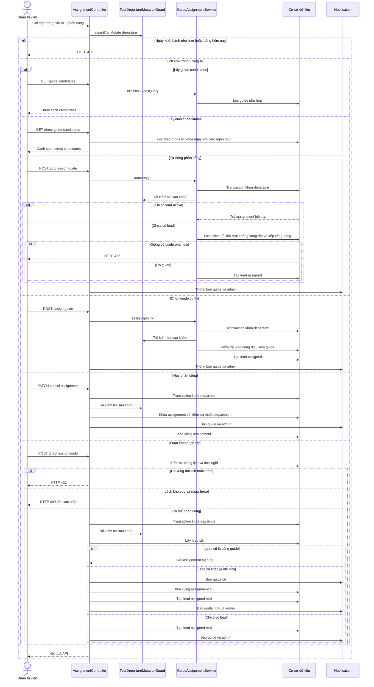
```mermaid
sequenceDiagram
    actor Admin as Quản trị viên
    participant Controller as AssignmentController
    participant Guard as TourDepartureMutationGuard
    participant Service as GuideAssignmentService
    participant DB as Cơ sở dữ liệu
    participant Notify as Notification

    Admin->>Controller: Gọi một trong sáu API phân công
    Controller->>Guard: assertCanMutate departure
    alt Ngày khởi hành nhỏ hơn hoặc bằng hôm nay
        Guard-->>Admin: HTTP 422
    else Lịch còn trong tương lai
      alt Lấy guide candidates
        Admin->>Controller: GET guide candidates
        Controller->>Service: eligibleGuidesQuery
        Service->>DB: Lọc guide phù hợp
        Controller-->>Admin: Danh sách candidates
      else Lấy direct candidates
        Admin->>Controller: GET direct guide candidates
        Controller->>DB: Lọc theo mode từ khóa ngày khu vực ngôn ngữ
        Controller-->>Admin: Danh sách direct candidates
      else Tự động phân công
        Admin->>Controller: POST auto assign guide
        Controller->>Service: autoAssign
        Service->>DB: Transaction khóa departure
        Service->>Guard: Tái kiểm tra sau khóa
        alt Đã có lead active
            DB-->>Service: Trả assignment hiện tại
        else Chưa có lead
            Service->>DB: Lọc active đủ khu vực không xung đột và xếp công bằng
            alt Không có guide phù hợp
                Service-->>Admin: HTTP 422
            else Có guide
                Service->>DB: Tạo lead assigned
            end
        end
        Controller->>Notify: Thông báo guide và admin
      else Chọn guide cụ thể
        Admin->>Controller: POST assign guide
        Controller->>Service: assignSpecific
        Service->>DB: Transaction khóa departure
        Service->>Guard: Tái kiểm tra sau khóa
        Service->>DB: Kiểm tra lead cùng điều kiện guide
        Service->>DB: Tạo lead assigned
        Controller->>Notify: Thông báo guide và admin
      else Hủy phân công
        Admin->>Controller: PATCH cancel assignment
        Controller->>DB: Transaction khóa departure
        Controller->>Guard: Tái kiểm tra sau khóa
        Controller->>DB: Khóa assignment và kiểm tra thuộc departure
        Controller->>Notify: Báo guide và admin
        Controller->>DB: Xóa cứng assignment
      else Phân công trực tiếp
        Admin->>Controller: POST direct assign guide
        Controller->>DB: Kiểm tra trùng lịch và đơn nghỉ
        alt Có xung đột lịch hoặc nghỉ
            Controller-->>Admin: HTTP 422
        else Lệch khu vực và chưa force
            Controller-->>Admin: HTTP 409 cần xác nhận
        else Có thể phân công
            Controller->>DB: Transaction khóa departure
            Controller->>Guard: Tái kiểm tra sau khóa
            Controller->>DB: Lấy lead cũ
            alt Lead cũ là cùng guide
                DB-->>Controller: Giữ assignment hiện tại
            else Lead cũ khác guide mới
                Controller->>Notify: Báo guide cũ
                Controller->>DB: Xóa cứng assignment cũ
                Controller->>DB: Tạo lead assigned mới
                Controller->>Notify: Báo guide mới và admin
            else Chưa có lead
                Controller->>DB: Tạo lead assigned mới
                Controller->>Notify: Báo guide và admin
            end
        end
      end
      Controller-->>Admin: Kết quả API
    end
```

**Source Code Reference**

- File: `backend_laravel/routes/api.php`; routes: `GET /api/admin/tour-departures/{departure}/guide-candidates`, `POST /api/admin/tour-departures/{departure}/auto-assign-guide`, `POST /api/admin/tour-departures/{departure}/assign-guide`, `PATCH /api/admin/tour-departures/{departure}/guide-assignments/{assignment}/cancel`, `GET /api/admin/tour-departures/{departure}/direct-guide-candidates`, `POST /api/admin/tour-departures/{departure}/direct-assign-guide`.
- File: `backend_laravel/app/Http/Controllers/Api/Admin/TourDepartureGuideAssignmentController.php`; class: `TourDepartureGuideAssignmentController`; methods: `candidates`, `autoAssign`, `assign`, `cancel`, `directCandidates`, `directAssign`, các method notification liên quan.
- File: `backend_laravel/app/Services/GuideAssignmentService.php`; class: `GuideAssignmentService`; methods: `eligibleGuidesQuery`, `applyFairWorkloadOrder`, `hasScheduleConflict`, `autoAssign`, `assignSpecific`.
- File: `backend_laravel/app/Services/TourDepartureMutationGuard.php`; class: `TourDepartureMutationGuard`; methods: `isLocked`, `assertCanMutate`.
- Models: `App\Models\TourDeparture`, `Guide`, `TourGuideAssignment`, `GuideLeaveRequest`, `Notification`.
- Migrations: `backend_laravel/database/migrations/2026_06_28_092905_create_tour_guide_assignments_table.php`, `2026_07_07_055358_create_guide_destinations_table.php`, `2026_07_07_080821_add_assignment_fields_to_tour_guide_assignments_table.php`, `2026_07_13_000000_create_guide_leave_requests_tables.php`.
- Test guard của sáu API và hard delete assignment tương lai: `backend_laravel/tests/Feature/GuideBusinessModelRegressionTest.php`.
- Xác minh hậu sửa: `docs/business-model-audit/11-post-fix-verification.md`; mục `BUG-XD-001`.

### 3.7. Điểm danh và tiến độ tour

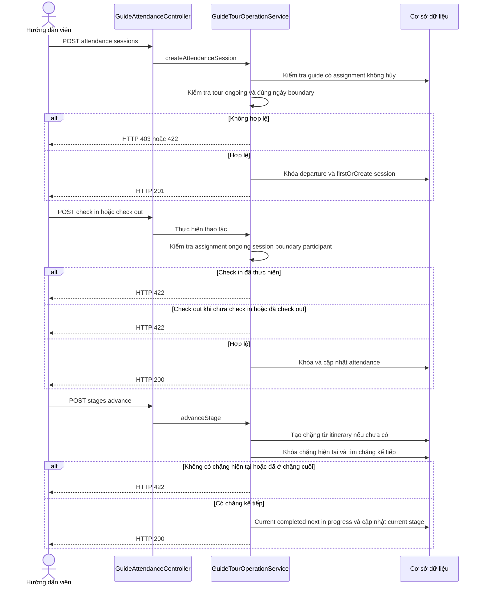
```mermaid
sequenceDiagram
    actor Guide as Hướng dẫn viên
    participant Controller as GuideAttendanceController
    participant Service as GuideTourOperationService
    participant DB as Cơ sở dữ liệu

    Guide->>Controller: POST attendance sessions
    Controller->>Service: createAttendanceSession
    Service->>DB: Kiểm tra guide có assignment không hủy
    Service->>Service: Kiểm tra tour ongoing và đúng ngày boundary
    alt Không hợp lệ
        Service-->>Guide: HTTP 403 hoặc 422
    else Hợp lệ
        Service->>DB: Khóa departure và firstOrCreate session
        Service-->>Guide: HTTP 201
    end

    Guide->>Controller: POST check in hoặc check out
    Controller->>Service: Thực hiện thao tác
    Service->>Service: Kiểm tra assignment ongoing session boundary participant
    alt Check in đã thực hiện
        Service-->>Guide: HTTP 422
    else Check out khi chưa check in hoặc đã check out
        Service-->>Guide: HTTP 422
    else Hợp lệ
        Service->>DB: Khóa và cập nhật attendance
        Service-->>Guide: HTTP 200
    end

    Guide->>Controller: POST stages advance
    Controller->>Service: advanceStage
    Service->>DB: Tạo chặng từ itinerary nếu chưa có
    Service->>DB: Khóa chặng hiện tại và tìm chặng kế tiếp
    alt Không có chặng hiện tại hoặc đã ở chặng cuối
        Service-->>Guide: HTTP 422
    else Có chặng kế tiếp
        Service->>DB: Current completed next in progress và cập nhật current stage
        Service-->>Guide: HTTP 200
    end
```

**Source Code Reference**

- File: `backend_laravel/routes/api.php`; routes: `POST /api/guide/tours/{tourDeparture}/attendance-sessions`, `POST /api/guide/tours/{tourDeparture}/attendance-sessions/{attendanceSession}/check-in`, `POST /api/guide/tours/{tourDeparture}/attendance-sessions/{attendanceSession}/check-out`, `PATCH /api/guide/tours/{tourDeparture}/attendance-sessions/{attendanceSession}/notes`, `GET /api/guide/tours/{tourDeparture}/stages`, `POST /api/guide/tours/{tourDeparture}/stages/advance`.
- File: `backend_laravel/app/Http/Controllers/Api/Guide/GuideAttendanceController.php`; class: `GuideAttendanceController`; methods: `storeSession`, `checkIn`, `checkOut`, `updateNote`, `stages`, `advanceStage`.
- File: `backend_laravel/app/Services/GuideTourOperationService.php`; class: `GuideTourOperationService`; methods: `assignedDepartureForUser`, `assertDepartureCanTakeAttendance`, `assertSessionBelongsToDeparture`, `assertSessionCanTakeAttendance`, `assertBoundaryMatchesToday`, `assertParticipantBelongsToDeparture`, `createAttendanceSession`, `checkIn`, `checkOut`, `updateAttendanceNote`, `ensureStagesForDeparture`, `createStagesFromItinerary`, `advanceStage`.
- Models: `App\Models\AttendanceSession`, `Attendance`, `BookingParticipant`, `TourDepartureStage`, `TourDeparture`, `TourItinerary`.
- Migrations: `backend_laravel/database/migrations/2026_07_02_143241_create_guide_attendance_and_stage_tables.php`, `2026_07_18_000000_add_boundary_to_attendance_sessions_table.php`.
- Test: `backend_laravel/tests/Feature/GuideTourAttendanceApiTest.php` cho session/boundary; test trực tiếp check-out và advance stage: **KHÔNG TÌM THẤY BẰNG CHỨNG TRONG SOURCE CODE**.

### 3.8. Gửi và xử lý yêu cầu hỗ trợ

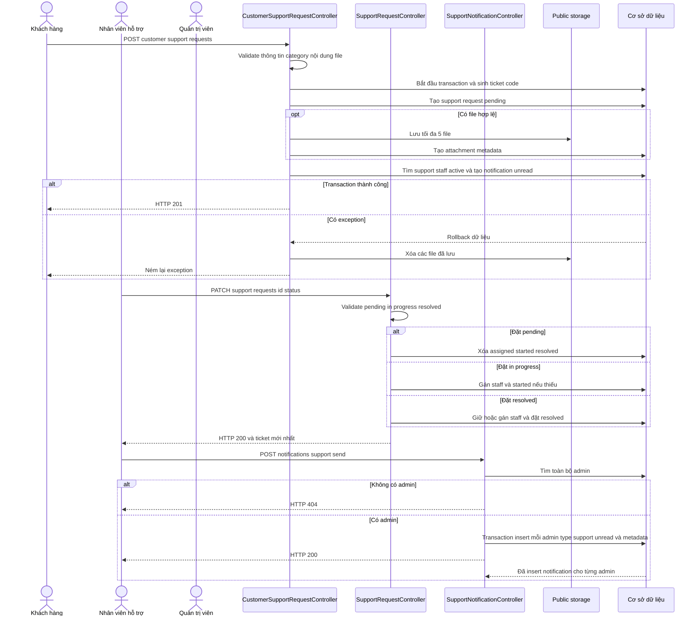
```mermaid
sequenceDiagram
    actor Customer as Khách hàng
    actor Staff as Nhân viên hỗ trợ
    actor Admin as Quản trị viên
    participant CustomerAPI as CustomerSupportRequestController
    participant SupportAPI as SupportRequestController
    participant SupportNotify as SupportNotificationController
    participant Storage as Public storage
    participant DB as Cơ sở dữ liệu

    Customer->>CustomerAPI: POST customer support requests
    CustomerAPI->>CustomerAPI: Validate thông tin category nội dung file
    CustomerAPI->>DB: Bắt đầu transaction và sinh ticket code
    CustomerAPI->>DB: Tạo support request pending
    opt Có file hợp lệ
        CustomerAPI->>Storage: Lưu tối đa 5 file
        CustomerAPI->>DB: Tạo attachment metadata
    end
    CustomerAPI->>DB: Tìm support staff active và tạo notification unread
    alt Transaction thành công
        CustomerAPI-->>Customer: HTTP 201
    else Có exception
        DB-->>CustomerAPI: Rollback dữ liệu
        CustomerAPI->>Storage: Xóa các file đã lưu
        CustomerAPI-->>Customer: Ném lại exception
    end

    Staff->>SupportAPI: PATCH support requests id status
    SupportAPI->>SupportAPI: Validate pending in progress resolved
    alt Đặt pending
        SupportAPI->>DB: Xóa assigned started resolved
    else Đặt in progress
        SupportAPI->>DB: Gán staff và started nếu thiếu
    else Đặt resolved
        SupportAPI->>DB: Giữ hoặc gán staff và đặt resolved
    end
    SupportAPI-->>Staff: HTTP 200 và ticket mới nhất

    Staff->>SupportNotify: POST notifications support send
    SupportNotify->>DB: Tìm toàn bộ admin
    alt Không có admin
        SupportNotify-->>Staff: HTTP 404
    else Có admin
        SupportNotify->>DB: Transaction insert mỗi admin type support unread và metadata
        SupportNotify-->>Staff: HTTP 200
        DB-->>SupportNotify: Đã insert notification cho từng admin
    end
```

**Source Code Reference**

- File: `backend_laravel/routes/api.php`; route: `POST /api/customer/support-requests`, `GET /api/support/requests`, `GET /api/support/requests/{supportRequest}`, `PATCH /api/support/requests/{supportRequest}/status`.
- File: `backend_laravel/app/Http/Controllers/Api/Customer/CustomerSupportRequestController.php`; class: `CustomerSupportRequestController`; methods: `store`, `generateTicketCode`, `notifySupportStaff`, `getSupportUserIds`.
- File: `backend_laravel/app/Http/Controllers/Api/Support/SupportRequestController.php`; class: `SupportRequestController`; methods: `index`, `show`, `updateStatus`.
- File: `backend_laravel/app/Http/Controllers/Api/Support/SupportNotificationController.php`; class: `SupportNotificationController`; method: `sendNotification`; route: `POST /api/notifications/support/send`.
- Models: `App\Models\SupportRequest`, `SupportRequestAttachment`, `Notification`, `User`.
- Migrations: `backend_laravel/database/migrations/2026_07_16_220919_create_support_requests_table.php`, `2026_07_16_220920_create_support_request_attachments_table.php`, `2026_06_24_161627_modify_notifications_table.php`.
- Test chuyên biệt cho chuyển trạng thái support request: **KHÔNG TÌM THẤY BẰNG CHỨNG TRONG SOURCE CODE**.
- Test riêng cho notification support: `backend_laravel/tests/Feature/BusinessModelAuditBugFixTest.php`.
- Xác minh hậu sửa: `docs/business-model-audit/11-post-fix-verification.md`; mục `BUG-SA-001`.

### 3.9. Đơn xin nghỉ hướng dẫn viên

```mermaid
sequenceDiagram
    actor Guide as Hướng dẫn viên
    actor Admin as Quản trị viên
    participant GuideAPI as GuideLeaveRequestController
    participant AdminAPI as AdminGuideLeaveRequestController
    participant Storage as Public storage
    participant DB as Cơ sở dữ liệu

    Guide->>GuideAPI: POST guide leave requests
    GuideAPI->>GuideAPI: Kiểm tra hồ sơ guide bảng và ngày trước ít nhất 5 ngày
    GuideAPI->>DB: Transaction khóa guide
    GuideAPI->>DB: Locking read đơn pending hoặc approved giao nhau
    alt Bị trùng hoặc validation lỗi
        GuideAPI-->>Guide: HTTP 422
    else Hợp lệ
        GuideAPI->>DB: Tạo đơn pending trong cùng transaction
        opt Có bằng chứng
            GuideAPI->>Storage: Lưu file
            GuideAPI->>DB: Tạo attachment
        end
        GuideAPI->>DB: Tạo notification cho admin
        GuideAPI-->>Guide: HTTP 201
    end

    opt Guide hủy đơn
        Guide->>GuideAPI: PATCH leave request cancel
        GuideAPI->>DB: Transaction khóa lại leave request
        GuideAPI->>GuideAPI: Tái kiểm tra chủ đơn và status pending
        alt Không phải chủ đơn hoặc trạng thái mới không pending
            GuideAPI-->>Guide: HTTP 404 hoặc 422
        else Là pending của guide
            GuideAPI->>DB: Đổi cancelled và thông báo admin trong transaction
            GuideAPI-->>Guide: HTTP 200
        end
    end

    Admin->>AdminAPI: Approve reject hoặc update decision
    AdminAPI->>DB: Transaction khóa lại cùng leave request
    AdminAPI->>AdminAPI: Tái kiểm tra status và end date
    alt Đơn đã cancelled hoặc ngày nghỉ đã qua
        AdminAPI-->>Admin: HTTP 422
    else Có thể xử lý
        AdminAPI->>DB: Ghi approved hoặc rejected admin note người duyệt thời gian
        AdminAPI->>DB: Tạo notification cho guide và admin
        AdminAPI-->>Admin: HTTP 200
    end
```

**Source Code Reference**

- File: `backend_laravel/routes/api.php`; routes: `POST /api/guide/leave-requests`, `PATCH /api/guide/leave-requests/{leaveRequest}/cancel`, `POST /api/admin/guide-leave-requests/{leaveRequest}/approve`, `POST /api/admin/guide-leave-requests/{leaveRequest}/reject`, `PATCH /api/admin/guide-leave-requests/{leaveRequest}/decision`.
- File: `backend_laravel/app/Http/Controllers/Api/Guide/GuideLeaveRequestController.php`; class: `GuideLeaveRequestController`; methods: `store`, `cancel`, `notifyAdminsAboutLeaveRequest`, `createNotification`.
- File: `backend_laravel/app/Http/Controllers/Api/Admin/AdminGuideLeaveRequestController.php`; class: `AdminGuideLeaveRequestController`; methods: `approve`, `reject`, `updateDecision`, `updateStatus`, `notifyGuide`, `notifyAdminsDecision`.
- Models: `App\Models\GuideLeaveRequest`, `GuideLeaveRequestAttachment`, `Guide`, `Notification`, `User`.
- Migration: `backend_laravel/database/migrations/2026_07_13_000000_create_guide_leave_requests_tables.php`.
- Tests: `backend_laravel/tests/Feature/GuideBusinessModelRegressionTest.php`, `backend_laravel/tests/Feature/BusinessModelConcurrencyMysqlTest.php`.
- Xác minh hậu sửa: `docs/business-model-audit/11-post-fix-verification.md`; các mục `BUG-RG-001`, `BUG-RG-002`.

### 3.10. Yêu cầu thay hướng dẫn viên

```mermaid
sequenceDiagram
    actor Guide as Hướng dẫn viên hiện tại
    actor Admin as Quản trị viên
    participant GuideAPI as GuideTourController
    participant AdminAPI as ReplacementAdminController
    participant Storage as Public storage
    participant DB as Cơ sở dữ liệu
    participant Notify as Notification

    Guide->>GuideAPI: POST replacement requests
    GuideAPI->>DB: Kiểm tra hồ sơ và assignment không cancelled
    GuideAPI->>GuideAPI: Kiểm tra trước ngày đi ít nhất 5 ngày
    GuideAPI->>DB: Kiểm tra chưa có yêu cầu pending
    alt Không đủ điều kiện
        GuideAPI-->>Guide: HTTP 403 409 hoặc 422
    else Hợp lệ
        opt Có evidence
            GuideAPI->>Storage: Lưu evidence
        end
        GuideAPI->>DB: Transaction khóa departure rồi assignment
        GuideAPI->>DB: Tái kiểm tra assignment ngày đi và pending bằng locking read
        alt Điều kiện đã đổi hoặc đã có pending
            GuideAPI->>Storage: Xóa evidence đã lưu nếu có
            GuideAPI-->>Guide: HTTP 403 409 hoặc 422
        else Vẫn hợp lệ
            GuideAPI->>DB: Tạo request pending
            GuideAPI->>Notify: Thông báo admin trong transaction
            GuideAPI-->>Guide: HTTP 201
        end
    end

    Admin->>AdminAPI: POST approve
    AdminAPI->>DB: Transaction khóa departure rồi request
    AdminAPI->>AdminAPI: Tái kiểm tra request pending
    alt Request không còn pending
        AdminAPI-->>Admin: HTTP 409
    else Còn pending
      AdminAPI->>DB: Tìm và khóa guide active không trùng lịch ưu tiên ít assignment
      alt Không có guide thay thế
        AdminAPI-->>Admin: HTTP 422
      else Có guide thay thế
        AdminAPI->>DB: Đổi assignment cũ assigned thành cancelled
        AdminAPI->>DB: Tạo assignment mới assigned
        AdminAPI->>DB: Đổi request approved và ghi reviewer
        AdminAPI->>Notify: Báo guide cũ guide mới và admin
        AdminAPI-->>Admin: HTTP 200
      end
    end

    opt Admin từ chối thay vì duyệt
        Admin->>AdminAPI: POST reject
        AdminAPI->>DB: Transaction khóa departure rồi request
        AdminAPI->>AdminAPI: Tái kiểm tra request pending
        alt Request không còn pending
            AdminAPI-->>Admin: HTTP 409
        else Còn pending
            AdminAPI->>DB: Đổi rejected và ghi reviewer
            AdminAPI->>Notify: Báo guide cũ và admin trong transaction
        end
    end
```

**Source Code Reference**

- File: `backend_laravel/routes/api.php`; routes: `POST /api/guide/tours/{tourDeparture}/replacement-requests`, `GET /api/guide/tours/{tourDeparture}/replacement-requests/status`, `POST /api/admin/guide-replacement-requests/{id}/approve`, `POST /api/admin/guide-replacement-requests/{id}/reject`.
- File: `backend_laravel/app/Http/Requests/StoreGuideReplacementRequest.php`; class: `StoreGuideReplacementRequest`; methods: `authorize`, `rules`.
- File: `backend_laravel/app/Http/Controllers/Api/Guide/GuideTourController.php`; class: `GuideTourController`; methods: `requestReplacement`, `replacementRequestStatus`, `notifyAdminsAboutReplacementRequest`.
- File: `backend_laravel/app/Http/Controllers/Api/Admin/AdminGuideReplacementRequestController.php`; class: `AdminGuideReplacementRequestController`; methods: `approve`, `reject`, `findReplacementGuide`, `notifyResult`, `notifyAdmins`.
- Models: `App\Models\Guide`, `TourDeparture`, `TourGuideAssignment`, `Notification`; model `GuideReplacementRequest`: **KHÔNG TÌM THẤY BẰNG CHỨNG TRONG SOURCE CODE**.
- Migrations: `backend_laravel/database/migrations/2026_07_12_000000_create_guide_replacement_requests_table.php`, `2026_06_28_092905_create_tour_guide_assignments_table.php`.
- Tests: `backend_laravel/tests/Feature/GuideBusinessModelRegressionTest.php`, `backend_laravel/tests/Feature/BusinessModelConcurrencyMysqlTest.php`.
- Xác minh hậu sửa: `docs/business-model-audit/11-post-fix-verification.md`; các mục `BUG-RG-003`, `BUG-RG-004`.

### 3.11. Tạo, gửi và thu hồi chiến dịch thông báo

```mermaid
sequenceDiagram
    actor Admin as Quản trị viên
    participant API as NotificationController
    participant DB as Cơ sở dữ liệu

    Admin->>API: POST notifications draft
    API->>API: Validate title message target type target ids
    API->>DB: updateOrCreate với status draft
    API-->>Admin: Bản nháp

    Admin->>API: POST notifications send id
    API->>DB: Transaction khóa draft bằng lockForUpdate
    API->>API: Tái kiểm tra status draft sau khóa
    alt Không tồn tại hoặc không còn draft
        API-->>Admin: HTTP 404
    else Không có recipient phù hợp
        API-->>Admin: HTTP 404
    else Có recipient
        API->>DB: Bulk insert notification unread
        API->>DB: Đổi draft thành sent
        API-->>Admin: HTTP 200 và số người nhận
    end

    Admin->>API: DELETE notifications revoke draft id
    alt Không có campaign sent
        API-->>Admin: HTTP 404
    else Có campaign sent
        API->>DB: Xóa notification theo draft id
        API->>DB: Đổi campaign về draft
        API-->>Admin: HTTP 200 và số bản ghi xóa
    end
```

**Source Code Reference**

- File: `backend_laravel/routes/api.php`; routes: `POST /api/admin/notifications/draft`, `PUT /api/admin/notifications/draft/{id}`, `POST /api/admin/notifications/send/{id}`, `DELETE /api/admin/notifications/revoke/{draft_id}`.
- File: `backend_laravel/app/Http/Controllers/Api/Admin/NotificationController.php`; class: `NotificationController`; methods: `saveDraft`, `updateDraft`, `sendNotification`, `getAllSentNotifications`, `revoke`.
- Models: `App\Models\NotificationDraft`, `Notification`, `User`.
- Migrations: `backend_laravel/database/migrations/2026_06_24_152026_create_notification_drafts_table.php`, `2026_06_24_155228_add_deleted_at_to_notification_drafts_table.php`, `2026_06_24_161627_modify_notifications_table.php`, `2026_06_24_165838_add_draft_id_to_notifications_table.php`.
- Tests gửi campaign: `backend_laravel/tests/Feature/BusinessModelAuditBugFixTest.php`, `backend_laravel/tests/Feature/BusinessModelConcurrencyMysqlTest.php`; test chuyên biệt cho thu hồi: **KHÔNG TÌM THẤY BẰNG CHỨNG TRONG SOURCE CODE**.
- Xác minh hậu sửa: `docs/business-model-audit/11-post-fix-verification.md`; mục `BUG-SA-004`.

### 3.12. Chatbot và fallback Gemini

```mermaid
sequenceDiagram
    actor Visitor as Người dùng
    participant Chat as ChatBotController
    participant DB as Cơ sở dữ liệu
    participant Tour as Truy vấn tour
    participant Gemini as Gemini API

    Visitor->>Chat: POST chatbot hoặc travel assistant
    Chat->>Chat: Validate message và session id
    Chat->>DB: firstOrCreate conversation theo session
    Chat->>DB: Lấy 10 tin nhắn gần nhất
    Chat->>Chat: Trích lọc giảm giá địa hình dị ứng số ngày
    Chat->>Tour: Lấy tối đa 10 tour published phù hợp
    Chat->>DB: Lưu message role user
    Chat->>Gemini: Prompt hệ thống history và message
    alt Gemini thành công và có text
        Gemini-->>Chat: Nội dung trả lời
    else HTTP lỗi exception hoặc text rỗng
        Chat->>Chat: Dùng FALLBACK_MESSAGE
    end
    Chat->>DB: Lưu message assistant và cờ fallback
    Chat-->>Visitor: reply và session id
```

**Source Code Reference**

- File: `backend_laravel/routes/api.php`; route: `POST /api/chatbot` với throttle `20,1`, `POST /api/travel-assistant` không có throttle tường minh.
- File: `backend_laravel/app/Http/Controllers/Api/Chat/ChatBotController.php`; class: `App\Http\Controllers\Api\Chat\ChatBotController`; methods: `handleChat`, `extractFilters`, `buildTourQuery`, `formatToursForPrompt`, `buildSystemPrompt`, `callGemini`; constant: `FALLBACK_MESSAGE`.
- Models: `App\Models\ChatConversation`, `ChatMessage`, `Tour`.
- Migrations: `backend_laravel/database/migrations/2026_07_15_193903_create_chat_conversations_table.php`, `2026_07_15_193904_create_chat_messages_table.php`, `2026_06_10_220020_create_tours_table.php`.
- Logging: `ChatBotController::callGemini` gọi `Log::warning` khi HTTP không thành công và `Log::error` khi có exception.
- Test chuyên biệt cho chatbot, history, filter và fallback: **KHÔNG TÌM THẤY BẰNG CHỨNG TRONG SOURCE CODE**.

### 3.13. Sao lưu database thủ công và theo lịch

```mermaid
sequenceDiagram
    actor Admin as Quản trị viên
    participant API as DatabaseBackupController
    participant Command as DatabaseBackupCommand
    participant Settings as Setting và Cache
    participant Service as DatabaseBackupService
    participant Dump as mysqldump
    participant Files as Thư mục backups

    alt Sao lưu thủ công
        Admin->>API: POST admin backups
        API->>Service: createBackup
    else Scheduler mỗi phút
        Command->>Settings: Kiểm tra enabled frequency time và period cache
        alt Chưa đến kỳ hoặc đã chạy kỳ này
            Command-->>Command: Kết thúc thành công không tạo file
        else Đến kỳ
            Command->>Service: createBackup
        end
    end

    Service->>Service: Chỉ chấp nhận MySQL hoặc MariaDB
    Service->>Files: Bảo đảm thư mục tồn tại
    Service->>Dump: Chạy mysqldump timeout 300 giây
    alt Dump thất bại
        Service->>Files: Xóa file chưa hoàn chỉnh
        alt Chạy thủ công
            Service-->>API: RuntimeException
            API-->>Admin: HTTP 422
        else Chạy theo lịch
            Service-->>Command: RuntimeException
            Command-->>Command: Kết thúc failure
        end
    else Dump thành công
        alt Chạy thủ công
            Service-->>API: Metadata file
            API->>Service: pruneOldBackups theo retention days
            API-->>Admin: HTTP 201 metadata file
        else Chạy theo lịch
            Service-->>Command: Metadata file
            Command->>Service: pruneOldBackups theo retention days
            Command->>Settings: Ghi cache period đã chạy
        end
    end
```

**Source Code Reference**

- File: `backend_laravel/routes/api.php`; route: `GET /api/admin/backups`, `POST /api/admin/backups`, `GET /api/admin/backups/{filename}/download`, `DELETE /api/admin/backups/{filename}`; middleware `auth:sanctum`, `role:admin`.
- File: `backend_laravel/app/Http/Controllers/Api/Admin/DatabaseBackupController.php`; class: `DatabaseBackupController`; methods: `index`, `store`, `download`, `destroy`.
- File: `backend_laravel/app/Services/DatabaseBackupService.php`; class: `DatabaseBackupService`; methods: `createBackup`, `listBackups`, `downloadPath`, `deleteBackup`, `pruneOldBackups`, `isValidBackupFilename`.
- File: `backend_laravel/app/Console/Commands/DatabaseBackupCommand.php`; class: `DatabaseBackupCommand`; methods: `handle`, `shouldRunScheduledBackup`, `scheduledPeriodKey`; command: `db:backup --scheduled`.
- File: `backend_laravel/routes/console.php`; scheduler chạy command mỗi phút. Route HTTP cho nhánh scheduled: **KHÔNG TÌM THẤY BẰNG CHỨNG TRONG SOURCE CODE** vì đây là command scheduler.
- Model: `App\Models\Setting`; file backup được quản lý bằng filesystem, không có model backup riêng: **KHÔNG TÌM THẤY BẰNG CHỨNG TRONG SOURCE CODE**.
- Migration: `backend_laravel/database/migrations/2026_06_13_000001_create_settings_table.php`.
- Tests: `backend_laravel/tests/Feature/DatabaseBackupApiTest.php`, `backend_laravel/tests/Feature/BackupSettingsTest.php`.

## 4. Activity Diagram

### 4.1. Đăng ký hoặc đăng nhập

```mermaid
flowchart TD
    A([Bắt đầu]) --> B{Thao tác}
    B -->|Đăng ký| C[Validate thông tin đăng ký]
    C --> D{Hợp lệ và không trùng}
    D -->|Không| E[Trả lỗi validation]
    D -->|Có| F[Tìm role customer]
    F --> G[Tạo user active]
    G --> H[Tạo token có thời hạn]
    H --> Z([Trả user và token])
    B -->|Đăng nhập| I[Validate identifier và password]
    I --> J[Tìm user theo email hoặc điện thoại]
    J --> K{Mật khẩu đúng}
    K -->|Không| L[Trả HTTP 401]
    K -->|Có| M{User active}
    M -->|Không| N[Trả HTTP 403]
    M -->|Có| H
```

**Source Code Reference**

- File: `backend_laravel/routes/api.php`; route: `POST /api/auth/register`, `POST /api/auth/login`.
- File: `backend_laravel/app/Http/Controllers/Api/AuthController.php`; class: `AuthController`; methods: `register`, `login`.
- Models: `App\Models\User`, `Role`, `Setting`; Sanctum personal access token.
- Migrations: `backend_laravel/database/migrations/0001_01_01_000000_create_users_table.php`, `2026_06_10_215900_create_roles_table.php`, `2026_06_10_215910_add_vivugo_columns_to_users_table.php`, `2026_06_10_055225_create_personal_access_tokens_table.php`, `2026_06_13_000001_create_settings_table.php`.

### 4.2. Booking, kết quả VNPAY và thao tác trạng thái của admin

```mermaid
flowchart TD
    A([Nhận yêu cầu booking]) --> B{VNPAY đã cấu hình}
    B -->|Không| X[Trả HTTP 422]
    B -->|Có| C[Khóa departure và tour]
    C --> D{Tour published và departure open chưa qua}
    D -->|Không| X
    D -->|Có| E{Giá và số chỗ hợp lệ}
    E -->|Không| X
    E -->|Có| F[Tạo booking payment và dữ liệu liên quan]
    F --> G[Tăng booked slots]
    G --> H[Trả checkout URL]
    H --> I([Nhận callback đã xác minh chữ ký])
    I --> J{Payment và amount hợp lệ}
    J -->|Không| Y[Trả mã lỗi không cập nhật]
    J -->|Có| K{Payment còn pending}
    K -->|Không| Z[Trả trạng thái đã xử lý]
    K -->|Có| L{Đã hết hạn}
    L -->|Có| M[Fail payment hủy booking giảm chỗ]
    L -->|Không| N{Mã gateway}
    N -->|Thành công| O[Payment success và booking paid]
    N -->|Mã 11 hoặc 24| M
    N -->|Lỗi khác| P[Lưu gateway response và giữ pending]
```

```mermaid
flowchart TD
    A([Admin thao tác payment]) --> B[Transaction khóa payment]
    B --> C{Cạnh trạng thái hợp lệ}
    C -->|Không| X[Trả HTTP 422 và không cập nhật]
    C -->|Có| D[Cập nhật payment và booking payment status]
    D --> E([Trả HTTP 200])
    F([Admin hủy booking]) --> G[Transaction khóa booking]
    G --> H{Booking đã cancelled}
    H -->|Có| I[Không hoàn chỗ lần nữa]
    H -->|Không| J[Đổi cancelled]
    J --> K[Khóa departure và giảm booked slots]
    I --> L([Trả HTTP 200])
    K --> L
    M([Admin yêu cầu mở lại booking cancelled]) --> N[Transaction khóa booking]
    N --> O[Trả HTTP 422]
```

**Source Code Reference**

- File: `backend_laravel/routes/api.php`; routes khách/VNPAY: `POST /api/customer/bookings`, `GET /api/webhooks/vnpay`, `GET /api/vnpay/return-status`, `POST /api/customer/bookings/{booking}/continue-payment`, `PATCH /api/customer/bookings/{booking}/cancel`; routes admin: `PATCH /api/admin/payments/{id}/confirm`, `PATCH /api/admin/payments/{id}/fail`, `PATCH /api/admin/payments/{id}/refund`, `PUT /api/admin/bookings/{id}`, `PATCH /api/admin/bookings/{id}/cancel`.
- File: `backend_laravel/app/Http/Controllers/Api/Customer/CustomerBookingController.php`; class: `CustomerBookingController`; methods: `store`, `continuePayment`, `cancel`, `ensureDepartureCanBeBooked`.
- File: `backend_laravel/app/Http/Controllers/Api/Customer/VnpayPaymentController.php`; class: `VnpayPaymentController`; methods: `ipn`, `returnStatus`, `processVnpayResponse`.
- Files: `backend_laravel/app/Services/VnpayService.php`, `backend_laravel/app/Services/VnpayPaymentLifecycleService.php`; classes: `VnpayService`, `VnpayPaymentLifecycleService`; methods: `isConfigured`, `verifyResponse`, `failPendingPayment`.
- File: `backend_laravel/app/Http/Controllers/Api/Admin/PaymentController.php`; class: `PaymentController`; methods: `confirm`, `fail`, `refund`, `updateStatus`.
- File: `backend_laravel/app/Http/Controllers/Api/Admin/BookingController.php`; class: `BookingController`; methods: `update`, `softDelete`, `releaseBookedSlots`.
- Models: `App\Models\Tour`, `TourDeparture`, `Booking`, `Payment`, `BookingStatusHistory`.
- Migrations: `backend_laravel/database/migrations/2026_06_10_220040_create_tour_departures_table.php`, `2026_06_10_220060_create_bookings_table.php`, `2026_06_10_220090_create_payments_table.php`, `2026_06_10_220200_create_booking_status_histories_table.php`, `2026_07_15_000000_add_vnpay_expiry_to_payments_table.php`.
- Tests: `backend_laravel/tests/Feature/AuthBookingBusinessModelRegressionTest.php`, `PaymentBookingSafetyTest.php`, `BusinessModelAuditBugFixTest.php`, `BusinessModelConcurrencyMysqlTest.php` trong `backend_laravel/tests/Feature`.
- Xác minh hậu sửa: `docs/business-model-audit/11-post-fix-verification.md`; các mục `BUG-AB-004`, `BUG-SA-003`.

### 4.3. Đánh giá tour

```mermaid
flowchart TD
    A([Khách gửi đánh giá tour]) --> B[Validate booking rating comment]
    B --> C[Tìm và khóa booking thuộc khách]
    C --> D{Booking được đánh giá}
    D -->|Không| X[Trả HTTP 422]
    D -->|Có| E{Booking đã có tour review}
    E -->|Có| Y[Trả HTTP 409]
    E -->|Không| F[Tạo review visible]
    F --> G[Tính lại điểm tour từ visible]
    G --> H([Trả HTTP 201])
    I([Khách sửa review]) --> J[Tìm và khóa review thuộc khách]
    J --> K[Chỉ sửa rating và comment]
    K --> G
    L([Admin kiểm duyệt]) --> M[Validate visible hidden spam]
    M --> N[Khóa review và ghi trạng thái người duyệt thời gian]
    N --> G
    O([Public đọc review]) --> P[Tìm tour published]
    P --> Q[Lọc review visible và áp dụng rating sort pagination]
    Q --> R[Trả summary phân bố và danh sách]
```

**Source Code Reference**

- File: `backend_laravel/routes/api.php`; routes: `POST /api/customer/tour-reviews`, `PUT /api/customer/tour-reviews/{tourReview}`, `PATCH /api/admin/tour-reviews/{tourReview}/status`, `GET /api/tours/{slug}/reviews`.
- File: `backend_laravel/app/Http/Controllers/Api/Customer/TourReviewController.php`; class: customer `TourReviewController`; methods: `store`, `update`.
- File: `backend_laravel/app/Http/Controllers/Api/Admin/TourReviewController.php`; class: admin `TourReviewController`; method: `updateStatus`.
- File: `backend_laravel/app/Http/Controllers/Api/TourReviewController.php`; class: public `TourReviewController`; method: `index`.
- Files: `backend_laravel/app/Services/BookingReviewEligibilityService.php`, `backend_laravel/app/Services/TourReviewService.php`; classes: `BookingReviewEligibilityService`, `TourReviewService`; methods: `isReviewable`, `refreshTourRating`, `summaryForTour`.
- Models: `App\Models\TourReview`, `Booking`, `Tour`, `User`.
- Migration: `backend_laravel/database/migrations/2026_07_21_000000_create_tour_reviews_table.php`.
- Test: `backend_laravel/tests/Feature/TourReviewApiTest.php`.

### 4.4. Đánh giá hướng dẫn viên

```mermaid
flowchart TD
    A([Khách gửi đánh giá guide]) --> B[Validate booking guide rating comment]
    B --> C[Tìm booking thuộc khách]
    C --> D{Booking được đánh giá}
    D -->|Không| X[Trả HTTP 422]
    D -->|Có| E{Guide có assignment không hủy của departure}
    E -->|Không| X
    E -->|Có| F[FirstOrNew theo booking và guide]
    F --> G{Review mới}
    G -->|Có| H[Đặt status visible]
    G -->|Không| I[Giữ status hiện tại]
    H --> J[Lưu rating comment và context]
    I --> J
    J --> K[Tính lại điểm guide từ visible]
    K --> L[Đánh dấu reminder read]
    L --> M{Review mới}
    M -->|Có| N[Trả HTTP 201]
    M -->|Không| O[Trả HTTP 200]
```

**Source Code Reference**

- File: `backend_laravel/routes/api.php`; route: `POST /api/customer/guide-reviews`, `GET /api/customer/guide-reviewable-bookings`; scheduler reminder tại `backend_laravel/routes/console.php`.
- File: `backend_laravel/app/Http/Controllers/Api/Customer/GuideReviewController.php`; class: `GuideReviewController`; methods: `store`, `reviewableBookings`.
- Files: `backend_laravel/app/Services/BookingReviewEligibilityService.php`, `backend_laravel/app/Services/GuideReviewService.php`, `backend_laravel/app/Services/GuideReviewNotificationService.php`; classes: `BookingReviewEligibilityService`, `GuideReviewService`, `GuideReviewNotificationService`; methods: `isReviewable`, `refreshGuideRating`, `markAsCompleted`, `syncAllEligibleCustomers`.
- Models: `App\Models\Review`, `Guide`, `Booking`, `TourGuideAssignment`, `Notification`.
- Migrations: `backend_laravel/database/migrations/2026_06_10_220100_create_reviews_table.php`, `2026_07_11_112416_add_guide_context_to_reviews_table.php`, `2026_06_24_161627_modify_notifications_table.php`.
- Test: `backend_laravel/tests/Feature/GuideReviewApiTest.php`.

### 4.5. Sửa hoặc xóa lịch khởi hành

```mermaid
flowchart TD
    A([Admin chọn thao tác]) --> B{Sửa hay xóa}
    B -->|Sửa| C{Departure đã bắt đầu hoặc đã qua}
    C -->|Có| X[Trả HTTP 422]
    C -->|Không| D[Validate dữ liệu và change reason]
    D --> E{Total slots nhỏ hơn booked slots}
    E -->|Có| X
    E -->|Không| F{Có thay đổi}
    F -->|Không| G[Trả không có thay đổi]
    F -->|Có| H{Có booking active}
    H -->|Có và chưa confirm| I[Trả HTTP 409]
    H -->|Không hoặc đã confirm| J[Transaction lưu departure]
    J --> K{Có booking active}
    K -->|Có| L[Gửi notification cho khách và guide assigned]
    K -->|Không| M[Không tạo campaign thay đổi]
    L --> N[Thông báo admin và trả kết quả]
    M --> N
    B -->|Xóa| O{Departure đã bắt đầu hoặc đã qua}
    O -->|Có| X
    O -->|Không| P{Có bất kỳ booking liên kết}
    P -->|Có| Q[Trả HTTP 422]
    P -->|Không| R[Transaction thông báo admin và xóa departure]
```

**Source Code Reference**

- File: `backend_laravel/routes/api.php`; route: `PUT /api/admin/tours/departures/{id}`, `DELETE /api/admin/tours/departures/{id}`.
- File: `backend_laravel/app/Http/Controllers/Api/Admin/TourDepartureController.php`; class: `TourDepartureController`; methods: `update`, `destroy`, `calculateReturnDate`, `normalizeUpdatedPrices`.
- Files: `backend_laravel/app/Services/TourDepartureMutationGuard.php`, `backend_laravel/app/Services/TourDepartureChangeNotificationService.php`, `backend_laravel/app/Services/AdminNotificationService.php`; classes: `TourDepartureMutationGuard`, `TourDepartureChangeNotificationService`, `AdminNotificationService`; methods: `assertCanMutate`, `sendForUpdatedDeparture`, `notifyTourDepartureUpdated`, `notifyTourDepartureDeleted`.
- Models: `App\Models\TourDeparture`, `Booking`, `NotificationDraft`, `Notification`.
- Migrations: `backend_laravel/database/migrations/2026_06_10_220040_create_tour_departures_table.php`, `2026_06_10_220060_create_bookings_table.php`, `2026_06_24_152026_create_notification_drafts_table.php`, `2026_06_24_161627_modify_notifications_table.php`.
- Test: `backend_laravel/tests/Feature/TourDepartureApiTest.php`.

### 4.6. Phân công hướng dẫn viên

```mermaid
flowchart TD
    A([Gọi một trong sáu API phân công]) --> B[Guard kiểm tra departure]
    B --> C{Ngày khởi hành nhỏ hơn hoặc bằng hôm nay}
    C -->|Có| X[Trả HTTP 422]
    C -->|Không| D{Loại API}
    D -->|Guide candidates| E[Query guide đủ điều kiện]
    D -->|Direct candidates| F[Query guide theo bộ lọc trực tiếp]
    E --> Z([Trả danh sách])
    F --> Z
    D -->|Direct assign| G{Trùng lịch nghỉ hoặc lệch khu vực chưa force}
    G -->|Có xung đột| X
    G -->|Lệch khu vực| Y[Trả HTTP 409]
    G -->|Hợp lệ| H[Transaction khóa departure]
    D -->|Auto assign| H
    D -->|Specific assign| H
    D -->|Cancel assignment| H
    H --> I[Tái kiểm tra guard sau khóa]
    I --> J{Loại thao tác ghi}
    J -->|Auto| K{Đã có lead active}
    J -->|Specific| L{Chưa có lead và guide eligible}
    J -->|Cancel| M[Khóa assignment kiểm tra cùng departure rồi xóa]
    J -->|Direct| N{Lead hiện tại là cùng guide}
    K -->|Có| Q
    K -->|Không| AA{Có guide phù hợp}
    AA -->|Không| X
    AA -->|Có| O[Tạo lead assigned]
    L -->|Không| X
    L -->|Có| O
    N -->|Có| Q
    N -->|Không| AB[Xóa lead cũ nếu có]
    AB --> O
    M --> P[Thông báo guide và admin]
    O --> P
    P --> Q([Trả kết quả])
```

**Source Code Reference**

- File: `backend_laravel/routes/api.php`; routes: `guide-candidates`, `auto-assign-guide`, `assign-guide`, `guide-assignments/{assignment}/cancel`, `direct-guide-candidates`, `direct-assign-guide` dưới `/api/admin/tour-departures/{departure}`.
- File: `backend_laravel/app/Http/Controllers/Api/Admin/TourDepartureGuideAssignmentController.php`; class: `TourDepartureGuideAssignmentController`; methods: `candidates`, `autoAssign`, `assign`, `cancel`, `directCandidates`, `directAssign`.
- File: `backend_laravel/app/Services/GuideAssignmentService.php`; class: `GuideAssignmentService`; methods: `eligibleGuidesQuery`, `applyFairWorkloadOrder`, `hasScheduleConflict`, `autoAssign`, `assignSpecific`.
- File: `backend_laravel/app/Services/TourDepartureMutationGuard.php`; class: `TourDepartureMutationGuard`; methods: `isLocked`, `assertCanMutate`.
- Models: `App\Models\Guide`, `TourDeparture`, `TourGuideAssignment`, `GuideLeaveRequest`, `Notification`.
- Migrations: `backend_laravel/database/migrations/2026_06_28_092905_create_tour_guide_assignments_table.php`, `2026_07_07_055358_create_guide_destinations_table.php`, `2026_07_07_080821_add_assignment_fields_to_tour_guide_assignments_table.php`, `2026_07_13_000000_create_guide_leave_requests_tables.php`.
- Test: `backend_laravel/tests/Feature/GuideBusinessModelRegressionTest.php`; case “mọi API phân công đều chặn lịch khởi hành bắt đầu hôm nay” và case hủy phân công tương lai.
- Xác minh hậu sửa: `docs/business-model-audit/11-post-fix-verification.md`; mục `BUG-XD-001`.

### 4.7. Điểm danh và chuyển chặng

```mermaid
flowchart TD
    A([Guide gửi thao tác]) --> B{Có role và hồ sơ guide cùng assignment không hủy}
    B -->|Không| X[Trả HTTP 403]
    B -->|Có| C{Departure đang diễn ra}
    C -->|Không| Y[Trả HTTP 422]
    C -->|Có| D{Loại thao tác}
    D -->|Tạo session| E{Boundary đúng ngày hiện tại}
    E -->|Không| Y
    E -->|Có| F[Khóa departure và firstOrCreate session]
    D -->|Check in| G{Session active đúng departure boundary và participant hợp lệ}
    G -->|Không| Y
    G -->|Có| H{Đã có checked in at}
    H -->|Có| Y
    H -->|Không| I[Lưu checked in]
    D -->|Check out| J{Đã check in và chưa check out}
    J -->|Không| Y
    J -->|Có| K[Lưu checked out]
    D -->|Advance stage| L[Đảm bảo có stages]
    L --> M{Có current in progress và next stage}
    M -->|Không| Y
    M -->|Có| N[Current completed và next in progress]
    F --> Z([Trả kết quả])
    I --> Z
    K --> Z
    N --> Z
```

**Source Code Reference**

- File: `backend_laravel/routes/api.php`; routes: `POST /api/guide/tours/{tourDeparture}/attendance-sessions`, `POST /api/guide/tours/{tourDeparture}/attendance-sessions/{attendanceSession}/check-in`, `POST /api/guide/tours/{tourDeparture}/attendance-sessions/{attendanceSession}/check-out`, `PATCH /api/guide/tours/{tourDeparture}/attendance-sessions/{attendanceSession}/notes`, `GET /api/guide/tours/{tourDeparture}/stages`, `POST /api/guide/tours/{tourDeparture}/stages/advance`.
- File: `backend_laravel/app/Http/Controllers/Api/Guide/GuideAttendanceController.php`; class: `GuideAttendanceController`; methods: `storeSession`, `checkIn`, `checkOut`, `updateNote`, `stages`, `advanceStage`.
- File: `backend_laravel/app/Services/GuideTourOperationService.php`; class: `GuideTourOperationService`; methods: `assignedDepartureForUser`, `assertDepartureCanTakeAttendance`, `assertBoundaryMatchesToday`, `createAttendanceSession`, `checkIn`, `checkOut`, `ensureStagesForDeparture`, `advanceStage`.
- Models: `App\Models\AttendanceSession`, `Attendance`, `BookingParticipant`, `TourDeparture`, `TourDepartureStage`, `TourItinerary`.
- Migrations: `backend_laravel/database/migrations/2026_07_02_143241_create_guide_attendance_and_stage_tables.php`, `2026_07_18_000000_add_boundary_to_attendance_sessions_table.php`.
- Test: `backend_laravel/tests/Feature/GuideTourAttendanceApiTest.php`.

### 4.8. Yêu cầu hỗ trợ

```mermaid
flowchart TD
    A([Khách gửi yêu cầu]) --> B[Validate thông tin và file]
    B --> C{Hợp lệ}
    C -->|Không| X[Trả HTTP 422]
    C -->|Có| D[Bắt đầu transaction]
    D --> E[Sinh ticket code duy nhất]
    E --> F[Tạo request pending]
    F --> G{Có attachment}
    G -->|Có| H[Lưu file và metadata]
    G -->|Không| I[Tìm support staff active]
    H --> I
    I --> J[Tạo notification unread]
    J --> K{Có exception}
    K -->|Có| L[Rollback DB và xóa file đã lưu]
    K -->|Không| M[Commit và trả HTTP 201]
    N([Staff đổi trạng thái]) --> O{Trạng thái đích}
    O -->|Pending| P[Xóa assignee started resolved]
    O -->|In progress| Q[Gán staff và started]
    O -->|Resolved| R[Giữ hoặc gán staff và đặt resolved]
    S([Staff gửi thông báo tới admin]) --> T[Validate title và message]
    T --> U[Tìm toàn bộ admin]
    U --> V{Có admin}
    V -->|Không| W[Trả HTTP 404]
    V -->|Có| AA[Transaction insert type support status unread và metadata]
    AA --> AB([Trả HTTP 200])
```

**Source Code Reference**

- File: `backend_laravel/routes/api.php`; route: `POST /api/customer/support-requests`, `PATCH /api/support/requests/{supportRequest}/status`.
- File: `backend_laravel/app/Http/Controllers/Api/Customer/CustomerSupportRequestController.php`; class: `CustomerSupportRequestController`; methods: `store`, `generateTicketCode`, `notifySupportStaff`, `getSupportUserIds`.
- File: `backend_laravel/app/Http/Controllers/Api/Support/SupportRequestController.php`; class: `SupportRequestController`; method: `updateStatus`.
- File: `backend_laravel/app/Http/Controllers/Api/Support/SupportNotificationController.php`; class: `SupportNotificationController`; method: `sendNotification`; route: `POST /api/notifications/support/send`.
- Models: `App\Models\SupportRequest`, `SupportRequestAttachment`, `Notification`, `User`.
- Migrations: `backend_laravel/database/migrations/2026_07_16_220919_create_support_requests_table.php`, `2026_07_16_220920_create_support_request_attachments_table.php`, `2026_06_24_161627_modify_notifications_table.php`.
- Test notification support: `backend_laravel/tests/Feature/BusinessModelAuditBugFixTest.php`.
- Xác minh hậu sửa: `docs/business-model-audit/11-post-fix-verification.md`; mục `BUG-SA-001`.

### 4.9. Đơn xin nghỉ hướng dẫn viên

```mermaid
flowchart TD
    A([Guide tạo đơn nghỉ]) --> B{Có bảng và hồ sơ guide}
    B -->|Không| X[Trả HTTP 500 hoặc 404]
    B -->|Có| C[Validate ngày lý do evidence]
    C --> D{Ngày bắt đầu trước ít nhất 5 ngày và khoảng ngày hợp lệ}
    D -->|Không| Y[Trả HTTP 422]
    D -->|Có| E[Transaction khóa guide]
    E --> F{Locking read thấy đơn pending hoặc approved giao nhau}
    F -->|Có| Y
    F -->|Không| G[Trong transaction tạo pending attachment và notification]
    G --> H([Trả HTTP 201])
    I([Guide yêu cầu hủy]) --> J[Transaction khóa leave request]
    J --> K{Tái kiểm tra chủ đơn và status pending}
    K -->|Không| L[Trả HTTP 404 hoặc 422]
    K -->|Có| M[Đổi cancelled và báo admin]
    N([Admin ra quyết định]) --> O[Transaction khóa cùng leave request]
    O --> P{Đơn cancelled}
    P -->|Có| Y
    P -->|Không| Q{End date đã qua}
    Q -->|Có| Y
    Q -->|Không| R[Đặt approved hoặc rejected]
    R --> S[Ghi admin note reviewer time và notification]
```

**Source Code Reference**

- File: `backend_laravel/routes/api.php`; routes: `POST /api/guide/leave-requests`, `PATCH /api/guide/leave-requests/{leaveRequest}/cancel`, `POST /api/admin/guide-leave-requests/{leaveRequest}/approve`, `POST /api/admin/guide-leave-requests/{leaveRequest}/reject`, `PATCH /api/admin/guide-leave-requests/{leaveRequest}/decision`.
- File: `backend_laravel/app/Http/Controllers/Api/Guide/GuideLeaveRequestController.php`; class: `GuideLeaveRequestController`; methods: `store`, `cancel`, `notifyAdminsAboutLeaveRequest`.
- File: `backend_laravel/app/Http/Controllers/Api/Admin/AdminGuideLeaveRequestController.php`; class: `AdminGuideLeaveRequestController`; methods: `approve`, `reject`, `updateDecision`, `updateStatus`, `notifyGuide`, `notifyAdminsDecision`.
- Models: `App\Models\GuideLeaveRequest`, `GuideLeaveRequestAttachment`, `Guide`, `Notification`.
- Migration: `backend_laravel/database/migrations/2026_07_13_000000_create_guide_leave_requests_tables.php`.
- Tests: `backend_laravel/tests/Feature/GuideBusinessModelRegressionTest.php`, `backend_laravel/tests/Feature/BusinessModelConcurrencyMysqlTest.php`.
- Xác minh hậu sửa: `docs/business-model-audit/11-post-fix-verification.md`; các mục `BUG-RG-001`, `BUG-RG-002`.

### 4.10. Yêu cầu thay hướng dẫn viên

```mermaid
flowchart TD
    A([Guide gửi yêu cầu thay]) --> B{Có hồ sơ và assignment không hủy}
    B -->|Không| X[Trả HTTP 404 hoặc 403]
    B -->|Có| C{Còn ít nhất 5 ngày trước departure}
    C -->|Không| Y[Trả HTTP 422]
    C -->|Có| D{Đã có request pending}
    D -->|Có| Z[Trả HTTP 409]
    D -->|Không| E[Lưu evidence nếu có]
    E --> F[Transaction khóa departure rồi assignment]
    F --> G{Tái kiểm tra assignment ngày đi và pending}
    G -->|Không hợp lệ| H[Xóa evidence đã lưu nếu có]
    H --> X
    G -->|Hợp lệ| I[Tạo request pending và báo admin]
    J([Admin xử lý]) --> K[Transaction khóa departure rồi request]
    K --> L{Request còn pending}
    L -->|Không| Z
    L -->|Có| M{Duyệt hay từ chối}
    M -->|Từ chối| N[Đổi rejected và gửi notification]
    M -->|Duyệt| O[Tìm và khóa guide active không trùng lịch]
    O --> P{Tìm thấy guide}
    P -->|Không| Y
    P -->|Có| Q[Hủy assignment cũ theo status assigned]
    Q --> R[Tạo assignment mới assigned]
    R --> S[Đổi request approved và gửi notification]
```

**Source Code Reference**

- File: `backend_laravel/routes/api.php`; routes: `POST /api/guide/tours/{tourDeparture}/replacement-requests`, `GET /api/guide/tours/{tourDeparture}/replacement-requests/status`, `POST /api/admin/guide-replacement-requests/{id}/approve`, `POST /api/admin/guide-replacement-requests/{id}/reject`.
- File: `backend_laravel/app/Http/Requests/StoreGuideReplacementRequest.php`; class: `StoreGuideReplacementRequest`; method: `rules`.
- File: `backend_laravel/app/Http/Controllers/Api/Guide/GuideTourController.php`; class: `GuideTourController`; methods: `requestReplacement`, `replacementRequestStatus`, `notifyAdminsAboutReplacementRequest`.
- File: `backend_laravel/app/Http/Controllers/Api/Admin/AdminGuideReplacementRequestController.php`; class: `AdminGuideReplacementRequestController`; methods: `approve`, `reject`, `findReplacementGuide`, `notifyResult`, `notifyAdmins`.
- Models: `App\Models\Guide`, `TourDeparture`, `TourGuideAssignment`, `Notification`; model riêng cho request: **KHÔNG TÌM THẤY BẰNG CHỨNG TRONG SOURCE CODE**.
- Migrations: `backend_laravel/database/migrations/2026_07_12_000000_create_guide_replacement_requests_table.php`, `2026_06_28_092905_create_tour_guide_assignments_table.php`.
- Tests: `backend_laravel/tests/Feature/GuideBusinessModelRegressionTest.php`, `backend_laravel/tests/Feature/BusinessModelConcurrencyMysqlTest.php`.
- Xác minh hậu sửa: `docs/business-model-audit/11-post-fix-verification.md`; các mục `BUG-RG-003`, `BUG-RG-004`.

### 4.11. Chiến dịch thông báo

```mermaid
flowchart TD
    A([Admin lưu campaign]) --> B[Validate title message target]
    B --> C[updateOrCreate status draft]
    C --> D{Admin chọn gửi}
    D -->|Chưa gửi| E([Giữ draft])
    D -->|Gửi| F[Transaction khóa draft]
    F --> G{Tái kiểm tra status draft sau khóa}
    G -->|Không| X[Trả HTTP 404]
    G -->|Có| H[Resolve recipient theo all role specific]
    H --> I{Có recipient}
    I -->|Không| X
    I -->|Có| J[Bulk insert notification unread]
    J --> K[Đổi campaign sent trong transaction]
    K --> L{Admin thu hồi}
    L -->|Không| M([Giữ sent])
    L -->|Có| N{Campaign còn sent}
    N -->|Không| X
    N -->|Có| O[Xóa notification theo draft id]
    O --> P[Đổi campaign về draft]
```

**Source Code Reference**

- File: `backend_laravel/routes/api.php`; route: `POST /api/admin/notifications/draft`, `PUT /api/admin/notifications/draft/{id}`, `POST /api/admin/notifications/send/{id}`, `DELETE /api/admin/notifications/revoke/{draft_id}`.
- File: `backend_laravel/app/Http/Controllers/Api/Admin/NotificationController.php`; class: `NotificationController`; methods: `saveDraft`, `updateDraft`, `sendNotification`, `revoke`.
- Models: `App\Models\NotificationDraft`, `Notification`, `User`.
- Migrations: `backend_laravel/database/migrations/2026_06_24_152026_create_notification_drafts_table.php`, `2026_06_24_155228_add_deleted_at_to_notification_drafts_table.php`, `2026_06_24_161627_modify_notifications_table.php`, `2026_06_24_165838_add_draft_id_to_notifications_table.php`.
- Tests gửi campaign: `backend_laravel/tests/Feature/BusinessModelAuditBugFixTest.php`, `backend_laravel/tests/Feature/BusinessModelConcurrencyMysqlTest.php`; test chuyên biệt cho thu hồi: **KHÔNG TÌM THẤY BẰNG CHỨNG TRONG SOURCE CODE**.
- Xác minh hậu sửa: `docs/business-model-audit/11-post-fix-verification.md`; mục `BUG-SA-004`.

### 4.12. Chatbot và fallback

```mermaid
flowchart TD
    A([Nhận message]) --> B{Message hợp lệ}
    B -->|Không| X[Trả HTTP 422]
    B -->|Có| C[Chọn session id gửi lên hoặc guest hash]
    C --> D[firstOrCreate conversation]
    D --> E[Lấy 10 message gần nhất]
    E --> F[Trích filter]
    F --> G[Query tối đa 10 tour published]
    G --> H[Tạo system prompt]
    H --> I[Lưu user message]
    I --> J[Gọi Gemini timeout 15 giây]
    J --> K{HTTP thành công và có text}
    K -->|Có| L[Dùng text Gemini]
    K -->|Không| M[Ghi log phù hợp và dùng fallback]
    L --> N[Xác định cờ fallback theo nội dung]
    M --> N
    N --> O[Lưu assistant message]
    O --> P([Trả reply và session id])
```

**Source Code Reference**

- File: `backend_laravel/routes/api.php`; route: `POST /api/chatbot`, `POST /api/travel-assistant`.
- File: `backend_laravel/app/Http/Controllers/Api/Chat/ChatBotController.php`; class: `ChatBotController`; methods: `handleChat`, `extractFilters`, `buildTourQuery`, `formatToursForPrompt`, `buildSystemPrompt`, `callGemini`; constant: `FALLBACK_MESSAGE`.
- Models: `App\Models\ChatConversation`, `ChatMessage`, `Tour`.
- Migrations: `backend_laravel/database/migrations/2026_07_15_193903_create_chat_conversations_table.php`, `2026_07_15_193904_create_chat_messages_table.php`, `2026_06_10_220020_create_tours_table.php`.
- Logging: `Illuminate\Support\Facades\Log` trong `ChatBotController::callGemini`.

### 4.13. Sao lưu database

```mermaid
flowchart TD
    A([Điểm vào backup]) --> B{Thủ công hay scheduled}
    B -->|Scheduled| C{Auto backup enabled}
    C -->|Không| X[Kết thúc success không tạo]
    C -->|Có| D{Đúng kỳ daily weekly monthly}
    D -->|Không| X
    D -->|Có| E{Kỳ này đã chạy hoặc chưa đến giờ}
    E -->|Có| X
    E -->|Không| F[createBackup]
    B -->|Thủ công| F
    F --> G{Driver MySQL hoặc MariaDB}
    G -->|Không| Y[RuntimeException]
    G -->|Có| H[Tạo thư mục và chạy mysqldump]
    H --> I{Process thành công}
    I -->|Không| J[Xóa file dở và báo lỗi]
    I -->|Có| K[Trả metadata file]
    K --> L[Prune file cũ theo retention days]
    L --> M{Là scheduled}
    M -->|Có| N[Ghi cache period]
    M -->|Không| O([Trả HTTP 201])
    N --> P([Command success])
```

**Source Code Reference**

- File: `backend_laravel/routes/api.php`; routes: `GET/POST /api/admin/backups`, `GET /api/admin/backups/{filename}/download`, `DELETE /api/admin/backups/{filename}`.
- File: `backend_laravel/app/Http/Controllers/Api/Admin/DatabaseBackupController.php`; class: `DatabaseBackupController`; methods: `index`, `store`, `download`, `destroy`.
- File: `backend_laravel/app/Services/DatabaseBackupService.php`; class: `DatabaseBackupService`; methods: `createBackup`, `pruneOldBackups`, `listBackups`, `downloadPath`, `deleteBackup`.
- File: `backend_laravel/app/Console/Commands/DatabaseBackupCommand.php`; class: `DatabaseBackupCommand`; methods: `handle`, `shouldRunScheduledBackup`, `scheduledPeriodKey`; scheduler: `backend_laravel/routes/console.php`.
- Model: `App\Models\Setting`; model backup riêng: **KHÔNG TÌM THẤY BẰNG CHỨNG TRONG SOURCE CODE**.
- Migration: `backend_laravel/database/migrations/2026_06_13_000001_create_settings_table.php`.
- Test: `backend_laravel/tests/Feature/DatabaseBackupApiTest.php`, `backend_laravel/tests/Feature/BackupSettingsTest.php`.

## 5. Các giới hạn xác minh riêng của sơ đồ

- Booking VNPAY thành công không tự chuyển `bookings.status` sang `confirmed`; test `PaymentBookingSafetyTest` xác nhận booking vẫn `pending` và chỉ `payment_status` là `paid`.
- Admin payment chỉ cho `pending -> success|failed`, `failed -> success`, `success -> refunded`; mọi cạnh khác trả HTTP 422 sau khi khóa payment. Admin booking coi `cancelled` là terminal và chỉ hoàn `booked_slots` ở lần chuyển sang hủy đầu tiên. Giữa ba trạng thái booking chưa hủy `pending`, `confirmed`, `completed`, controller vẫn không định nghĩa ma trận hạn chế riêng ngoài tập giá trị validation.
- Support request cho phép đặt lại bất kỳ một trong ba trạng thái từ bất kỳ trạng thái hiện có. Lịch sử trạng thái hoặc audit riêng cho lần đổi này: **KHÔNG TÌM THẤY BẰNG CHỨNG TRONG SOURCE CODE**.
- Tour và tour departure có enum, nhưng API cập nhật tổng quát không định nghĩa transition matrix.
- Attendance session có enum `active` và `closed`, nhưng method đóng session: **KHÔNG TÌM THẤY BẰNG CHỨNG TRONG SOURCE CODE**.
- Tour departure stage cuối không được đánh dấu `completed` bởi `advanceStage`; method dừng với validation khi không có chặng kế tiếp.
- Assignment có enum `confirmed` và `completed`, nhưng method chuyển vào hai trạng thái này: **KHÔNG TÌM THẤY BẰNG CHỨNG TRONG SOURCE CODE**.
- Guard backend chặn cả sáu API phân công khi lịch đã bắt đầu hoặc đã qua; bốn API ghi khóa departure và tái kiểm tra guard trong transaction.
- Yêu cầu thay hướng dẫn viên dùng query builder trực tiếp; model Eloquent tương ứng: **KHÔNG TÌM THẤY BẰNG CHỨNG TRONG SOURCE CODE**.
- Test chuyên biệt cho support status, thu hồi campaign, chatbot fallback, chuyển assignment sang `confirmed`/`completed` và stage advance: **KHÔNG TÌM THẤY BẰNG CHỨNG TRONG SOURCE CODE**. Tạo/hủy/decision đơn nghỉ, tạo/approve/reject yêu cầu thay thế, gửi campaign và guard của sáu API phân công đã có regression test; các race condition tương ứng đã có test đa tiến trình trên MySQL trong `BusinessModelConcurrencyMysqlTest.php`.

**Source Code Reference**

- Booking/payment: `backend_laravel/app/Http/Controllers/Api/Customer/VnpayPaymentController.php::processVnpayResponse`; `backend_laravel/app/Http/Controllers/Api/Admin/PaymentController.php::confirm/fail/refund/updateStatus`; `backend_laravel/app/Http/Controllers/Api/Admin/BookingController.php::update/softDelete/releaseBookedSlots`; models `App\Models\Booking`, `Payment`; migrations `2026_06_10_220060_create_bookings_table.php`, `2026_06_10_220090_create_payments_table.php`; routes tại `backend_laravel/routes/api.php`; tests `AuthBookingBusinessModelRegressionTest.php`, `PaymentBookingSafetyTest.php`, `BusinessModelAuditBugFixTest.php`, `BusinessModelConcurrencyMysqlTest.php`.
- Support/tour/departure: `backend_laravel/app/Http/Controllers/Api/Support/SupportRequestController.php::updateStatus`, `backend_laravel/app/Http/Controllers/Api/Support/SupportNotificationController.php::sendNotification`, `backend_laravel/app/Http/Controllers/Api/Admin/TourManagerController.php::update/hide/unhide`, `backend_laravel/app/Http/Controllers/Api/Admin/TourDepartureController.php::update`; models `SupportRequest`, `Notification`, `Tour`, `TourDeparture`; migrations `2026_07_16_220919_create_support_requests_table.php`, `2026_06_10_220020_create_tours_table.php`, `2026_06_10_220040_create_tour_departures_table.php`; routes tại `backend_laravel/routes/api.php`; test notification support tại `backend_laravel/tests/Feature/BusinessModelAuditBugFixTest.php`.
- Attendance/stage/assignment: `backend_laravel/app/Services/GuideTourOperationService.php::assertSessionCanTakeAttendance/advanceStage`; `backend_laravel/app/Http/Controllers/Api/Admin/TourDepartureGuideAssignmentController.php::candidates/autoAssign/assign/cancel/directCandidates/directAssign`; `backend_laravel/app/Services/GuideAssignmentService.php::autoAssign/assignSpecific`; `backend_laravel/app/Services/TourDepartureMutationGuard.php::assertCanMutate`; models `AttendanceSession`, `TourDepartureStage`, `TourGuideAssignment`; migrations `2026_07_02_143241_create_guide_attendance_and_stage_tables.php`, `2026_06_28_092905_create_tour_guide_assignments_table.php`; routes tại `backend_laravel/routes/api.php`; test guard tại `backend_laravel/tests/Feature/GuideBusinessModelRegressionTest.php`.
- Leave/replacement: `backend_laravel/app/Http/Controllers/Api/Guide/GuideLeaveRequestController.php::store/cancel`, `backend_laravel/app/Http/Controllers/Api/Admin/AdminGuideLeaveRequestController.php::updateStatus`, `backend_laravel/app/Http/Controllers/Api/Guide/GuideTourController.php::requestReplacement`, `backend_laravel/app/Http/Controllers/Api/Admin/AdminGuideReplacementRequestController.php::approve/reject`; migrations `backend_laravel/database/migrations/2026_07_13_000000_create_guide_leave_requests_tables.php`, `2026_07_12_000000_create_guide_replacement_requests_table.php`; tests `backend_laravel/tests/Feature/GuideBusinessModelRegressionTest.php`, `BusinessModelConcurrencyMysqlTest.php`; model replacement riêng: **KHÔNG TÌM THẤY BẰNG CHỨNG TRONG SOURCE CODE**.
- Notification campaign: `backend_laravel/app/Http/Controllers/Api/Admin/NotificationController.php::sendNotification/revoke`; models `App\Models\NotificationDraft`, `Notification`; tests `backend_laravel/tests/Feature/BusinessModelAuditBugFixTest.php`, `BusinessModelConcurrencyMysqlTest.php`.
- Xác minh hậu sửa tổng hợp: `docs/business-model-audit/11-post-fix-verification.md`.
