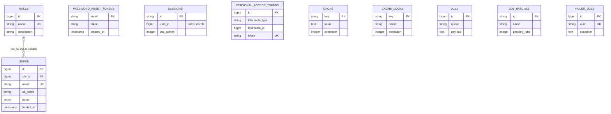
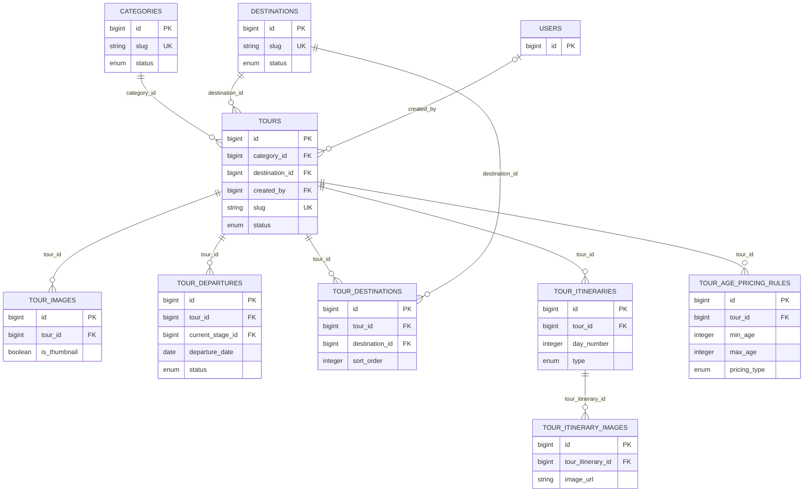
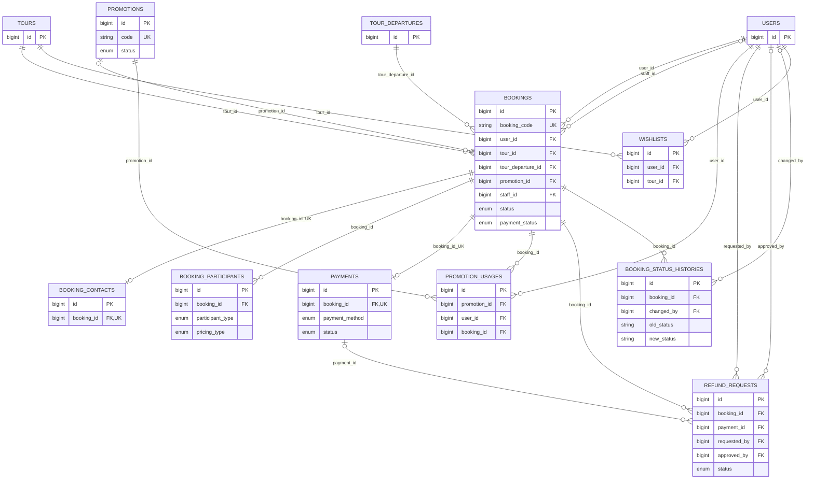
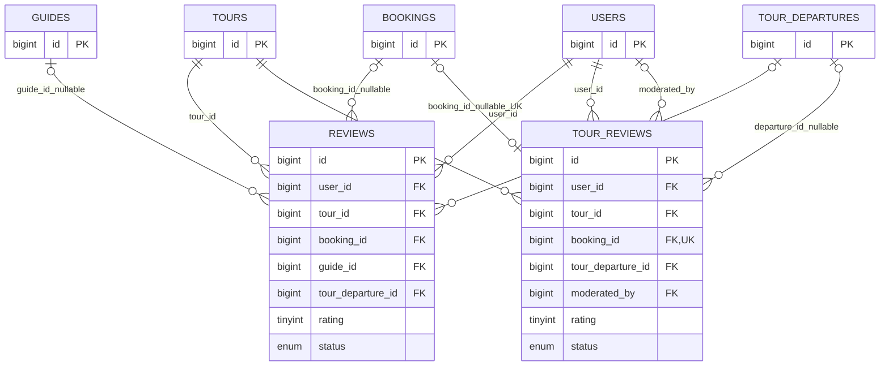
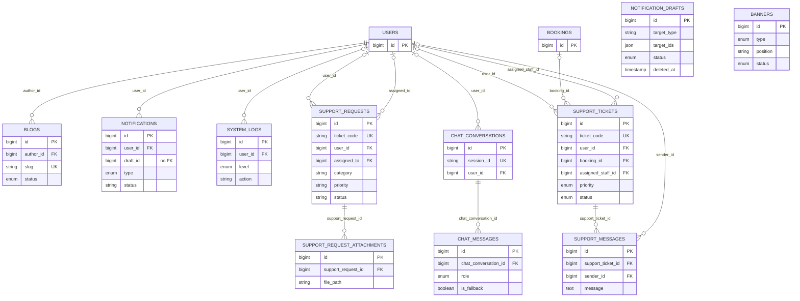
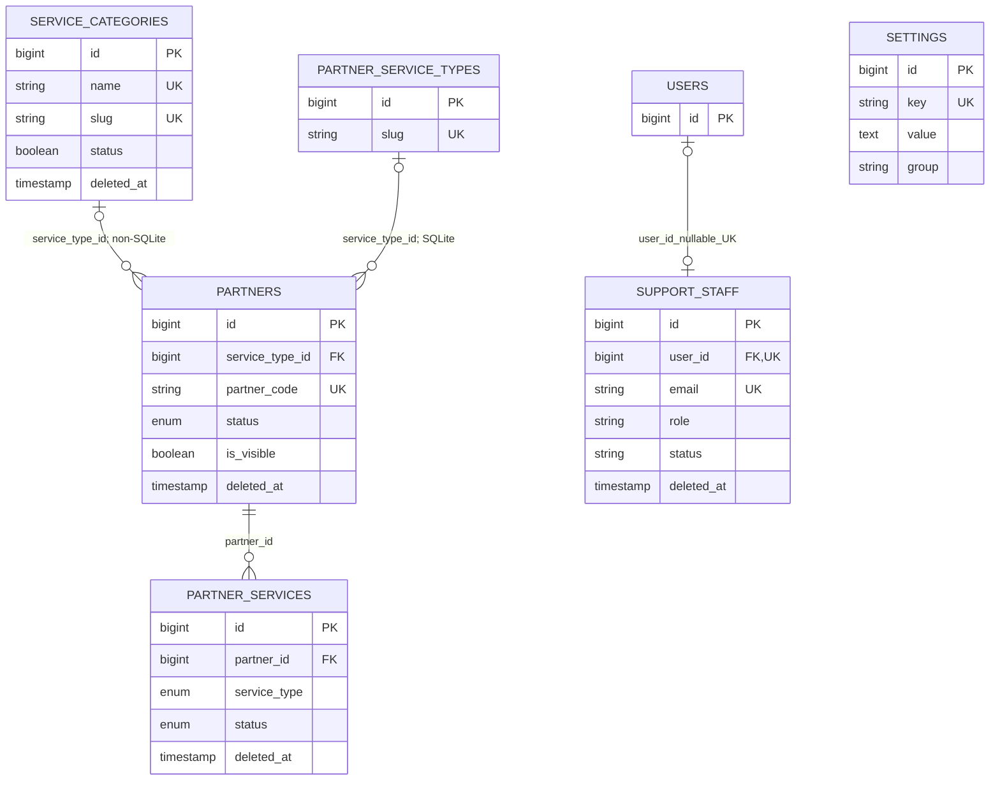

# 07. Database Design và ERD

## 1. Phạm vi và nguyên tắc truy vết

Tài liệu này tái dựng schema hiện trạng từ:

- Toàn bộ `backend_laravel/database/migrations/*.php` theo thứ tự tên file.
- Toàn bộ model trong `backend_laravel/app/Models` để ghi nhận quan hệ Eloquent, cast, scope và soft delete ở tầng ứng dụng.
- Seeder/factory chỉ được dùng để phát hiện dữ liệu mẫu, backfill hoặc bất nhất; dữ liệu mẫu không được nâng thành quy tắc nghiệp vụ production.

File `backend_laravel/database/migrations/2026_06_14_144719_create_destinations_table.php.bak` bị loại khỏi inventory vì không có đuôi `.php` và không thuộc tập migration Laravel đang chạy.

Kết quả đối chiếu tĩnh: **63 bảng duy nhất**, được phủ đủ trong inventory và các sơ đồ ERD bên dưới.

Quy ước:

- `D:C` = `ON DELETE CASCADE`; `D:N` = `ON DELETE SET NULL`; `D:R` = `ON DELETE RESTRICT`.
- `U:C` = `ON UPDATE CASCADE`.
- “Không khai báo” nghĩa là migration không chỉ định action; tài liệu không tự quy đổi thành một action cụ thể theo DB engine.
- `timestamps` = `created_at` và `updated_at`; `soft delete` = có `deleted_at`.
- Index chỉ được ghi là DB constraint/index khi migration trực tiếp tạo. Quan hệ hoặc convention trong model không được biến thành DB constraint.
- Với FK nullable, cardinality phía cha của bản ghi con là `0..1`; với unique nullable, nhiều dòng `NULL` có thể vẫn tồn tại tùy cơ chế xử lý `NULL` của DB.

## 2. Inventory 63 bảng

### 2.1. Xác thực, phân quyền và hạ tầng Laravel — 10 bảng

| Bảng | Cột nghiệp vụ cốt lõi và PK | FK và action | Unique, index, enum/check | Thời gian/xóa | Model và relation | Migration nguồn |
|---|---|---|---|---|---|---|
| `roles` | `id` PK; `name`; `description` | Không có FK | UQ `name` | timestamps | `Role`; `users(): HasMany` | `2026_06_10_215900_create_roles_table.php::up()` |
| `users` | `id` PK; `role_id`; `full_name`; `email`; `email_verified_at`; `password`; `phone`; `avatar_url`; `status`; `otp`; `otp_expires_at`; `remember_token` | `role_id -> roles.id`, D:R/U:C. Migration cố thực thi `ALTER TABLE ... MODIFY` để ép NOT NULL khi driver khác SQLite; SQLite bỏ qua nhánh này | UQ `email`; IDX `status`; enum `status = active\|locked\|inactive` | timestamps; soft delete | `User`; `role`, `guide`, `supportStaff`, `bookings`, `reviews`, `tourReviews`, `wishlists` | `0001_01_01_000000_create_users_table.php::up()`; `2026_06_10_215910_add_vivugo_columns_to_users_table.php::up()`; `2026_06_13_144107_add_otp_to_users_table.php::up()`; `2026_06_17_000000_drop_name_from_users_table.php::up()` |
| `password_reset_tokens` | `email` PK; `token`; `created_at` | Không có FK tới `users` | PK `email` | chỉ `created_at` nullable | Không tìm thấy App model | `0001_01_01_000000_create_users_table.php::up()` |
| `sessions` | `id` chuỗi PK; `user_id`; `ip_address`; `user_agent`; `payload`; `last_activity` | `user_id` chỉ là `foreignId` nullable, **không có foreign constraint** | IDX `user_id`; IDX `last_activity` | Không có timestamps chuẩn | Không tìm thấy App model | `0001_01_01_000000_create_users_table.php::up()` |
| `personal_access_tokens` | `id` PK; `tokenable_type`; `tokenable_id`; `name`; `token`; `abilities`; `last_used_at`; `expires_at` | Morph key, không có FK vật lý | UQ `token`; composite morph index; IDX `expires_at` | timestamps | Không tìm thấy App model; User dùng trait Sanctum `HasApiTokens` | `2026_06_10_055225_create_personal_access_tokens_table.php::up()` |
| `cache` | `key` PK; `value`; `expiration` | Không có FK | IDX `expiration` | Không có timestamps | Không tìm thấy App model | `0001_01_01_000001_create_cache_table.php::up()` |
| `cache_locks` | `key` PK; `owner`; `expiration` | Không có FK | IDX `expiration` | Không có timestamps | Không tìm thấy App model | `0001_01_01_000001_create_cache_table.php::up()` |
| `jobs` | `id` PK; `queue`; `payload`; `attempts`; `reserved_at`; `available_at`; `created_at` | Không có FK | IDX `queue` | Unix-time fields, không có timestamps chuẩn | Không tìm thấy App model | `0001_01_01_000002_create_jobs_table.php::up()` |
| `job_batches` | `id` chuỗi PK; `name`; tổng/pending/failed jobs; `failed_job_ids`; `options`; `cancelled_at`; `created_at`; `finished_at` | Không có FK | Chỉ PK | Unix-time fields | Không tìm thấy App model | `0001_01_01_000002_create_jobs_table.php::up()` |
| `failed_jobs` | `id` PK; `uuid`; `connection`; `queue`; `payload`; `exception`; `failed_at` | Không có FK | UQ `uuid` | chỉ `failed_at`, mặc định current timestamp | Không tìm thấy App model | `0001_01_01_000002_create_jobs_table.php::up()` |

### 2.2. Danh mục và thiết kế tour — 9 bảng

| Bảng | Cột nghiệp vụ cốt lõi và PK | FK và action | Unique, index, enum/check | Thời gian/xóa | Model và relation | Migration nguồn |
|---|---|---|---|---|---|---|
| `categories` | `id` PK; `name`; `slug`; `description`; `thumbnail_url`; `thumbnail_alt_text`; `status` | Không có FK | UQ `slug`; IDX `status`; enum `active\|inactive` | timestamps; soft delete | `Category`; `tours(): HasMany`; `isActive()` | `2026_06_10_220000_create_categories_table.php::up()`; `2026_07_03_112000_add_thumbnail_fields_to_categories_table.php::up()` |
| `destinations` | `id` PK; `name`; `slug`; `province_city`; `country`; `description`; `thumbnail_url`; `status` | Không có FK | UQ `slug`; IDX `province_city`; IDX `status`; enum `active\|inactive` | timestamps; soft delete | `Destination`; `tours(): HasMany`; `guides(): BelongsToMany` | `2026_06_10_220010_create_destinations_table.php::up()` |
| `tours` | `id` PK; `category_id`; `destination_id`; `created_by`; title/slug/nội dung/lịch trình; số ngày/đêm; giá; số chỗ; `status`; `average_rating`; `review_count` | `category_id -> categories`, D:R/U:C; `destination_id -> destinations`, D:R/U:C; `created_by -> users` nullable, D:N/U:C | UQ `slug`; IDX `status`; IDX `base_price`; enum `draft\|published\|hidden\|cancelled`; full-text title/summary/description ngoài SQLite | timestamps; soft delete | `Tour`; category, destination, destinations, usersWhoLiked, departures, bookings, reviews, tourReviews, agePricingRules, itineraries, images, thumbnail. Không có relation `creator()` | `2026_06_10_220020_create_tours_table.php::up()` |
| `tour_images` | `id` PK; `tour_id`; `image_url`; `alt_text`; `sort_order`; `is_thumbnail` | `tour_id -> tours`, D:C/U:C | IDX `is_thumbnail` | timestamps | `TourImage`; `tour(): BelongsTo` | `2026_06_10_220030_create_tour_images_table.php::up()` |
| `tour_departures` | `id` PK; `tour_id`; ngày đi/về; `price`; `base_price`; `discount_price`; tổng/đã đặt chỗ; `status`; `current_stage_id` | `tour_id -> tours`, D:C/U:C; `current_stage_id -> tour_departure_stages` nullable, D:N/U:C | IDX `departure_date`; IDX `status`; enum `open\|closed\|completed\|cancelled` | timestamps | `TourDeparture`; tour, bookings, reviews, tourReviews, attendanceSessions, stages, currentStage, guideAssignments | `2026_06_10_220040_create_tour_departures_table.php::up()`; `2026_07_02_143241_create_guide_attendance_and_stage_tables.php::up()`; `2026_07_06_000001_add_base_and_discount_price_to_tour_departures_table.php::up()` |
| `tour_destinations` | `id` PK; `tour_id`; `destination_id`; `sort_order` | `tour_id -> tours`, D:C/U:C; `destination_id -> destinations`, D:C/U:C | UQ `(tour_id,destination_id)`; IDX `sort_order` | timestamps | Không có model pivot riêng; `Tour::destinations()` và `Destination::tours()` thể hiện hai cách đọc, nhưng `Destination::tours()` là hasMany theo cột chính, không phải pivot | `2026_06_10_220210_create_tour_destinations_table.php::up()` |
| `tour_itineraries` | `id` PK; `tour_id`; ngày/thứ tự; `type`; title; giờ; duration; transport; description | `tour_id -> tours`, D:C/U:C | IDX `type`; IDX `(tour_id,day_number,sort_order)`; enum `departure\|transport\|sightseeing\|meal\|free_time\|return` | timestamps | `TourItinerary`; tour, images | `2026_06_27_000001_create_tour_itineraries_table.php::up()` |
| `tour_itinerary_images` | `id` PK; `tour_itinerary_id`; URL/alt/thứ tự | `tour_itinerary_id -> tour_itineraries`, D:C/U:C | IDX `(tour_itinerary_id,sort_order)` | timestamps | `TourItineraryImage`; `itinerary(): BelongsTo` | `2026_06_27_000002_create_tour_itinerary_images_table.php::up()` |
| `tour_age_pricing_rules` | `id` PK; `tour_id`; label; min/max age; `pricing_type`; `price_value`; `sort_order`; `is_active` | `tour_id -> tours`, D:C/U:C | IDX `(tour_id,is_active)`; IDX `(tour_id,min_age,max_age)`; enum `percentage\|fixed\|free` | timestamps | `TourAgePricingRule`; `tour(): BelongsTo` | `2026_07_03_120000_create_tour_age_pricing_rules_table.php::up()` |

### 2.3. Booking, khuyến mãi, thanh toán — 9 bảng

| Bảng | Cột nghiệp vụ cốt lõi và PK | FK và action | Unique, index, enum/check | Thời gian/xóa | Model và relation | Migration nguồn |
|---|---|---|---|---|---|---|
| `promotions` | `id` PK; code/name/mô tả; loại/mức giảm; trần giảm; đơn tối thiểu; giới hạn/số lượt dùng; hiệu lực; `status` | Không có FK | UQ `code`; IDX `status`; IDX `(start_date,end_date)`; enum discount `percent\|fixed`; enum status `active\|inactive\|expired` | timestamps; soft delete | Không tìm thấy App model | `2026_06_10_220050_create_promotions_table.php::up()` |
| `bookings` | `id` PK; `booking_code`; user/tour/departure/promotion/staff; số người; giá; giảm; tổng; `status`; `payment_status`; note/hủy | `user_id -> users`, D:R/U:C; `tour_id -> tours`, D:R/U:C; `tour_departure_id -> tour_departures`, D:R/U:C; `promotion_id -> promotions` nullable, D:N/U:C; `staff_id -> users` nullable, D:N/U:C | UQ `booking_code` (migration sau kiểm tra/tạo lại cùng index); IDX status/payment_status/created_at; enum status `pending\|confirmed\|completed\|cancelled`; payment `unpaid\|paid\|failed\|refunded` | timestamps; `cancelled_at` | `Booking`; user, tour, departure, payment, contact, participants, statusHistories, reviews, tourReview; không có relation promotion/staff | `2026_06_10_220060_create_bookings_table.php::up()`; `2026_07_04_005529_add_unique_booking_code_to_bookings_table.php::up()` |
| `booking_contacts` | `id` PK; `booking_id`; tên/email/điện thoại liên hệ; địa chỉ; yêu cầu đặc biệt | `booking_id -> bookings`, D:C/U:C | UQ `booking_id`; IDX `contact_phone` | timestamps | `BookingContact`; `booking(): BelongsTo` | `2026_06_10_220070_create_booking_contacts_table.php::up()` |
| `booking_participants` | `id` PK; `booking_id`; tên/phone/ngày sinh/gender/định danh/type; snapshot giá/rule | `booking_id -> bookings`, D:C/U:C | IDX `identity_number` nhưng không unique; enum gender `male\|female\|other`; participant `adult\|child\|infant`; pricing nullable `percentage\|fixed\|free` | timestamps | `BookingParticipant`; booking, attendances, latestAttendanceNote | `2026_06_10_220080_create_booking_participants_table.php::up()`; `2026_07_03_120100_add_pricing_snapshot_to_booking_participants_table.php::up()` |
| `payments` | `id` PK; `booking_id`; method; amount; transaction code; gateway JSON; status; paid/expiry | `booking_id -> bookings`, D:R/U:C | UQ `booking_id`; IDX method/transaction/status/expiry; enum method `vnpay\|momo\|cod`; status `pending\|success\|failed\|refunded` | timestamps; `paid_at`, `expires_at` | `Payment`; `booking(): BelongsTo` | `2026_06_10_220090_create_payments_table.php::up()`; `2026_07_15_000000_add_vnpay_expiry_to_payments_table.php::up()` |
| `promotion_usages` | `id` PK; promotion/user/booking; số tiền giảm; `used_at` | Cả ba FK D:C/U:C | UQ `(promotion_id,booking_id)`; IDX `used_at` | Không có timestamps chuẩn | Không tìm thấy App model | `2026_06_10_220150_create_promotion_usages_table.php::up()` |
| `refund_requests` | `id` PK; booking/payment; requested/approved user; amount/reason/status; requested/processed time | `booking_id -> bookings`, D:R/U:C; `payment_id -> payments` nullable, D:N/U:C; `requested_by -> users`, D:R/U:C; `approved_by -> users` nullable, D:N/U:C | IDX `status`; IDX `requested_at`; enum `pending\|approved\|rejected\|refunded` | Không có timestamps chuẩn; có requested/processed time | Không tìm thấy App model | `2026_06_10_220160_create_refund_requests_table.php::up()` |
| `booking_status_histories` | `id` PK; booking; người đổi; old/new status; note | `booking_id -> bookings`, D:C/U:C; `changed_by -> users` nullable, D:N/U:C | IDX `created_at` | Chỉ `created_at`; Model đặt `UPDATED_AT = null` | `BookingStatusHistory`; booking, changedBy | `2026_06_10_220200_create_booking_status_histories_table.php::up()` |
| `wishlists` | `id` PK; `user_id`; `tour_id` | Hai FK D:C/U:C | UQ `(user_id,tour_id)` | timestamps | `Wishlist`; user, tour; đồng thời `User::wishlists()` và `Tour::usersWhoLiked()` | `2026_06_10_220110_create_wishlists_table.php::up()` |

### 2.4. Đánh giá — 2 bảng

| Bảng | Cột nghiệp vụ cốt lõi và PK | FK và action | Unique, index, enum/check | Thời gian/xóa | Model và relation | Migration nguồn |
|---|---|---|---|---|---|---|
| `reviews` | `id` PK; user/tour/booking/guide/departure; rating; comment; status | `user_id -> users`, D:C/U:C; `tour_id -> tours`, D:C/U:C; booking/guide/departure nullable, D:N/U:C | UQ `(booking_id,guide_id)`; IDX status; IDX `(guide_id,status)`; IDX departure; enum `visible\|hidden\|spam`; CHECK rating 1–5 ngoài SQLite | timestamps | `Review`; user, tour, booking, guide, tourDeparture; `scopeVisible()` | `2026_06_10_220100_create_reviews_table.php::up()`; `2026_07_11_112416_add_guide_context_to_reviews_table.php::up()` |
| `tour_reviews` | `id` PK; user/tour/booking/departure; rating/comment/status; moderator/time | `user_id -> users`, D:C/U:C; `tour_id -> tours`, D:C/U:C; booking/departure/moderator nullable, D:N/U:C | UQ nullable `booking_id`; IDX `(tour_id,status,created_at)`; IDX `(status,rating,created_at)`; enum `visible\|hidden\|spam`; CHECK rating 1–5 ngoài SQLite | timestamps; không soft delete | `TourReview`; user, tour, booking, tourDeparture, moderator; `scopeVisible()` | `2026_07_21_000000_create_tour_reviews_table.php::up()` |

### 2.5. Hướng dẫn viên và vận hành — 16 bảng

| Bảng | Cột nghiệp vụ cốt lõi và PK | FK và action | Unique, index, enum/check | Thời gian/xóa | Model và relation | Migration nguồn |
|---|---|---|---|---|---|---|
| `guides` | `id` PK; `user_id`; `guide_code`; avatar; kinh nghiệm; rating/count; status | `user_id -> users`, D:C; U không khai báo | UQ `guide_code`; **không unique user_id**; enum `active\|inactive\|locked` | timestamps; soft delete | `Guide`; user, specializations, languages, guideLanguages, experiences, assignments, departures, destinations, reviews | `2026_06_14_145318_create_guides_table.php::up()`; các migration specialization/avatar |
| `languages` | `id` PK; `name` | Không có FK | UQ `name` | timestamps | `Language`; levels, guides | `2026_06_24_042942_create_languages_table.php::up()` |
| `language_levels` | `id` PK; `language_id`; `level_name` | `language_id -> languages`, D:C; U không khai báo | Không có UQ `(language_id,level_name)` | timestamps | `LanguageLevel`; language, guideLanguages | `2026_06_24_042945_create_language_levels_table.php::up()` |
| `certificates` | `id` PK; `name`; `issued_by` | Không có FK | UQ `name` | timestamps | `Certificate`; guides qua guide_experiences | `2026_06_24_042945_create_certificates_table.php::up()` |
| `guide_languages` | `id` PK; guide/language/level | guide và language D:C; level nullable D:N; U không khai báo | UQ `(guide_id,language_id)` | timestamps | `GuideLanguage`; guide, language, level | `2026_06_24_042946_drop_and_recreate_guide_languages_table.php::up()`; migration này drop cấu trúc string/enum cũ trước khi tạo lại |
| `guide_experiences` | `id` PK; guide/certificate; issued year | guide và certificate D:C; U không khai báo | UQ `(guide_id,certificate_id)` | timestamps | `GuideExperience`; guide, certificate | `2026_06_24_042950_drop_and_recreate_guide_experiences_table.php::up()`; migration này drop cấu trúc text cũ trước khi tạo lại |
| `guide_specializations` | `id` PK; name/description | Không có FK | UQ `name` | timestamps | `GuideSpecialization`; guides | `2026_06_27_143012_create_guide_specializations_table.php::up()` |
| `guide_specialization` | `id` PK; guide/specialization | Cả hai FK D:C; U không khai báo | UQ `(guide_id,specialization_id)` | timestamps | Không có model pivot riêng; relation nằm ở Guide và GuideSpecialization | `2026_06_27_151320_create_guide_specialization_pivot_table.php::up()` |
| `guide_destinations` | `id` PK; guide/destination | `guide_id -> guides`, D:C; `destination_id -> destinations`, D:R; U không khai báo | UQ `(guide_id,destination_id)` | timestamps | Không có class `GuideDestination` hợp lệ; relation M:N nằm ở Guide/Destination | `2026_07_07_055358_create_guide_destinations_table.php::up()` |
| `tour_guide_assignments` | `id` PK; guide/departure; role/status; `note`; `notes`; assigned actor/time | guide và departure D:C; `assigned_by -> users` nullable, D:N; U không khai báo | UQ `(guide_id,tour_departure_id)`; IDX guide/departure/status; enum status `assigned\|confirmed\|completed\|cancelled`; role là string mặc định lead | timestamps | `TourGuideAssignment`; departure/tourDeparture, guide, assignedBy | `2026_06_28_092905_create_tour_guide_assignments_table.php::up()`; `2026_07_07_080821_add_assignment_fields_to_tour_guide_assignments_table.php::up()` |
| `attendance_sessions` | `id` PK; departure; boundary; name/note/status; creator | departure D:C/U:C; creator D:R/U:C | UQ nullable `(tour_departure_id,boundary)`; IDX status; IDX `(tour_departure_id,created_at)`; status `active\|closed`; boundary `departure\|return` nullable | timestamps | `AttendanceSession`; tourDeparture, attendances, creator | `2026_07_02_143241_create_guide_attendance_and_stage_tables.php::up()`; `2026_07_18_000000_add_boundary_to_attendance_sessions_table.php::up()` |
| `attendances` | `id` PK; session/participant; check-in/out actor/time; status; note/note actor | session và participant D:C/U:C; ba actor FK nullable D:N/U:C | UQ `(session,participant)`; IDX status; IDX `(participant,status)`; enum `not_checked_in\|checked_in\|absent\|checked_out` | timestamps; checked-in/out timestamps | `Attendance`; session, bookingParticipant, checkedInBy, checkedOutBy, noteUpdatedBy | `2026_07_02_143241_create_guide_attendance_and_stage_tables.php::up()` |
| `tour_departure_stages` | `id` PK; departure; itinerary nullable; ngày/thứ tự/type/title/time/status; started/completed | departure D:C/U:C; itinerary nullable D:N/U:C | UQ nullable `(departure,itinerary)`; IDX status; IDX `(departure,day,sort)`; enum `pending\|in_progress\|completed`; type là string không enum | timestamps | `TourDepartureStage`; tourDeparture, itinerary | `2026_07_02_143241_create_guide_attendance_and_stage_tables.php::up()` |
| `guide_replacement_requests` | `id` PK; departure/current guide/requester; reason/evidence; status; replacement guide/reviewer/time/note | departure/current guide/requester D:C; replacement guide/reviewer nullable D:N; U không khai báo | IDX `(departure,status)`; IDX `(current_guide,status)`; status string mặc định pending, không enum/check | timestamps | Không tìm thấy App model | `2026_07_12_000000_create_guide_replacement_requests_table.php::up()` |
| `guide_leave_requests` | `id` PK; guide/user; ngày; lý do/status; admin/note/reviewed; cancel reason/time | guide và user D:C; admin nullable D:N; U không khai báo | IDX `(guide,status)`; IDX `(start,end)`; IDX `(status,created_at)`; enum `pending\|approved\|rejected\|cancelled` | timestamps; soft delete | `GuideLeaveRequest`; guide, user, admin, attachments; scopes busy/overlapping | `2026_07_13_000000_create_guide_leave_requests_tables.php::up()` |
| `guide_leave_request_attachments` | `id` PK; leave request; file metadata | `guide_leave_request_id -> guide_leave_requests`, D:C; U không khai báo | Không có unique/index riêng | timestamps | `GuideLeaveRequestAttachment`; leaveRequest; accessor URL | `2026_07_13_000000_create_guide_leave_requests_tables.php::up()` |

### 2.6. Nội dung, thông báo, hỗ trợ và chat — 11 bảng

| Bảng | Cột nghiệp vụ cốt lõi và PK | FK và action | Unique, index, enum/check | Thời gian/xóa | Model và relation | Migration nguồn |
|---|---|---|---|---|---|---|
| `blogs` | `id` PK; author; title/slug/summary/content; thumbnail; SEO; status/published_at | `author_id -> users`, D:R/U:C | UQ slug; IDX status; enum `draft\|published\|hidden`; full-text ngoài SQLite | timestamps; soft delete | Không tìm thấy App model | `2026_06_10_220120_create_blogs_table.php::up()` |
| `notifications` | `id` PK; `draft_id`; user; title/message/type/data/read/status | `user_id -> users`, D:C/U:C; `draft_id` **không có FK** | IDX type; IDX read_at; enum type `booking\|payment\|promotion\|system\|support`; status string mặc định unread | timestamps | `Notification`; user. Không có relation draft, không cast data/read_at | `2026_06_10_220130_create_notifications_table.php::up()`; `2026_06_24_161627_modify_notifications_table.php::up()`; `2026_06_24_165838_add_draft_id_to_notifications_table.php::up()` |
| `notification_drafts` | `id` PK; title/message; target_type; target_ids JSON; status | Không có FK | enum `draft\|sent`; target_type chỉ là string | timestamps; soft delete | `NotificationDraft`; cast target_ids array | `2026_06_24_152026_create_notification_drafts_table.php::up()`; `2026_06_24_155228_add_deleted_at_to_notification_drafts_table.php::up()` |
| `system_logs` | `id` PK; user; level/action/message/context/IP/user-agent | `user_id -> users` nullable, D:N/U:C | IDX level/action/created_at; enum `info\|warning\|error\|critical` | chỉ `created_at` nullable | Không tìm thấy App model | `2026_06_10_220140_create_system_logs_table.php::up()` |
| `support_tickets` | `id` PK; ticket code; user/booking/staff; subject/priority/status | Ba FK nullable, D:N/U:C | UQ ticket code; IDX status; enum priority `low\|medium\|high\|urgent`; status `open\|in_progress\|resolved\|closed` | timestamps | Không tìm thấy App model | `2026_06_10_220170_create_support_tickets_table.php::up()` |
| `support_messages` | `id` PK; ticket; sender; message/attachment | ticket D:C/U:C; sender nullable D:N/U:C | IDX created_at | timestamps | Không tìm thấy App model | `2026_06_10_220180_create_support_messages_table.php::up()` |
| `banners` | `id` PK; title/display title; type; image/HTML/link; position/pages; sort; hiệu lực; status | Không có FK | IDX position/type/status; IDX `(start_date,end_date)`; enum type `image\|html`; status `active\|inactive`; position/page chỉ là model constants, không phải DB check | timestamps | `Banner`; `scopeVisible()` | `2026_06_10_220190_create_banners_table.php::up()`; `2026_06_13_000002_add_widget_columns_to_banners_table.php::up()` |
| `chat_conversations` | `id` PK; session ID; user | `user_id -> users` nullable, D:N; U không khai báo | UQ session_id | timestamps | `ChatConversation`; messages. Không có relation user dù DB có FK | `2026_07_15_193903_create_chat_conversations_table.php::up()` |
| `chat_messages` | `id` PK; conversation; role/content/fallback | conversation D:C; U không khai báo | enum role `user\|assistant` | timestamps | `ChatMessage`; conversation | `2026_07_15_193904_create_chat_messages_table.php::up()` |
| `support_requests` | `id` PK; ticket code; user; snapshot liên hệ; category/priority; subject/description; status; assignee; start/resolve | user/assignee nullable, D:N; U không khai báo | UQ ticket code; IDX status/category/priority; IDX `(status,created_at)`; category/priority/status là string, chỉ có vocabulary trong comment migration | timestamps | `SupportRequest`; user, assignedTo, attachments | `2026_07_16_220919_create_support_requests_table.php::up()` |
| `support_request_attachments` | `id` PK; support request; tên/path/MIME/size | request D:C; U không khai báo | Không có unique/index riêng | timestamps | `SupportRequestAttachment`; supportRequest; append URL | `2026_07_16_220920_create_support_request_attachments_table.php::up()` |

### 2.7. Cấu hình, đối tác và nhân viên hỗ trợ — 6 bảng

| Bảng | Cột nghiệp vụ cốt lõi và PK | FK và action | Unique, index, enum/check | Thời gian/xóa | Model và relation | Migration nguồn |
|---|---|---|---|---|---|---|
| `settings` | `id` PK; key/value/group | Không có FK | UQ key; IDX group | timestamps | `Setting`; constants ALLOWED_KEYS/PUBLIC_KEYS; valueFor/intValueFor/boolValueFor | `2026_06_13_000001_create_settings_table.php::up()` |
| `service_categories` | `id` PK; name/slug/description/status boolean | Không có FK | UQ name; UQ slug; IDX status; IDX created_at | timestamps; soft delete | `ServiceCategory`; model events sinh slug unique kể cả bản ghi đã xóa mềm | `2026_07_03_031102_create_service_categories_table.php::up()` |
| `partner_service_types` | `id` PK; name/slug | Không có FK | UQ slug | timestamps | Không tìm thấy App model | `2026_06_25_075330_create_partner_service_types_table.php::up()` |
| `partners` | `id` PK; `service_type_id`; code; thông tin liên hệ; rating; hợp đồng; status/visible | Ban đầu `service_type_id -> partner_service_types`, D:R. Sau migration sync: ngoài SQLite trỏ `service_categories`, D:R/U:C; SQLite giữ FK cũ | UQ nullable `partner_code`; enum status `active\|inactive`; không có index status/visible | timestamps; soft delete | Không tìm thấy App model | `2026_06_25_075333_create_partners_table.php::up()`; `2026_06_25_081003_add_fields_to_partners_table.php::up()`; `2026_07_03_104500_sync_partner_service_types_to_service_categories.php::up()` |
| `partner_services` | `id` PK; partner; tên/code/type; giờ/tuyến/phương tiện/hạng; operate days; booking hours; confirmation; amenities; status | `partner_id -> partners`, D:C; U không khai báo | IDX partner/type/status; enum type `flight\|hotel\|restaurant\|transport\|train\|cruise\|insurance\|attraction`; status `active\|inactive` | timestamps; soft delete | Không tìm thấy App model | `2026_06_25_081004_create_partner_services_table.php::up()` |
| `support_staff` | `id` PK; user nullable; name/email/role/specialization/kinh nghiệm/status/performance/hidden time | `user_id -> users` nullable, D:N/U:C | UQ email; UQ nullable user_id; role/status là string không check | timestamps; soft delete | `SupportStaff`; `user(): BelongsTo` | `2026_06_22_032814_create_support_staff_table.php::up()`; `2026_07_01_000001_add_user_id_to_support_staff_table.php::up()`; `2026_07_04_000001_add_specialization_and_experience_years_to_support_staff_table.php::up()` |

## 3. ERD Mermaid

Các ERD được chia theo bounded module. Entity tham chiếu chéo có thể xuất hiện lại trong nhiều sơ đồ; số bảng duy nhất vẫn là 63.

### 3.1. Xác thực và hạ tầng



`password_reset_tokens.email`, `sessions.user_id` và morph key của `personal_access_tokens` không có foreign constraint, nên không có cạnh FK trong ERD.

### 3.2. Danh mục và thiết kế tour



FK vòng `tour_departures.current_stage_id -> tour_departure_stages.id` được thể hiện trong sơ đồ vận hành, nơi bảng stage được định nghĩa.

### 3.3. Booking, khuyến mãi và thanh toán



### 3.4. Đánh giá



`reviews` chỉ unique theo cặp nullable `(booking_id,guide_id)`, không phải unique riêng `booking_id`. `tour_reviews.booking_id` là unique nullable; các review không còn booking có thể tồn tại nhiều dòng.

### 3.5. Hướng dẫn viên và vận hành

```mermaid
erDiagram
    USERS ||--o{ GUIDES : user_id_not_UK
    LANGUAGES ||--o{ LANGUAGE_LEVELS : language_id
    GUIDES ||--o{ GUIDE_LANGUAGES : guide_id
    LANGUAGES ||--o{ GUIDE_LANGUAGES : language_id
    LANGUAGE_LEVELS o|--o{ GUIDE_LANGUAGES : level_id
    GUIDES ||--o{ GUIDE_EXPERIENCES : guide_id
    CERTIFICATES ||--o{ GUIDE_EXPERIENCES : certificate_id
    GUIDES ||--o{ GUIDE_SPECIALIZATION : guide_id
    GUIDE_SPECIALIZATIONS ||--o{ GUIDE_SPECIALIZATION : specialization_id
    GUIDES ||--o{ GUIDE_DESTINATIONS : guide_id
    DESTINATIONS ||--o{ GUIDE_DESTINATIONS : destination_id
    GUIDES ||--o{ TOUR_GUIDE_ASSIGNMENTS : guide_id
    TOUR_DEPARTURES ||--o{ TOUR_GUIDE_ASSIGNMENTS : tour_departure_id
    USERS o|--o{ TOUR_GUIDE_ASSIGNMENTS : assigned_by
    TOUR_DEPARTURES ||--o{ ATTENDANCE_SESSIONS : tour_departure_id
    USERS ||--o{ ATTENDANCE_SESSIONS : created_by
    ATTENDANCE_SESSIONS ||--o{ ATTENDANCES : session_id
    BOOKING_PARTICIPANTS ||--o{ ATTENDANCES : participant_id
    USERS o|--o{ ATTENDANCES : checked_in_by
    USERS o|--o{ ATTENDANCES : checked_out_by
    USERS o|--o{ ATTENDANCES : note_updated_by
    TOUR_DEPARTURES ||--o{ TOUR_DEPARTURE_STAGES : tour_departure_id
    TOUR_ITINERARIES o|--o{ TOUR_DEPARTURE_STAGES : tour_itinerary_id
    TOUR_DEPARTURE_STAGES o|--o{ TOUR_DEPARTURES : current_stage_id
    TOUR_DEPARTURES ||--o{ GUIDE_REPLACEMENT_REQUESTS : tour_departure_id
    GUIDES ||--o{ GUIDE_REPLACEMENT_REQUESTS : current_guide_id
    USERS ||--o{ GUIDE_REPLACEMENT_REQUESTS : requested_by
    GUIDES o|--o{ GUIDE_REPLACEMENT_REQUESTS : replacement_guide_id
    USERS o|--o{ GUIDE_REPLACEMENT_REQUESTS : reviewed_by
    GUIDES ||--o{ GUIDE_LEAVE_REQUESTS : guide_id
    USERS ||--o{ GUIDE_LEAVE_REQUESTS : user_id
    USERS o|--o{ GUIDE_LEAVE_REQUESTS : admin_id
    GUIDE_LEAVE_REQUESTS ||--o{ GUIDE_LEAVE_REQUEST_ATTACHMENTS : leave_request_id

    USERS { bigint id PK }
    DESTINATIONS { bigint id PK }
    TOUR_DEPARTURES { bigint id PK bigint current_stage_id FK }
    TOUR_ITINERARIES { bigint id PK }
    BOOKING_PARTICIPANTS { bigint id PK }
    GUIDES { bigint id PK bigint user_id FK string guide_code UK enum status }
    LANGUAGES { bigint id PK string name UK }
    LANGUAGE_LEVELS { bigint id PK bigint language_id FK string level_name }
    CERTIFICATES { bigint id PK string name UK }
    GUIDE_LANGUAGES { bigint id PK bigint guide_id FK bigint language_id FK bigint level_id FK }
    GUIDE_EXPERIENCES { bigint id PK bigint guide_id FK bigint certificate_id FK }
    GUIDE_SPECIALIZATIONS { bigint id PK string name UK }
    GUIDE_SPECIALIZATION { bigint id PK bigint guide_id FK bigint specialization_id FK }
    GUIDE_DESTINATIONS { bigint id PK bigint guide_id FK bigint destination_id FK }
    TOUR_GUIDE_ASSIGNMENTS { bigint id PK bigint guide_id FK bigint tour_departure_id FK bigint assigned_by FK enum status }
    ATTENDANCE_SESSIONS { bigint id PK bigint tour_departure_id FK bigint created_by FK enum boundary enum status }
    ATTENDANCES { bigint id PK bigint attendance_session_id FK bigint booking_participant_id FK bigint checked_in_by FK bigint checked_out_by FK bigint note_updated_by FK enum status }
    TOUR_DEPARTURE_STAGES { bigint id PK bigint tour_departure_id FK bigint tour_itinerary_id FK enum status }
    GUIDE_REPLACEMENT_REQUESTS { bigint id PK bigint tour_departure_id FK bigint current_guide_id FK bigint requested_by FK bigint replacement_guide_id FK bigint reviewed_by FK string status }
    GUIDE_LEAVE_REQUESTS { bigint id PK bigint guide_id FK bigint user_id FK bigint admin_id FK enum status timestamp deleted_at }
    GUIDE_LEAVE_REQUEST_ATTACHMENTS { bigint id PK bigint guide_leave_request_id FK string file_path }
```



FK `current_stage_id` không có unique và không có DB check buộc stage được chọn phải thuộc chính departure đang tham chiếu. Do đó một stage có thể được nhiều departure tham chiếu ở mức schema, dù model đặt tên là `currentStage`.

### 3.6. Nội dung, thông báo, hỗ trợ và chat



Không vẽ cạnh `notification_drafts -> notifications` vì `notifications.draft_id` không có foreign constraint.

### 3.7. Cấu hình, đối tác và nhân viên hỗ trợ



Hai cạnh phân loại partner là hai biến thể schema theo DB driver, không đồng thời là hai FK trên cùng một database sau khi migration hoàn tất.

## 4. Quan hệ và cardinality cần lưu ý

- Booking—Contact và Booking—Payment là `1 -> 0..1` nhờ FK con non-null và unique.
- Booking—TourReview là `0..1 <-> 0..1` vì `tour_reviews.booking_id` vừa nullable vừa unique.
- User—SupportStaff là `0..1 <-> 0..1` vì `support_staff.user_id` nullable unique.
- User—Guide chỉ được model mô tả `hasOne`, nhưng DB không unique `guides.user_id`; cardinality DB thực tế là User `1 -> 0..N` Guide.
- Tour—Destination có hai cấu trúc song song: điểm đến chính qua `tours.destination_id` và M:N có thứ tự qua `tour_destinations`.
- Guide—Departure là M:N qua `tour_guide_assignments`; unique chỉ cấm lặp cùng cặp guide/departure, không cấm một departure có nhiều guide hoặc nhiều role `lead`.
- Unique `(tour_departure_id,boundary)` không cấm nhiều session có `boundary = NULL` trên DB cho phép nhiều NULL trong unique index.
- Unique `(tour_departure_id,tour_itinerary_id)` không cấm nhiều stage có `tour_itinerary_id = NULL` theo cùng cơ chế.
- Unique `(booking_id,guide_id)` của `reviews` không đảm bảo một review duy nhất khi một hoặc cả hai FK là NULL.
- `language_levels` không có unique `(language_id,level_name)`; `firstOrCreate` trong seeder không phải DB constraint.
- `booking_participants.identity_number` chỉ được index, không unique.

## 5. Trạng thái và CHECK có bằng chứng

| Đối tượng | Giá trị được DB giới hạn | Nguồn |
|---|---|---|
| Role | Bốn bản ghi nền `support staff`, `customer`, `tour guide`, `admin` được insert/update bởi migration và `RoleSeeder`; đây là dữ liệu nền, không phải enum/check | migration roles; `RoleSeeder::run()` |
| User | `active`, `locked`, `inactive` | migration bổ sung cột ViVuGo cho users |
| Category/Destination | `active`, `inactive` | migration tạo bảng tương ứng |
| Tour | `draft`, `published`, `hidden`, `cancelled` | `create_tours_table` |
| Departure | `open`, `closed`, `completed`, `cancelled` | `create_tour_departures_table` |
| Promotion | discount `percent|fixed`; status `active|inactive|expired` | `create_promotions_table` |
| Booking | `pending`, `confirmed`, `completed`, `cancelled`; payment `unpaid|paid|failed|refunded` | `create_bookings_table` |
| Participant | gender `male|female|other`; type `adult|child|infant`; pricing `percentage|fixed|free` | migration participant và pricing snapshot |
| Payment | method `vnpay|momo|cod`; status `pending|success|failed|refunded` | `create_payments_table` |
| Review/TourReview | status `visible|hidden|spam`; rating CHECK 1–5 ngoài SQLite | migration review và tour review |
| Guide | `active`, `inactive`, `locked` | `create_guides_table` |
| Assignment | `assigned`, `confirmed`, `completed`, `cancelled` | `create_tour_guide_assignments_table` |
| Attendance | session `active|closed`; boundary `departure|return`; attendance `not_checked_in|checked_in|absent|checked_out` | migration attendance và boundary |
| Departure stage | `pending`, `in_progress`, `completed` | migration stage |
| Leave request | `pending`, `approved`, `rejected`, `cancelled` | migration leave |
| Legacy support ticket | priority `low|medium|high|urgent`; status `open|in_progress|resolved|closed` | migration support ticket |
| Support request mới | Không có enum/check cho category/priority/status | `create_support_requests_table` |
| Notification | type `booking|payment|promotion|system|support`; status chỉ là string | migration notification và modify notification |
| Notification draft | `draft`, `sent`; target type chỉ là string | migration notification draft |
| Chat | role `user`, `assistant` | migration chat message |
| Banner | type `image|html`; status `active|inactive` | migration banner/widget |
| Partner/Service | partner `active|inactive`; service type tám giá trị; service status `active|inactive` | migration partner/service |

Các enum chỉ chứng minh tập giá trị, không chứng minh transition hợp lệ. **KHÔNG TÌM THẤY BẰNG CHỨNG TRONG SOURCE CODE** thuộc migration/model về một state-machine tổng quát hoặc bảng transition.

## 6. Backfill, migration dữ liệu và rollback

### 6.1. Backfill có bằng chứng

- `2026_06_10_215910_add_vivugo_columns_to_users_table.php::up()` gán role `customer` cho user chưa có role và lấy email làm `full_name` khi thiếu. Khi driver khác SQLite, migration cố thực thi `ALTER TABLE ... MODIFY` để ép `role_id`/`full_name` NOT NULL và đổi email dài 150; cú pháp `MODIFY` này là MySQL/MariaDB-specific. **KHÔNG TÌM THẤY BẰNG CHỨNG TRONG SOURCE CODE** rằng migration chạy thành công trên PostgreSQL hoặc SQL Server. Trên SQLite, nhánh ép NOT NULL/đổi độ dài email bị bỏ qua.
- `2026_07_01_000001_add_user_id_to_support_staff_table.php::up()` nối profile support với user theo email hoặc tạo profile mặc định.
- `2026_07_03_104500_sync_partner_service_types_to_service_categories.php::up()` copy loại đối tác sang service category, remap ID và đổi FK ngoài SQLite.
- `2026_07_06_000001_add_base_and_discount_price_to_tour_departures_table.php::up()` backfill `base_price = price` khi còn thiếu.
- `2026_07_07_040324_backfill_missing_booking_payments.php::up()` tạo payment COD cho booking chưa có payment; ánh xạ `paid -> success`, `failed -> failed`, `refunded -> refunded`, còn lại -> `pending`.
- `2026_07_21_000000_create_tour_reviews_table.php::moveLegacyTourReviews()` chuyển review có `guide_id IS NULL` sang `tour_reviews`; nếu booking đã được một review dùng thì review chuyển sau giữ dữ liệu nhưng đặt `booking_id = NULL`.
- Cùng migration tour review gọi `refreshTourRatingsFrom('tour_reviews')`; chỉ status `visible` được tính vào `average_rating` và `review_count`.

### 6.2. Rollback

- Tour review có rollback dữ liệu rõ ràng: chép toàn bộ tour review về `reviews` với `guide_id = NULL`, tính lại điểm từ `reviews`, rồi drop bảng.
- Migration payment backfill cố ý để `down()` rỗng nhằm không xóa lịch sử thanh toán đã tạo.
- `add_deleted_at_to_notification_drafts::down()` không drop `deleted_at`.
- `add_draft_id_to_notifications::down()` không drop `draft_id`.
- `modify_notifications::down()` drop `status` nhưng không hoàn nguyên độ dài title từ 500 về 255.
- `drop_and_recreate_guide_languages` và `drop_and_recreate_guide_experiences` xóa cấu trúc cũ khi chạy `up()`; migration không có logic khôi phục dữ liệu cũ.

## 7. Audit, history và log

| Phạm vi | Dữ liệu audit/history | Nguồn |
|---|---|---|
| Booking | old/new status, changed_by, note, created_at | `booking_status_histories` |
| Hệ thống | user, level, action, message, JSON context, IP, user-agent | `system_logs` |
| Tour review | `moderated_by`, `moderated_at` | `tour_reviews` |
| Attendance | người/thời điểm check-in, check-out, người sửa note | `attendances` |
| Phân công guide | `assigned_by`, `assigned_at` | `tour_guide_assignments` |
| Leave/replacement | requester, reviewer/admin, reviewed/cancelled time, admin note/reason | hai bảng request guide |
| Refund | requester, approver, requested/processed time | `refund_requests` |
| Notification | `read_at`, trạng thái đọc dạng string | `notifications` |
| Tour/session | `created_by` | `tours`, `attendance_sessions` |

**KHÔNG TÌM THẤY BẰNG CHỨNG TRONG SOURCE CODE** thuộc migration/model về một generic audit observer hoặc bảng audit bao phủ mọi thao tác CRUD.

## 8. Điểm bất nhất và chưa xác minh

1. `database/seeders/ServiceCategorySeeder.php::run()` chứa marker merge conflict `<<<<<<<`, `=======`, `>>>>>>>`; file không parse được. Đây không đổi schema migration nhưng làm `DatabaseSeeder` thất bại khi đi qua seeder này.
2. `app/Models/GuideDestination.php` khai báo nhầm `class TourGuideAssignment`; không có class `GuideDestination` đúng tên file.
3. `app/Models/TourGuideAssignments.php` cũng khai báo `class TourGuideAssignment`, trùng với class đúng trong `TourGuideAssignment.php`.
4. `User::guide()` là `hasOne`, nhưng `guides.user_id` không unique.
5. Sau backfill, `reviews` được sử dụng như đánh giá guide, nhưng `guide_id` vẫn nullable; DB không bắt buộc review phải có guide.
6. `notifications.draft_id` không có FK, index hoặc relation Eloquent tới `notification_drafts`.
7. Có cả module `support_tickets/support_messages` và `support_requests/support_request_attachments`. **KHÔNG TÌM THẤY BẰNG CHỨNG TRONG SOURCE CODE** thuộc migration/model về module nào thay thế module nào.
8. Có cả `partner_service_types` và `service_categories`; đích FK của `partners.service_type_id` khác nhau giữa SQLite và non-SQLite.
9. `tour_guide_assignments` có đồng thời `note` và `notes`; model fillable `notes`, trong khi relation `Guide::assignedDepartures()` lấy pivot `note`.
10. `support_staff.role/status`, `support_requests.category/priority/status`, `guide_replacement_requests.status` là string không có DB CHECK. Vocabulary trong comment/seeder không phải constraint.
11. CHECK rating và full-text không tồn tại trên SQLite; `users.role_id/full_name` cũng vẫn nullable trên SQLite. Các khác biệt này phải được xét khi sinh ERD vật lý theo môi trường.
12. Model `Tour` không định nghĩa relation cho `created_by`; `Booking` không định nghĩa relation promotion/staff; `ChatConversation` không định nghĩa relation user. FK vẫn tồn tại ở DB.
13. Nhiều bảng nghiệp vụ không có App model: promotions/usages/refunds, blog, system log, legacy support, partner/service, guide replacement. **KHÔNG TÌM THẤY BẰNG CHỨNG TRONG SOURCE CODE** thuộc model rằng các bảng này dùng Eloquent repository chuẩn.

## 9. Kiểm tra độ phủ

Độ phủ đã lập tài liệu:

- **63/63 bảng duy nhất** từ `Schema::create()` trong migration `.php`.
- **7 sơ đồ Mermaid**, phủ tất cả 63 bảng; entity tham chiếu chéo được lặp lại để diễn tả đầy đủ FK giữa module.
- Tất cả FK khai báo bởi `constrained()`, `foreign()` hoặc `references()` đã được đưa vào inventory và ít nhất một cạnh ERD.
- Các cột trông giống FK nhưng không có constraint (`sessions.user_id`, `notifications.draft_id`, morph token) được ghi rõ và không vẽ cạnh giả.

Có thể tái kiểm tra tĩnh bằng:

```bash
rg -o "Schema::create\\('[^']+'" backend_laravel/database/migrations --glob '*.php' \
  | sed "s/.*Schema::create('//" \
  | sort -u \
  | wc -l

rg -n "foreignId|foreign\\(|constrained\\(|references\\(|unique\\(|index\\(|enum\\(|CHECK" \
  backend_laravel/database/migrations --glob '*.php'
```

Kết quả runtime còn cần được đối chiếu riêng trên từng DB driver bằng migrate vào database rỗng và đọc metadata schema. Tài liệu không khẳng định đã kiểm thử runtime khi chưa có bằng chứng chạy migration thành công trên các driver đó.
